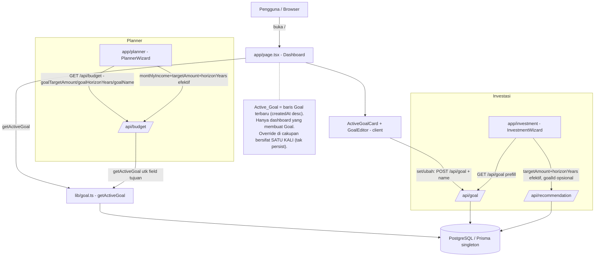
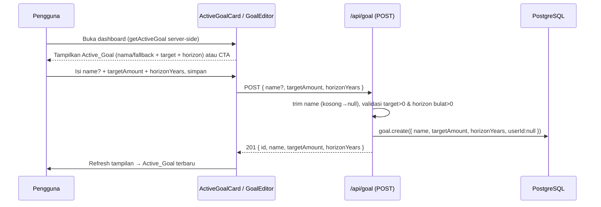
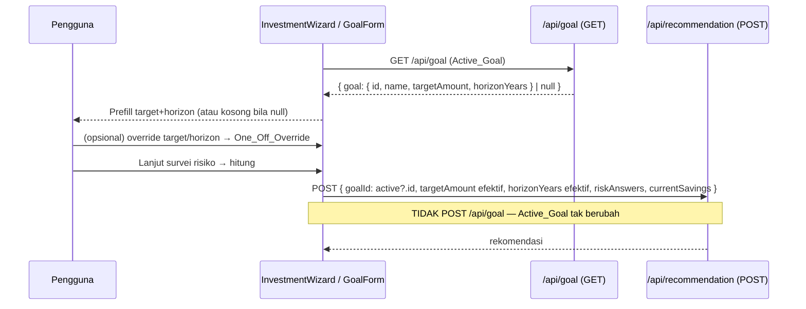

# Design Document

## Overview

**Active Goal** menyentralisasi **satu tujuan keuangan** menjadi masukan bersama untuk cakupan **Investasi** dan **Planner**. Alih-alih kedua cakupan menanyakan target + jangka waktu secara terpisah, **dashboard menjadi satu-satunya tempat tujuan ditetapkan/diubah**, dan kedua cakupan **membaca + memprefill** dari tujuan tersebut.

Definisi otoritatif: **`Active_Goal` = baris `Goal` terbaru** (`orderBy createdAt desc`) — memakai ulang pola "latest wins" yang identik dengan `getLatestProfile()`, `InvestmentRecommendation` terbaru, dan `BudgetPlan` terbaru. Menetapkan/mengubah tujuan = **membuat baris `Goal` baru** (yang terbaru menjadi aktif).

Prinsip desain (selaras dengan pola repo yang sudah ada):

- **Reuse, bukan duplikasi.** Memakai ulang model `Goal`, endpoint `/api/goal`, Prisma singleton (`lib/db.ts`), helper input Rupiah `lib/format/rupiahInput.ts`, pola visual kartu dashboard, token Miami blue, dan format Rupiah `Rp ${Math.round(v).toLocaleString("id-ID")}`.
- **Migrasi aditif, tanpa reset.** Tambah `name String?` (nullable) ke `Goal` lewat `prisma migrate dev --name add_goal_name`. Baris lama → `name` null.
- **Satu sumber baca.** `getActiveGoal()` (server, mengikuti `getLatestProfile()`) dipakai dashboard; `GET /api/goal` dipakai klien Investasi; `GET /api/budget` menyertakan field tujuan untuk Planner. Semua membaca baris `Goal` terbaru yang sama.
- **Override satu kali (one-off).** Kedua cakupan boleh menimpa target/horizon prefilled untuk satu perhitungan skenario; nilai `Active_Goal` yang tersimpan **tidak** berubah. Konsekuensinya, alur Investasi **berhenti mem-`POST /api/goal`** (dashboard-lah pembuat `Goal`).
- **Sifat fitur: integrasi & persistensi, bukan matematika murni.** Tidak ada fungsi murni baru yang cocok untuk property-based testing; validasi via **integration test** (route API) + **component test** (UI). Lihat [Testing Strategy](#testing-strategy).

Design ini memenuhi Requirements 1–10.

## Architecture

### Diagram Konteks — Dashboard sebagai Sumber Tujuan



### Alur Set/Ubah Tujuan (Dashboard)



### Alur Prefill + Override Satu Kali (Investasi)



### Struktur Folder (Delta)

Berkas dari cakupan Investasi & Planner sudah **ADA** (build hijau). Delta Active Goal ditandai `# BARU`/`# DIUBAH`.

```text
/
├── app/
│   ├── api/
│   │   ├── goal/route.ts          # ADA (DIUBAH): POST terima name? (trim→null); GET & POST kembalikan name
│   │   └── budget/route.ts        # ADA (DIUBAH): GET sertakan goalTargetAmount/goalHorizonYears/goalName via getActiveGoal
│   └── page.tsx                   # ADA (DIUBAH): render ActiveGoalCard (getActiveGoal server-side)
├── components/
│   ├── goal/
│   │   ├── ActiveGoalCard.tsx     # BARU (client): tampil Active_Goal + aksi ubah / CTA tetapkan
│   │   └── GoalEditor.tsx         # BARU (client): form name?+target+horizon → POST /api/goal
│   ├── investment/
│   │   ├── GoalForm.tsx           # ADA (DIUBAH): prefill dari Active_Goal; TIDAK POST /api/goal; serahkan nilai+goalId
│   │   └── InvestmentWizard.tsx   # ADA (DIUBAH): fetch GET /api/goal; teruskan goalId + nilai efektif ke recommendation
│   └── planner/
│       ├── BudgetForm.tsx         # ADA (DIUBAH): terima defaultTargetAmount/defaultHorizonYears untuk prefill
│       └── PlannerWizard.tsx      # ADA (DIUBAH): baca goalTargetAmount/goalHorizonYears dari GET /api/budget → prefill
├── lib/
│   └── goal.ts                    # BARU: getActiveGoal() (pola getLatestProfile)
└── prisma/
    └── schema.prisma              # ADA (DIUBAH): Goal + name String? (migrasi add_goal_name)
```

## Components and Interfaces

### Data Model — `Goal` + `name` (Migrasi Aditif)

Model `Goal` yang ada diperluas dengan satu field nullable. **Tanpa mengubah kolom lain**, tanpa reset DB.

```prisma
model Goal {
  id           String   @id @default(cuid())
  userId       String?
  name         String?  // BARU: label opsional (mis. "Beli Rumah"); null → tampilan fallback
  targetAmount Float
  horizonYears Int
  createdAt    DateTime @default(now())
}
```

Migrasi: `prisma migrate dev --name add_goal_name` (aditif; **JANGAN** reset — data `Goal`/Investasi/BudgetPlan harus tetap ada). Baris `Goal` yang sudah ada memperoleh `name = NULL` (Req 1.2, 1.3). Regenerasi Prisma Client setelah migrasi.

### Pembaca Server-Side — `lib/goal.ts`

Mengikuti pola `lib/profileGate.ts#getLatestProfile()`.

```ts
import { prisma } from "@/lib/db";
import type { Goal } from "@prisma/client";

/**
 * Ambil Active_Goal (server-side): baris Goal terbaru (createdAt desc),
 * atau null bila belum ada. Sumber tunggal "latest wins" untuk dashboard.
 * Requirements: 3.2, 3.3
 */
export async function getActiveGoal(): Promise<Goal | null> {
  return prisma.goal.findFirst({ orderBy: { createdAt: "desc" } });
}
```

Catatan: `getActiveGoal()` mengembalikan seluruh baris termasuk `name`. Dashboard (server component) memanggilnya langsung; endpoint tetap dipakai klien (Investasi memakai `GET /api/goal`, Planner memakai `GET /api/budget`).

### Kontrak API — `app/api/goal`

**`POST /api/goal`** (Req 2) — DIUBAH: terima `name` opsional.
- Body: `{ name?: string | null, targetAmount: number, horizonYears: number, userId?: string | null }`.
- Normalisasi `name`: bila `typeof name === "string"`, `trimmed = name.trim()`, gunakan `trimmed === "" ? null : trimmed`; selain itu → null (Req 2.1, 2.2).
- Validasi (pertahankan yang lama, Req 2.3, 2.4, 10.1): `targetAmount` finite `> 0` → else 400; `horizonYears` finite, `Number.isInteger`, `> 0` → else 400; JSON tidak valid → 400.
- Persist: `prisma.goal.create({ data: { name, targetAmount, horizonYears, userId } })`.
- Sukses → 201 `{ id, name, targetAmount, horizonYears }` (Req 2.5) — **tambahkan `name`** ke payload respons yang sudah ada.
- Error DB → 500 pesan ramah (Req 2.6). `runtime = "nodejs"` dipertahankan.

**`GET /api/goal`** (Req 3.1) — DIUBAH secara implisit (mengembalikan seluruh baris, kini termasuk `name`).
- Alur tetap: `prisma.goal.findFirst({ orderBy: { createdAt: "desc" } })` → 200 `{ goal: Goal | null }`. Karena mengembalikan seluruh baris, field `name` otomatis ikut setelah migrasi (Req 3.1). Error DB → 500 (Req 3.4).

### Kontrak API — `app/api/budget` (GET diperluas)

**`GET /api/budget`** (Req 8.1, 8.2) — DIUBAH: sertakan field Tujuan Aktif.
- Alur: pertahankan `getLatestProfile()` untuk `defaultMonthlyIncome`/`currentSavings`/`monthlyExpense` dan `latestPlan`. **Tambahkan** `const active = await getActiveGoal();`.
- Respons 200 (superset field lama):
  ```ts
  {
    defaultMonthlyIncome: profile?.income ?? null,
    currentSavings: profile?.currentSavings ?? null,
    monthlyExpense: profile?.expense ?? null,
    goalTargetAmount: active?.targetAmount ?? null,   // BARU (Req 8.1/8.2)
    goalHorizonYears: active?.horizonYears ?? null,   // BARU
    goalName: active?.name ?? null,                   // BARU
    latestPlan,
  }
  ```
- **`POST /api/budget` tidak berubah** — tetap `{ monthlyIncome, targetAmount, horizonYears, userId? }` (Req 9.2). Planner tidak membuat `Goal` (Req 9.4).
- Error DB → 500; `runtime = "nodejs"` dipertahankan.

### Komponen Dashboard — `ActiveGoalCard` + `GoalEditor`

- **`app/page.tsx`** (server, DIUBAH): `const activeGoal = await getActiveGoal();` lalu render `<ActiveGoalCard activeGoal={serializable} />` di dalam bagian ringkasan. Karena `getActiveGoal()` mengembalikan objek Prisma dengan `Date`, teruskan bentuk terserialisasi ringan (`{ id, name, targetAmount, horizonYears }` — `createdAt` tidak diperlukan UI) sebagai prop ke komponen klien. `dynamic = "force-dynamic"` sudah aktif.
- **`components/goal/ActiveGoalCard.tsx`** (BARU, client): 
  - Bila `activeGoal` ada (Req 4.1, 4.2, 4.3): tampilkan nama (fallback `"Tujuan"` bila `name` null/kosong), `Target_Amount` Rupiah, dan `Horizon_Years` (mis. "5 tahun"); sertakan tombol "Ubah tujuan" yang membuka/menampilkan `GoalEditor` (inline expand atau modal ringan — pilih inline expand agar konsisten dengan kartu lain dan tanpa dependensi modal baru).
  - Bila `activeGoal` null (Req 4.4): tampilkan CTA "Tetapkan tujuan" yang membuka `GoalEditor`.
  - Ikon memakai `lucide-react` (mis. `Target`), token Miami blue (`bg-accent-soft`, `text-[var(--accent)]`), format Rupiah `Rp ${Math.round(v).toLocaleString("id-ID")}` (Req 4.6, 10.2, 10.3), responsif (Req 10.4).
  - Setelah `GoalEditor` sukses menyimpan: panggil `router.refresh()` (Next App Router) agar server component memuat ulang `getActiveGoal()` dan menampilkan nilai terbaru (Req 5.5).
- **`components/goal/GoalEditor.tsx`** (BARU, client): form dengan field:
  - `name` (opsional, teks bebas; kosong diperbolehkan).
  - `targetAmount` (Rupiah, pemisah ribuan via `formatThousands`/`parseThousands`, ikon `Target`) — pola input identik `GoalForm`/`BudgetForm` (Req 5.7).
  - `horizonYears` (input number bilangan bulat tahun, ikon `CalendarClock`).
  - Validasi klien mirror server (Req 5.3, 5.4): target diisi & `> 0`; horizon bilangan bulat `> 0`. Cegah submit bila tidak valid.
  - Submit → `POST /api/goal` `{ name: name.trim() || null, targetAmount, horizonYears }` (Req 5.2). Sukses (201) → callback `onSaved()` (memicu `router.refresh()` di parent). Gagal → tampilkan pesan error ramah tanpa menghapus input (Req 5.6).
  - Nilai awal saat "Ubah": prefill dari `activeGoal` yang diberikan parent (nama, target bergrup ribuan, horizon).

### Komponen Investasi — `GoalForm` + `InvestmentWizard` (DIUBAH)

Perubahan inti Req 6 & 7: **prefill dari `Active_Goal`, berhenti mem-`POST /api/goal`**, dan teruskan nilai efektif + `goalId` opsional ke rekomendasi.

- **`InvestmentWizard.tsx`** (DIUBAH):
  - Pada mount, `fetch("/api/goal")` → simpan `activeGoal` (`{ id, name, targetAmount, horizonYears } | null`). Bila null/gagal, biarkan form kosong (Req 6.2).
  - Teruskan prefill ke `GoalForm` (target bergrup ribuan + horizon) (Req 6.1).
  - Ubah `handleGoalSubmitted` agar menerima nilai target/horizon **tanpa** `goalId` dari POST; simpan sebagai `goal` state, dan simpan `activeGoal?.id` sebagai `goalId` yang akan diteruskan ke `/api/recommendation` (Req 7.4).
  - `handleSurveyComplete` tetap seperti sekarang tetapi memakai `targetAmount`/`horizonYears` efektif dari state dan `goalId: activeGoal?.id ?? undefined` (Req 7.2, 7.4). Tidak ada perubahan pada `/api/recommendation`.
- **`GoalForm.tsx`** (DIUBAH):
  - **Hapus** panggilan `fetch("/api/goal", { method: "POST" })` dan state `apiError`/`submitting` terkait POST (Req 7.3). Ganti tombol menjadi aksi lokal: validasi klien lalu panggil `onSubmitted({ targetAmount, horizonYears })` (tanpa `goalId` dari POST; wizard menyuplai `goalId` dari `Active_Goal`).
  - Terima `initial` prefill dari `Active_Goal` (sudah didukung lewat prop `initial`), sehingga field terisi otomatis; pengguna boleh menimpa (One_Off_Override, Req 7.1).
  - Pertahankan validasi klien (target > 0; horizon bilangan bulat > 0) dan gaya visual.
  - Antarmuka `GoalValues` disederhanakan: `{ targetAmount: number; horizonYears: number }` (hapus `goalId` yang berasal dari POST; wizard menambahkannya dari `Active_Goal`).

### Komponen Planner — `BudgetForm` + `PlannerWizard` (DIUBAH)

Perubahan inti Req 8 & 9: prefill target/horizon dari field tujuan `GET /api/budget`; override satu kali; tanpa membuat `Goal`.

- **`PlannerWizard.tsx`** (DIUBAH): dari respons `GET /api/budget`, baca `goalTargetAmount`/`goalHorizonYears`/`goalName` dan simpan sebagai default. Teruskan `defaultTargetAmount`/`defaultHorizonYears` ke `BudgetForm`. `POST /api/budget` tetap sama (Req 9.2, 9.4).
- **`BudgetForm.tsx`** (DIUBAH): tambahkan prop opsional `defaultTargetAmount: number | null` dan `defaultHorizonYears: number | null`. Inisialisasi state `targetAmount` (bergrup ribuan) dan `horizonYears` dari default tersebut bila tersedia; kosong bila null (Req 8.3, 8.4). Pengguna boleh menimpa (One_Off_Override, Req 9.1). Validasi klien tidak berubah. `currentSavings` tetap read-only.

### Ringkasan Perubahan Berkas

| Berkas | Status | Perubahan |
|---|---|---|
| `prisma/schema.prisma` | DIUBAH | `Goal.name String?` (migrasi `add_goal_name`, aditif) |
| `lib/goal.ts` | BARU | `getActiveGoal()` (pola `getLatestProfile`) |
| `app/api/goal/route.ts` | DIUBAH | POST terima `name` (trim→null) + kembalikan `name`; GET kembalikan seluruh baris (incl. `name`) |
| `app/api/budget/route.ts` | DIUBAH | GET sertakan `goalTargetAmount`/`goalHorizonYears`/`goalName` via `getActiveGoal()`; POST tak berubah |
| `app/page.tsx` | DIUBAH | `getActiveGoal()` + render `ActiveGoalCard` |
| `components/goal/ActiveGoalCard.tsx` | BARU | Kartu Tujuan Aktif + aksi ubah / CTA |
| `components/goal/GoalEditor.tsx` | BARU | Form set/ubah tujuan → POST /api/goal |
| `components/investment/InvestmentWizard.tsx` | DIUBAH | Fetch GET /api/goal → prefill; teruskan `goalId` + nilai efektif; tanpa POST goal |
| `components/investment/GoalForm.tsx` | DIUBAH | Hapus POST /api/goal; prefill + serahkan nilai lokal |
| `components/planner/PlannerWizard.tsx` | DIUBAH | Baca field tujuan GET /api/budget → prefill |
| `components/planner/BudgetForm.tsx` | DIUBAH | Prop default target/horizon untuk prefill |

## Data Models

Tidak ada model baru. Perubahan tunggal: penambahan kolom `name String?` pada `Goal` (lihat [Data Model — Goal + name](#data-model--goal--name-migrasi-aditif)).

Kontrak data (bentuk yang mengalir antar lapisan):

```ts
// Active_Goal terserialisasi yang mengalir ke komponen klien (createdAt diomit).
interface ActiveGoalView {
  id: string;
  name: string | null;      // null → label fallback "Tujuan"
  targetAmount: number;     // > 0
  horizonYears: number;     // bilangan bulat > 0
}

// Superset respons GET /api/budget (field tujuan ditambahkan; lainnya tetap).
interface BudgetContextResponse {
  defaultMonthlyIncome: number | null;
  currentSavings: number | null;
  monthlyExpense: number | null;
  goalTargetAmount: number | null;   // dari Active_Goal
  goalHorizonYears: number | null;   // dari Active_Goal
  goalName: string | null;           // dari Active_Goal
  latestPlan: unknown | null;
}
```

## Correctness Properties

**Property-based testing (PBT) TIDAK diterapkan pada fitur ini.** Active Goal murni bersifat **integrasi & persistensi**: pembacaan "latest wins", normalisasi `name` (trim → null), penambahan field pada respons API, prefill/override pada UI, dan penghapusan satu efek samping (POST goal dari Investasi). Tidak ada fungsi murni dengan ruang input besar yang layak "for all inputs" — tidak ada matematika/parsing/serialisasi non-trivial. Sesuai panduan ("bila tidak dapat menulis pernyataan `for all inputs X, P(X)` yang bermakna, PBT bukan alat yang tepat"), bagian Correctness Properties **sengaja dihilangkan** dan validasi dilakukan melalui **integration test** (route API) dan **component test** (UI). Lihat [Testing Strategy](#testing-strategy).

Satu-satunya normalisasi kecil yang bernilai unit test (bukan property): trim `name` — string kosong/whitespace → null, string non-kosong → nilai ter-trim.

## Error Handling

| Titik | Kondisi | Perilaku |
|---|---|---|
| `POST /api/goal` | Body bukan JSON | 400 `{ error: "Permintaan tidak valid." }` |
| `POST /api/goal` | `targetAmount` bukan angka > 0 | 400 pesan validasi target (Req 2.3) |
| `POST /api/goal` | `horizonYears` bukan bilangan bulat > 0 | 400 pesan validasi horizon (Req 2.4) |
| `POST /api/goal` | `name` non-string / kosong / whitespace | Simpan `name = null` (bukan error) (Req 2.2) |
| `POST /api/goal` | Kegagalan DB saat create | 500 pesan ramah, log server (Req 2.6) |
| `GET /api/goal` | Kegagalan DB | 500 pesan ramah; klien memperlakukan sebagai "belum ada tujuan" → form kosong (Req 3.4, 6.2) |
| `GET /api/budget` | `Active_Goal` tidak ada | `goalTargetAmount`/`goalHorizonYears`/`goalName` = null; form Planner kosong (Req 8.2, 8.4) |
| `GET /api/budget` | Kegagalan DB | 500 pesan ramah (perilaku lama dipertahankan) |
| `GoalEditor` | Validasi klien gagal | Cegah submit, tampilkan pesan field, pertahankan input (Req 5.3, 5.4, 5.6) |
| `GoalEditor` | POST gagal (non-201) | Tampilkan pesan error API/ramah tanpa menghapus input (Req 5.6) |
| `InvestmentWizard` | `GET /api/goal` gagal/null | Lanjut dengan form kosong, input manual (Req 6.2) |
| `PlannerWizard` | `GET /api/budget` gagal | Form terisi manual (perilaku lama dipertahankan) (Req 8.4) |

Semua pesan error dalam Bahasa Indonesia yang ramah, tanpa mengekspos detail internal (konsisten dengan route yang ada).

## Testing Strategy

Karena fitur ini integrasi/persistensi (bukan matematika murni), pengujian berfokus pada **integration test** (route API) dan **component test** (UI). **Tidak ada property-based test** untuk fitur ini (lihat [Correctness Properties](#correctness-properties)). Pendekatan mengikuti runner yang sudah dipakai repo (Vitest untuk logika; component/integration test bila tersedia harness). Sub-task test bersifat opsional (ditandai `*` pada tasks.md) — inti implementasi tidak pernah opsional.

**Unit test (fokus, sedikit):**
- Normalisasi `name` pada `POST /api/goal`: `"  "`/`""` → null; `"  Beli Rumah "` → `"Beli Rumah"`.
- `getActiveGoal()` mengembalikan baris terbaru (mock/seed dua baris `Goal` dengan `createdAt` berbeda → yang terbaru terpilih) dan null saat kosong.

**Integration test (route API):**
- `POST /api/goal`: dengan `name` → tersimpan & 201 `{ id, name, targetAmount, horizonYears }`; tanpa `name`/kosong → `name` null; `targetAmount<=0`/`horizonYears` non-integer → 400; error DB → 500.
- `GET /api/goal`: mengembalikan baris terbaru termasuk `name`; null saat kosong.
- `GET /api/budget`: menyertakan `goalTargetAmount`/`goalHorizonYears`/`goalName` dari `Active_Goal`; null saat belum ada tujuan; field lama (`defaultMonthlyIncome`/`currentSavings`/`monthlyExpense`/`latestPlan`) tetap ada.

**Component test (UI):**
- `ActiveGoalCard`: menampilkan nama/fallback + Rupiah target + horizon saat ada tujuan; CTA saat null; format Rupiah benar.
- `GoalEditor`: mencegah submit saat target/horizon tidak valid; mengirim `name` ter-trim (kosong → null); menampilkan error saat POST gagal tanpa kehilangan input.
- `GoalForm` (Investasi): terprefill dari `Active_Goal`; **tidak** memanggil `POST /api/goal`; menyerahkan nilai (di-override) ke wizard.
- `InvestmentWizard`: meneruskan `goalId` dari `Active_Goal` + `targetAmount`/`horizonYears` efektif ke `POST /api/recommendation`; alur tetap jalan saat tidak ada `Active_Goal`.
- `BudgetForm`/`PlannerWizard` (Planner): terprefill dari `goalTargetAmount`/`goalHorizonYears`; override satu kali tidak membuat `Goal`.

**Verifikasi build:** `npm run build` harus bersih dan `npm test` (jika ada test) hijau pada checkpoint akhir.

## Technical Decisions

1. **`Active_Goal` = baris `Goal` terbaru (latest wins).** Konsisten dengan `getLatestProfile()` dan pola terbaru lain; menghindari kolom "isActive" atau state tambahan. Mengubah tujuan = insert baris baru — sederhana, auditable (riwayat tersimpan), tanpa update-in-place.
2. **Dashboard sebagai satu-satunya pembuat `Goal`.** Menyederhanakan mental model ("satu tempat mengelola tujuan") dan menghilangkan duplikasi pembuatan `Goal` di Investasi. Investasi/Planner menjadi konsumen murni.
3. **Override satu kali tanpa persist.** Menjaga tujuan tersimpan sebagai sumber kebenaran; skenario "coba-coba" di cakupan tidak mencemari tujuan. Investasi meneruskan nilai efektif langsung ke `/api/recommendation`; Planner ke `/api/budget` (yang menyimpan ke `BudgetPlan`, bukan `Goal`).
4. **Migrasi aditif `name String?`.** Nullable → aman untuk baris lama, tanpa reset. Tampilan memakai fallback saat null, sehingga tidak ada regresi visual.
5. **`getActiveGoal()` di `lib/goal.ts`.** Server helper terpisah agar dashboard (server component) tidak perlu memanggil route HTTP internal; klien tetap memakai endpoint. Semua tetap membaca baris terbaru yang sama.
6. **`GET /api/budget` diperluas (bukan endpoint baru).** Planner sudah memanggil `GET /api/budget` sekali saat mount; menyisipkan field tujuan menghindari fetch tambahan dan menjaga satu round-trip.
7. **`goalId` opsional pada rekomendasi.** Relasi tetap longgar (seperti sekarang) — `InvestmentRecommendation.goalId` opsional; tidak ada FK wajib, sejalan dengan gaya MVP.
