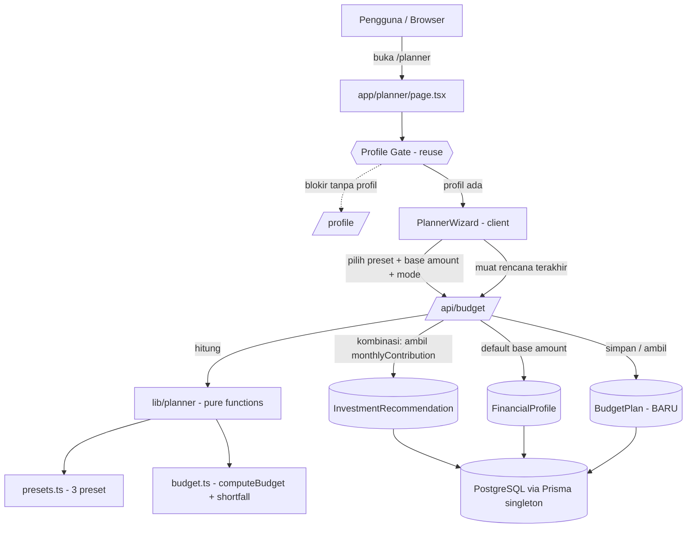
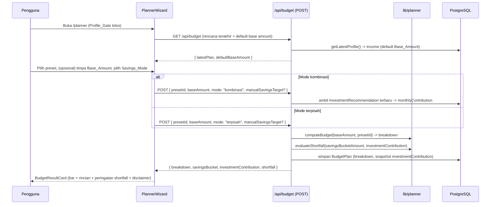

# Design Document

## Overview

**Budget Planner** menambahkan cakupan **Planner** ke aplikasi Financial Planner: alat penganggaran alokasi yang membagi pemasukan bulanan (`Base_Amount`) ke pos-pos anggaran menurut **metode preset** (`50/30/20`, `70/20/10`, `80/20`). Fitur ini menjawab pertanyaan pelengkap terhadap cakupan Investasi: *"Berapa yang sebaiknya saya alokasikan tiap bulan untuk kebutuhan, keinginan, dan tabungan?"*

Prinsip desain (selaras dengan pola `financial-planner` yang sudah ada):

- **Logika Planner murni dan terisolasi.** Definisi preset dan perhitungan alokasi ditulis sebagai pure function di `lib/planner/` (`presets.ts`, `budget.ts`), tanpa I/O — deterministik, mudah diuji (PBT), dan dapat dipakai ulang. Ini mengikuti pola `lib/investment/*`.
- **Reuse, bukan duplikasi.** Memakai ulang `Profile_Gate` (server component), `getLatestProfile()`, Prisma Client singleton (`lib/db.ts`), pola API route runtime Node.js dengan error ramah Bahasa Indonesia, dan pola visual `RecommendationCard` (bar proporsi + rincian per pos + format Rupiah + disclaimer).
- **Integrasi lintas cakupan.** Mode `kombinasi` menarik `monthlyContribution` dari `InvestmentRecommendation` terbaru sebagai pos "Investasi" otomatis, dan membandingkannya dengan alokasi tabungan preset untuk menandai *shortfall*.
- **Persistensi via model baru `BudgetPlan`.** Migrasi Prisma baru (tanpa reset DB), dengan `userId` nullable sebagai placeholder auth.
- **Allocation-only.** Pencatatan transaksi harian dan cash-flow tetap di luar cakupan (roadmap).

- **Proyeksi target tabungan opsional (tambahan).** Di atas alokasi, pengguna dapat mengisi `Savings_Target_Amount` (opsional) dan `Savings_Horizon` (opsional). Logika proyeksi ditambahkan sebagai pure function baru terisolasi di `lib/planner/savingsProjection.ts`, memakai ulang pendekatan Future Value of Annuity dari `lib/investment/projection.ts` untuk mode `kombinasi`. Ini murni **penambahan inkremental** ke berkas/kontrak yang sudah ada — bukan penulisan ulang.

Design ini memenuhi Requirements 1–12. Bagian bertanda **TAMBAHAN** menandai delta untuk kapabilitas proyeksi target tabungan; bagian lain tetap sesuai implementasi yang sudah ada (build-green).

## Architecture

### Diagram Konteks



### Alur Data Penganggaran



### Struktur Folder

Berkas dari iterasi alokasi (Req 1–10) sudah **ADA** (build-green). Delta proyeksi target tabungan (Req 11–12) ditandai `# TAMBAHAN`.

```text
/
├── app/
│   ├── api/
│   │   └── budget/route.ts            # ADA (DIUBAH): POST menerima savingsTargetAmount? + savingsHorizonYears?, sertakan savingsProjection di respons
│   ├── planner/
│   │   └── page.tsx                   # ADA: server component, dibungkus Profile_Gate
│   └── page.tsx                       # ADA: tautan ke /planner
├── components/
│   └── planner/
│       ├── PlannerWizard.tsx          # ADA (DIUBAH): teruskan field proyeksi opsional + savingsProjection ke hasil
│       ├── PresetPicker.tsx           # ADA: pilih 1 dari 3 preset
│       ├── BudgetForm.tsx             # ADA (DIUBAH): + input opsional Savings_Target_Amount & Savings_Horizon
│       └── BudgetResultCard.tsx       # ADA (DIUBAH): + tampilan Savings_Projection (Arah A/B + status "tidak akan tercapai")
├── lib/
│   └── planner/
│       ├── presets.ts                 # ADA: konstanta 3 preset (pure)
│       ├── budget.ts                  # ADA: computeBudget + savingsBucketAmount + evaluateShortfall (pure)
│       └── savingsProjection.ts       # TAMBAHAN: monthsToReachTarget + requiredMonthlySaving (pure)
├── types/
│   └── planner.ts                     # ADA (DIUBAH): + tipe SavingsProjection & input proyeksi
└── prisma/
    └── schema.prisma                  # ADA (DIUBAH): + BudgetPlan.savingsTargetAmount Float? & savingsHorizonYears Int? (migrasi tambahan)
```

## Components and Interfaces

### Tipe Domain (`types/planner.ts`)

```ts
export type PresetId = "50/30/20" | "70/20/10" | "80/20";

export type SavingsMode = "terpisah" | "kombinasi";

export interface BudgetCategory {
  name: string;       // mis. "Kebutuhan", "Keinginan", "Tabungan & Investasi"
  percentage: number; // 0..100
  isSavings: boolean;  // menandai Savings_Bucket preset
}

export interface BudgetPreset {
  id: PresetId;
  label: string;                 // mis. "50/30/20"
  categories: BudgetCategory[];  // total percentage = 100
}

export interface BudgetLine {
  name: string;
  percentage: number;
  amount: number;    // Rupiah = baseAmount * percentage / 100
  isSavings: boolean;
}

export interface BudgetBreakdown {
  presetId: PresetId;
  baseAmount: number;
  lines: BudgetLine[]; // total amount ~= baseAmount (toleransi pembulatan)
}

export interface ShortfallResult {
  hasShortfall: boolean;
  savingsBucketAmount: number;     // total alokasi Savings_Bucket preset (Rupiah)
  investmentContribution: number;  // monthlyContribution dari rekomendasi (0 bila tak ada)
  gap: number;                     // max(0, investmentContribution - savingsBucketAmount)
}
```

**TAMBAHAN — tipe proyeksi target tabungan (Req 11, 12).** Ditambahkan ke `types/planner.ts` tanpa mengubah tipe yang sudah ada.

```ts
// Arah proyeksi: "time-to-goal" (target tanpa horizon) atau "required-monthly"
// (target + horizon). "none" bila target tidak diisi (tanpa proyeksi).
export type SavingsProjectionDirection = "none" | "time-to-goal" | "required-monthly";

// Hasil Arah A (Time_To_Goal): berapa bulan untuk mencapai target.
export interface MonthsToReachResult {
  reachable: boolean;        // false bila monthlySaving<=0 tanpa pertumbuhan
  months: number | null;     // null saat reachable === false
}

// Hasil proyeksi lengkap yang dikembalikan API + dirender di UI.
export interface SavingsProjection {
  direction: SavingsProjectionDirection;
  targetAmount: number;         // Savings_Target_Amount (Rupiah)
  horizonYears: number | null;  // Savings_Horizon (null pada Arah A)
  monthlySavingRate: number;    // Monthly_Saving_Rate = savingsBucketAmount(breakdown)
  annualReturn: number;         // Growth_Rate dipakai (0 pada terpisah / fallback)
  // Arah A:
  reachable: boolean;           // false → "tidak akan tercapai dengan alokasi saat ini"
  months: number | null;        // estimasi bulan (null bila tidak reachable / Arah B)
  years: number | null;         // months / 12 (untuk tampilan "~Y tahun")
  // Arah B:
  requiredMonthly: number | null;   // Required_Monthly_Saving (null pada Arah A)
  allocationSufficient: boolean | null; // monthlySavingRate >= requiredMonthly
  monthlyGap: number | null;         // max(0, requiredMonthly - monthlySavingRate)
}
```

### Modul Logika Planner (`lib/planner/`)

Semua fungsi **pure** — tanpa I/O, hanya mengimpor tipe dari `@/types/planner` (mengikuti pola `lib/investment/*`).

**`presets.ts`**
```ts
import type { BudgetPreset, PresetId } from "@/types/planner";

// Konstanta terstruktur; persentase tiap preset berjumlah 100.
export const BUDGET_PRESETS: Record<PresetId, BudgetPreset>;

// Ambil preset by id; lempar error bila id tidak dikenal (Req 3.7).
export function getPreset(id: PresetId): BudgetPreset;
```

Definisi preset (Req 3.2–3.4):

| Preset | Kategori (persentase) | Savings_Bucket |
|---|---|---|
| `50/30/20` | Kebutuhan 50%, Keinginan 30%, Tabungan & Investasi 20% | "Tabungan & Investasi" |
| `70/20/10` | Kebutuhan 70%, Tabungan 20%, Keinginan 10% | "Tabungan" |
| `80/20` | Pengeluaran 80%, Tabungan 20% | "Tabungan" |

**`budget.ts`**
```ts
import type { BudgetBreakdown, PresetId, ShortfallResult } from "@/types/planner";

// computeBudget: baseAmount * (persentase/100) per kategori.
// Guard: lempar error bila baseAmount bukan angka berhingga non-negatif (Req 4.5),
// atau presetId tidak dikenal (Req 3.7).
export function computeBudget(baseAmount: number, presetId: PresetId): BudgetBreakdown;

// Jumlahkan alokasi kategori Savings_Bucket dari sebuah breakdown.
export function savingsBucketAmount(breakdown: BudgetBreakdown): number;

// evaluateShortfall: hasShortfall = savingsBucketAmount < investmentContribution.
// gap = max(0, investmentContribution - savingsBucketAmount).
export function evaluateShortfall(
  savingsBucketAmount: number,
  investmentContribution: number,
): ShortfallResult;
```

Catatan presisi: jumlah tiap kategori dihitung `baseAmount * percentage / 100`. Karena persentase preset berjumlah 100, jumlah seluruh kategori sama dengan `baseAmount` secara eksak untuk aritmetika riil; deviasi hanya berupa galat floating-point kecil (diuji dengan toleransi, Req 4.3). Pembulatan ke Rupiah dilakukan hanya di lapisan tampilan (format), bukan di dalam breakdown, agar total tetap presisi.

**TAMBAHAN — `savingsProjection.ts` (Req 11, 12).** Modul pure baru, hanya mengimpor tipe dari `@/types/planner`. Memakai ulang pendekatan Future Value of Annuity dari `lib/investment/projection.ts` (tidak mengimpornya — menjaga isolasi tipe Planner — melainkan menyalin pola rumus yang sama).

```ts
import type { MonthsToReachResult } from "@/types/planner";

// Arah A (Time_To_Goal): berapa bulan untuk mencapai targetAmount pada
// monthlySaving, dengan annualReturn desimal (0 → tanpa pertumbuhan).
export function monthsToReachTarget(args: {
  targetAmount: number;   // > 0
  monthlySaving: number;  // Monthly_Saving_Rate (>= 0)
  annualReturn: number;   // desimal >= 0 (0 → tanpa bunga)
}): MonthsToReachResult;

// Arah B (Required_Monthly_Saving): tabungan bulanan yang diperlukan untuk
// mencapai targetAmount dalam horizonYears, dengan annualReturn desimal.
export function requiredMonthlySaving(args: {
  targetAmount: number;   // > 0
  horizonYears: number;   // bilangan bulat positif
  annualReturn: number;   // desimal >= 0 (0 → tanpa bunga)
}): number;
```

Rumus (dengan `i = annualReturn / 12` sebagai tingkat bunga bulanan):

- **Arah A — `monthsToReachTarget`**
  - Tanpa pertumbuhan (`i === 0`):
    - Jika `monthlySaving <= 0` → target tak pernah tercapai → `{ reachable: false, months: null }` (Req 12.6). Ini satu-satunya penanganan agar tidak merender nilai tak hingga; nilai berhingga besar tetap ditampilkan apa adanya (Req 12.5).
    - Selain itu → `months = ceil(targetAmount / monthlySaving)` (Req 12.1), `reachable: true`.
  - Dengan pertumbuhan (`i > 0`, mode kombinasi):
    - Jika `monthlySaving <= 0` → dana tidak bertambah (kontribusi nol, tanpa saldo awal) → `{ reachable: false, months: null }` (Req 12.6).
    - Selain itu, selesaikan anuitas untuk `n` (Req 12.3):
      `n = ln(1 + (targetAmount × i) / monthlySaving) / ln(1 + i)`, lalu `months = ceil(n)`, `reachable: true`.
  - Fallback: bila `annualReturn <= 0` atau tidak berhingga, gunakan cabang tanpa pertumbuhan (Req 12.4).

- **Arah B — `requiredMonthlySaving`** (dengan `n = horizonYears × 12`)
  - Tanpa pertumbuhan (`i === 0`): `requiredMonthly = targetAmount / n` (Req 12.1).
  - Dengan pertumbuhan (`i > 0`, mode kombinasi): Future Value of Annuity diselesaikan untuk PMT (rumus sama dengan `calculateMonthlyContribution` saat `presentValue = 0`, Req 12.3):
    `PMT = targetAmount × i / ((1 + i)^n − 1)`.
  - Fallback: `annualReturn <= 0`/tidak berhingga → cabang tanpa pertumbuhan (Req 12.4).
  - Hasil di-clamp minimum 0.

Guard (konsisten gaya pure function lain): `targetAmount` harus angka berhingga `> 0`; `horizonYears` harus bilangan bulat positif berhingga; `annualReturn` harus angka berhingga `>= 0` (nilai negatif/`NaN`/tak hingga → error). `monthlySaving` harus angka berhingga `>= 0`.

**Orkestrasi proyeksi (di lapisan API, bukan di modul murni):** API menentukan `direction` dari kehadiran `savingsTargetAmount`/`savingsHorizonYears`, memilih `annualReturn` (0 untuk `terpisah`; `Growth_Rate` rekomendasi untuk `kombinasi`, 0 bila tak ada), memanggil fungsi murni yang sesuai, lalu menyusun objek `SavingsProjection` (mis. `years = months / 12`, `allocationSufficient = monthlySavingRate >= requiredMonthly`, `monthlyGap = max(0, requiredMonthly − monthlySavingRate)`). `savingsProjection.ts` tetap murni dan tidak tahu soal mode/DB.

### API Contracts (BARU)

**`GET /api/budget`** — muat konteks awal Planner
- Alur server: `getLatestProfile()` → `defaultBaseAmount = income` (atau null); ambil `BudgetPlan` terbaru bila ada.
- Sukses → HTTP 200 `{ defaultBaseAmount: number | null, latestPlan: BudgetPlan | null }`.

**`POST /api/budget`** — hitung + simpan rencana anggaran
- Body (field proyeksi bertanda **TAMBAHAN**, opsional): `{ presetId: PresetId, baseAmount: number, mode: SavingsMode, manualSavingsTarget?: number | null, savingsTargetAmount?: number | null /* TAMBAHAN */, savingsHorizonYears?: number | null /* TAMBAHAN */, userId?: string | null }`.
- Validasi: `presetId` ∈ 3 preset; `baseAmount` angka berhingga ≥ 0; `mode` ∈ {`terpisah`, `kombinasi`}; `manualSavingsTarget` bila ada ≥ 0. **TAMBAHAN:** bila diberikan, `savingsTargetAmount` harus angka berhingga `> 0` (Req 11.7); `savingsHorizonYears` harus bilangan bulat positif berhingga (`Number.isInteger` dan `> 0`, Req 11.8). Invalid → HTTP 400 `{ error }`.
- Alur server:
  1. `computeBudget(baseAmount, presetId)` → `breakdown`.
  2. `savingsBucketAmount(breakdown)` → jumlah `Savings_Bucket` (= `Monthly_Saving_Rate` untuk proyeksi).
  3. Bila `mode === "kombinasi"`: ambil `InvestmentRecommendation` terbaru (`orderBy createdAt desc`) → `investmentContribution = monthlyContribution` (atau `0` bila tidak ada, Req 5.5); simpan juga `annualReturn` (atau `0` bila tidak ada) sebagai `Growth_Rate` proyeksi.
  4. Bila `mode === "terpisah"`: `investmentContribution = 0`; `Growth_Rate = 0`; target = `manualSavingsTarget`.
  5. `evaluateShortfall(savingsBucketAmount, investmentContribution)` → `shortfall`.
  6. **TAMBAHAN — proyeksi:** bila `savingsTargetAmount` diberikan (> 0):
     - Tanpa `savingsHorizonYears` → Arah A: `monthsToReachTarget({ targetAmount, monthlySaving: savingsBucketAmount, annualReturn: growthRate })`.
     - Dengan `savingsHorizonYears` → Arah B: `requiredMonthlySaving({ targetAmount, horizonYears, annualReturn: growthRate })`, lalu bandingkan dengan `savingsBucketAmount`.
     - Susun objek `SavingsProjection` (lihat tipe). Bila `savingsTargetAmount` tidak diberikan → `savingsProjection = null` (tanpa proyeksi, Req 11.2).
  7. Simpan `BudgetPlan` (snapshot `investmentContribution` di kombinasi; **TAMBAHAN:** simpan `savingsTargetAmount` dan `savingsHorizonYears` bila ada).
- Sukses → HTTP 200 `{ breakdown, savingsBucketAmount, investmentContribution, manualSavingsTarget, shortfall, savingsProjection /* TAMBAHAN: SavingsProjection | null */, recommendationMissing? }`.
- Error mesin (input tidak valid) → HTTP 400; error DB → HTTP 500 `{ error }` ramah pengguna.
- `export const runtime = "nodejs"` (konsisten dengan route lain).

### Halaman & Komponen UI

- **`app/planner/page.tsx`** (server component): dibungkus `ProfileGate` (reuse), `export const dynamic = "force-dynamic"` (karena gate query DB), header bergaya sama dengan `app/investment/page.tsx` (badge aksen, tautan kembali ke dashboard), lalu me-render `PlannerWizard`.
- **`PlannerWizard.tsx`** (client): orkestrasi langkah `PresetPicker` → `BudgetForm` → `BudgetResultCard`; memanggil `GET /api/budget` untuk default `Base_Amount` + rencana terakhir, dan `POST /api/budget` untuk menghitung/menyimpan.
- **`PresetPicker.tsx`**: menampilkan 3 preset sebagai kartu pilih (persentase per kategori terlihat), menandai preset terpilih dengan token `--accent`.
- **`BudgetForm.tsx`** (DIUBAH): input `Base_Amount` (prefilled dari `defaultBaseAmount`, dapat ditimpa), pemilih `Savings_Mode` (`terpisah`/`kombinasi`), input opsional `Manual_Savings_Target`. Dalam mode `kombinasi`, menampilkan `investmentContribution` yang ditarik (read-only informatif). **TAMBAHAN:** dua field opsional baru — `Savings_Target_Amount` (Rupiah) dan `Savings_Horizon` (tahun) — dengan hint yang menjelaskan Arah A vs B: "isi target saja → estimasi waktu tercapai; isi target + jangka waktu → tabungan bulanan yang diperlukan". Nilai proyeksi diteruskan ke `onSubmit` sebagai `savingsTargetAmount: number | null` dan `savingsHorizonYears: number | null` (validasi lapisan form: bila target diisi harus `> 0`; bila horizon diisi harus bilangan bulat `> 0`).
- **`BudgetResultCard.tsx`** (DIUBAH): mengikuti pola visual `RecommendationCard` — bar proporsi gabungan (warna berputar), rincian per pos (`name`, `percentage`, `amount` dalam Rupiah), panel peringatan `Savings_Shortfall` bila ada, dan disclaimer edukatif wajib. Format Rupiah: `Rp ${Math.round(v).toLocaleString("id-ID")}`. **TAMBAHAN:** panel `Savings_Projection` opsional (dirender hanya bila `savingsProjection` tidak null):
  - Arah A (`direction: "time-to-goal"`) dan `reachable` → "Target Rp … tercapai dalam ~X bulan (~Y tahun)".
  - Arah B (`direction: "required-monthly"`) → "Butuh Rp …/bulan untuk mencapai Rp … dalam Y tahun" plus badge status: alokasi preset cukup (hijau) atau kurang Rp … (amber) berdasarkan `allocationSufficient`/`monthlyGap`.
  - `reachable === false` → status "Tidak akan tercapai dengan alokasi saat ini" (Req 12.6), tanpa merender nilai tak hingga.
  - Nilai berhingga besar ditampilkan apa adanya, tanpa cap/peringatan (Req 12.5).
- **`app/page.tsx`** (diubah minimal): tambahkan satu kartu/tautan menuju `/planner` di dashboard.

## Data Models

### Model Prisma Baru (`prisma/schema.prisma`)

Ditambahkan **tanpa mengubah** model yang ada. Migrasi baru (`prisma migrate dev --name add_budget_plan`), **bukan** reset DB.

```prisma
model BudgetPlan {
  id                     String   @id @default(cuid())
  userId                 String?  // placeholder auth (nullable)
  presetId               String   // "50/30/20" | "70/20/10" | "80/20"
  baseAmount             Float
  mode                   String   // "terpisah" | "kombinasi"
  manualSavingsTarget    Float?   // opsional
  investmentContribution Float?   // snapshot monthlyContribution (kombinasi)
  savingsTargetAmount    Float?   // TAMBAHAN (Req 12.7): nominal target tabungan opsional
  savingsHorizonYears    Int?     // TAMBAHAN (Req 12.7): jangka waktu opsional (tahun)
  breakdown              Json     // BudgetLine[] hasil computeBudget
  createdAt              DateTime @default(now())
}
```

**TAMBAHAN — migrasi aditif.** Dua field baru bersifat **nullable** sehingga migrasi murni tambahan (`prisma migrate dev --name add_savings_projection`), **tidak** mengubah kolom lama dan **tidak** mereset DB — data `BudgetPlan` yang sudah ada tetap valid (kolom baru bernilai `NULL`).

Catatan:
- `breakdown` disimpan sebagai `Json` (daftar `BudgetLine`) agar fleksibel terhadap jumlah kategori per preset (2 atau 3).
- `investmentContribution` adalah **snapshot** nilai `monthlyContribution` dari `InvestmentRecommendation` terbaru pada saat penyimpanan (mode `kombinasi`); menyimpannya membuat rencana tetap konsisten meski rekomendasi berubah kemudian.
- `presetId` dan `mode` disimpan sebagai `String` (konsisten dengan penyimpanan `riskProfile`/`profile` sebagai `String` pada model yang ada); validasi nilai dilakukan di lapisan API + tipe TypeScript.

### Struktur Konstanta Preset

`BUDGET_PRESETS` adalah `Record<PresetId, BudgetPreset>` konstan di `lib/planner/presets.ts`. Contoh entri:

```ts
"50/30/20": {
  id: "50/30/20",
  label: "50/30/20",
  categories: [
    { name: "Kebutuhan", percentage: 50, isSavings: false },
    { name: "Keinginan", percentage: 30, isSavings: false },
    { name: "Tabungan & Investasi", percentage: 20, isSavings: true },
  ],
}
```

Invarian: untuk setiap preset, `sum(categories[].percentage) === 100` dan tepat satu (atau lebih) kategori memiliki `isSavings: true` untuk menandai `Savings_Bucket`.

### Snapshot `monthlyContribution` (kontrak lintas cakupan)

Mode `kombinasi` membaca `InvestmentRecommendation` terbaru via Prisma (`orderBy: { createdAt: "desc" }`) dan mengambil `monthlyContribution`. Nilai ini menjadi `Investment_Contribution`, di-snapshot ke `BudgetPlan.investmentContribution`, dan dibandingkan dengan alokasi `Savings_Bucket` untuk menghitung `Savings_Shortfall`. Bila belum ada rekomendasi, `Investment_Contribution = 0` (Req 5.5).

## Correctness Properties

*A property is a characteristic or behavior that should hold true across all valid executions of a system — essentially, a formal statement about what the system should do. Properties serve as the bridge between human-readable specifications and machine-verifiable correctness guarantees.*

Bagian ini berlaku untuk logika murni di `lib/planner/` (`presets.ts`, `budget.ts`) yang merupakan pure function dengan ruang input besar (nilai `Base_Amount` sembarang, tiap preset) — cocok untuk property-based testing. Lapisan API wiring (baca profil/rekomendasi, persistensi `BudgetPlan`), `Profile_Gate`, dan rendering UI diuji dengan example-based/integration/component test (lihat Testing Strategy), bukan properti.

Hasil prework dirangkum menjadi 5 properti untuk alokasi (Property 1–5) ditambah 4 properti TAMBAHAN untuk proyeksi target tabungan (Property 6–9) setelah refleksi redundansi. Untuk proyeksi: Arah B + fallback tanpa pertumbuhan digabung ke satu properti round-trip (Property 6); Arah A digabung ke satu properti konsistensi (Property 7) yang mencakup cabang tanpa-bunga (ceil) dan berpertumbuhan (solve-n) sekaligus; kondisi tepi laju-nol dipisah (Property 8) karena menguji jaminan berbeda (tidak menghasilkan nilai tak hingga); dan kondisi error digabung (Property 9).

### Property 1: Alokasi per pos sesuai preset dan proporsi

*For any* `Base_Amount` berhingga yang tidak negatif dan setiap `PresetId` yang valid, `computeBudget` SHALL mengembalikan `lines` yang jumlah dan nama posnya persis sama dengan kategori preset, dengan `amount` tiap pos sama dengan `Base_Amount × percentage ÷ 100`.

**Validates: Requirements 4.1, 4.2, 3.6**

### Property 2: Total alokasi sama dengan jumlah dasar

*For any* `Base_Amount` berhingga yang tidak negatif dan setiap `PresetId` yang valid, jumlah seluruh `lines[].amount` dari `computeBudget` SHALL sama dengan `Base_Amount` dalam toleransi pembulatan numerik kecil.

**Validates: Requirements 4.3**

### Property 3: Persentase setiap preset berjumlah 100

*For any* `Budget_Preset` di dalam `BUDGET_PRESETS`, jumlah `percentage` seluruh kategorinya SHALL sama dengan 100.

**Validates: Requirements 3.5**

### Property 4: Penandaan kekurangan dana investasi konsisten

*For any* nilai `savingsBucketAmount` dan `investmentContribution` yang tidak negatif, `evaluateShortfall` SHALL mengembalikan `hasShortfall` bernilai benar jika dan hanya jika `savingsBucketAmount < investmentContribution`, dan `gap` sama dengan `max(0, investmentContribution − savingsBucketAmount)`.

**Validates: Requirements 6.1, 6.2, 6.3, 6.4**

### Property 5: Input tidak valid ditolak

*For any* `Base_Amount` yang bukan angka berhingga tidak negatif (negatif, `NaN`, atau tak hingga) atau `PresetId` di luar himpunan `{50/30/20, 70/20/10, 80/20}`, `computeBudget`/`getPreset` SHALL melempar error alih-alih mengembalikan hasil.

**Validates: Requirements 2.3, 4.5, 3.7**

*Properti berikut bertanda TAMBAHAN dan berlaku untuk modul murni `lib/planner/savingsProjection.ts` (Req 11–12). Fungsi ini murni dengan ruang input besar (target, laju tabungan, horizon, imbal hasil sembarang) sehingga cocok untuk property-based testing. Nilai `annualReturn` mencakup 0 (tanpa pertumbuhan, mode terpisah / fallback) dan > 0 (mode kombinasi), sehingga satu properti menguji kedua cabang sekaligus.*

### Property 6: Required_Monthly_Saving mencapai target (round-trip FV annuity) — TAMBAHAN

*For any* `targetAmount` berhingga > 0, `horizonYears` bilangan bulat positif, dan `annualReturn` berhingga ≥ 0, menabung `requiredMonthlySaving({ targetAmount, horizonYears, annualReturn })` setiap bulan selama `horizonYears × 12` periode (mengakumulasi dengan bunga bulanan `annualReturn/12` bila > 0, atau tanpa bunga bila 0) SHALL menghasilkan nilai akhir yang sama dengan `targetAmount` dalam toleransi numerik relatif kecil.

**Validates: Requirements 11.4, 12.1, 12.3, 12.4**

### Property 7: Konsistensi Time_To_Goal (monthsToReachTarget) — TAMBAHAN

*For any* `targetAmount` berhingga > 0, `monthlySaving` berhingga > 0, dan `annualReturn` berhingga ≥ 0, `monthsToReachTarget` SHALL mengembalikan `reachable = true` dengan `months` bilangan bulat terkecil sehingga akumulasi tabungan selama `months` periode ≥ `targetAmount` sedangkan akumulasi selama `months − 1` periode < `targetAmount`.

**Validates: Requirements 11.3, 12.1, 12.3, 12.4**

### Property 8: Laju tabungan nol tanpa pertumbuhan → tidak akan tercapai — TAMBAHAN

*For any* `targetAmount` berhingga > 0 dan `monthlySaving ≤ 0` dengan `annualReturn = 0` (tanpa pertumbuhan), `monthsToReachTarget` SHALL mengembalikan `{ reachable: false, months: null }` alih-alih nilai tak hingga; untuk `monthlySaving > 0` yang menghasilkan `months` berhingga besar, fungsi SHALL tetap mengembalikan nilai berhingga tersebut apa adanya (tanpa membatasinya).

**Validates: Requirements 12.5, 12.6**

### Property 9: Input proyeksi tidak valid ditolak — TAMBAHAN

*For any* `targetAmount` yang bukan angka berhingga > 0, atau `horizonYears` yang bukan bilangan bulat positif berhingga (untuk `requiredMonthlySaving`), atau `annualReturn` yang bukan angka berhingga ≥ 0, fungsi proyeksi terkait SHALL melempar error alih-alih mengembalikan hasil.

**Validates: Requirements 11.7, 11.8**

## Error Handling

| Kondisi | Deteksi | Respons | Req |
|---|---|---|---|
| Profil belum ada saat akses Planner | `Profile_Gate` cek `getLatestProfile()` | Redirect ke `/profile` | 1.1 |
| `Base_Amount` negatif/non-berhingga | Guard di `computeBudget` + validasi API | Lempar error → HTTP 400 + JSON error | 2.3, 4.5 |
| `presetId` tidak dikenal | Guard di `getPreset`/`computeBudget` + validasi API | HTTP 400 + JSON error | 3.7 |
| `mode` bukan `terpisah`/`kombinasi` | Validasi API | HTTP 400 + JSON error | 5.1 |
| `manualSavingsTarget` negatif | Validasi API | HTTP 400 + JSON error | 5.2, 5.4 |
| Mode `kombinasi` tanpa `InvestmentRecommendation` | Cek query DB null | `investmentContribution = 0` + info ke pengguna | 5.5 |
| `savingsTargetAmount` bukan berhingga > 0 (diisi) | Guard `savingsProjection.ts` + validasi API | Lempar error → HTTP 400 + JSON error | 11.7 |
| `savingsHorizonYears` bukan bilangan bulat positif (diisi) | `Number.isInteger` & > 0 di API + guard `requiredMonthlySaving` | HTTP 400 + JSON error | 11.8 |
| `Monthly_Saving_Rate` = 0 tanpa pertumbuhan (target tak tercapai) | Cabang `monthsToReachTarget` | `{ reachable: false, months: null }` → status "tidak akan tercapai" (bukan Infinity) | 12.6 |
| Operasi database gagal | `try/catch` di route | HTTP 500 + pesan ramah tanpa detail internal | 7.5 |

## Testing Strategy

**Pendekatan ganda** (mengikuti pola `financial-planner`):

- **Property-based tests** (Vitest + `fast-check`) untuk logika murni `lib/planner/*` (`computeBudget`, `getPreset`, `evaluateShortfall`, invarian preset, **dan TAMBAHAN `savingsProjection.ts`** — `monthsToReachTarget`, `requiredMonthlySaving`). Minimum 100 iterasi per properti. Setiap test diberi tag `Feature: budget-planner, Property {n}: {teks properti}` dan merujuk nomor properti pada dokumen ini.
- **Unit tests (example-based)** untuk nilai konstanta preset spesifik (kategori & persentase per preset), format Rupiah, dan angka yang diverifikasi manual.
- **Integration/component tests** untuk:
  - `GET /api/budget` mengembalikan default `Base_Amount` dari profil + rencana terakhir.
  - `POST /api/budget` mode `terpisah` (investmentContribution 0) dan `kombinasi` (menarik `monthlyContribution`, snapshot tersimpan; kasus tanpa rekomendasi → 0).
  - Persistensi `BudgetPlan` (field benar, **TAMBAHAN:** `savingsTargetAmount`/`savingsHorizonYears` tersimpan bila ada, `NULL` bila tidak) dan penanganan error DB (mock throw → HTTP 500 ramah).
  - **TAMBAHAN** — `POST /api/budget` proyeksi: tanpa `savingsTargetAmount` → `savingsProjection` null (perilaku alokasi seperti biasa); Arah A (target tanpa horizon); Arah B (target + horizon) cukup vs kurang; mode `kombinasi` memakai `annualReturn` rekomendasi; validasi `savingsTargetAmount`/`savingsHorizonYears` → 400.
  - `Profile_Gate` (reuse): redirect saat profil null.
  - `BudgetResultCard`: rincian per pos, bar proporsi, peringatan shortfall, disclaimer edukatif, **dan TAMBAHAN panel `Savings_Projection`** (Arah A "~X bulan (~Y tahun)"; Arah B nominal/bulan + cukup/kurang; status "tidak akan tercapai"; nilai besar apa adanya).
  - Dashboard menautkan `/planner`.

**Mengapa PBT hanya untuk `lib/planner/*`:**
- Fungsi murni dengan perilaku bervariasi terhadap input (`Base_Amount` sembarang) → 100 iterasi menemukan galat pembulatan dan kasus tepi.
- Persistensi PostgreSQL, konfigurasi Prisma, pembacaan rekomendasi, dan rendering UI **tidak** cocok PBT: gunakan integration/component test dengan 1–3 contoh representatif.

**Konfigurasi property test:**
- Library PBT (`fast-check`) — jangan implementasi dari nol; minimum 100 iterasi.
- Generator `Base_Amount`: `fc.double` non-negatif berhingga (termasuk 0 dan nilai besar); generator preset dari kunci `BUDGET_PRESETS`; generator pasangan (savings, contribution) non-negatif untuk shortfall.

**TDD:** logika murni `lib/planner/*` ditulis test-first sebelum API dan UI.

**Catatan sub-task test opsional:** semua sub-task test ditandai `*` di `tasks.md` dan boleh dilewati untuk MVP cepat (konsisten dengan spec `financial-planner`).

## Keputusan Teknis Utama (Rationale)

- **Preset terstruktur, bukan kategori kustom penuh.** Menyediakan 3 metode teruji menjaga UX sederhana dan perhitungan deterministik; memodelkan preset sebagai konstanta `Record<PresetId, BudgetPreset>` membuat penambahan preset baru mudah tanpa mengubah `computeBudget`.
- **Pembulatan hanya di lapisan tampilan.** `computeBudget` mempertahankan nilai presisi (float) agar total pos tetap sama dengan `Base_Amount`; pembulatan Rupiah (`Math.round`) dilakukan saat format (`BudgetResultCard`), mencegah "kebocoran" akibat pembulatan per pos.
- **Snapshot `investmentContribution`.** Menyimpan nilai kontribusi investasi pada saat penyimpanan menjaga rencana anggaran tetap koheren meski `InvestmentRecommendation` berubah kemudian, dan menghindari join runtime.
- **Reuse `Profile_Gate` & Prisma singleton.** Tidak menduplikasi guard maupun manajemen koneksi; konsisten dengan cakupan Investasi dan aman terhadap hot reload dev.
- **`lib/planner/*` sebagai pure function terisolasi** (impor hanya dari `@/types/planner`) memungkinkan pengujian menyeluruh dan pemakaian ulang, mengikuti pola `lib/investment/*` (Req 10).
- **Allocation-only, transaksi/cash-flow ditunda.** Menjaga cakupan iterasi kecil dan dapat dikirim; pencatatan transaksi tetap roadmap.
- **Proyeksi target tabungan sebagai tambahan opsional & adaptif (TAMBAHAN).** Field `Savings_Target_Amount` menjadi *pemicu* proyeksi; kehadiran `Savings_Horizon` menentukan *arah*: tanpa horizon → estimasi waktu (Arah A, output), dengan horizon → tabungan bulanan yang diperlukan + penilaian cukup/kurang (Arah B, input). Ini menjaga alur lama tidak berubah bila field kosong (Req 11.2) dan memberi nilai tambah tanpa menambah langkah wajib.
- **`Monthly_Saving_Rate` = alokasi `Savings_Bucket` preset.** Memilih laju tabungan dari alokasi preset (bukan `Manual_Savings_Target`) menjaga proyeksi sebagai turunan murni dari anggaran alokasi, konsisten, dan mudah diuji. Untuk mode `terpisah` proyeksi adalah akumulasi murni dari 0 (tidak menarik `currentSavings`) agar tetap murni turunan alokasi (Req 12.2); ini disengaja berbeda dari cakupan Investasi yang memakai `presentValue`.
- **Reuse rumus FV annuity, bukan mengimpor modul Investasi.** `savingsProjection.ts` menyalin pola rumus `lib/investment/projection.ts` (solve-PMT dan solve-n) agar `lib/planner/*` tetap hanya bergantung pada `@/types/planner` (Req 11.6), menghindari kopling lintas cakupan.
- **Tampilkan apa adanya, kecuali laju nol tanpa pertumbuhan.** Nilai berhingga besar (ratusan tahun) ditampilkan tanpa cap/peringatan (Req 12.5); satu-satunya pengecualian adalah laju tabungan efektif nol tanpa pertumbuhan yang secara matematis tak berhingga — direpresentasikan sebagai `reachable: false` + status "tidak akan tercapai", bukan `Infinity` (Req 12.6).
- **Migrasi aditif nullable.** `savingsTargetAmount Float?` dan `savingsHorizonYears Int?` ditambahkan tanpa mengubah kolom lama → aman terhadap data `BudgetPlan` yang sudah ada, tanpa reset DB.
