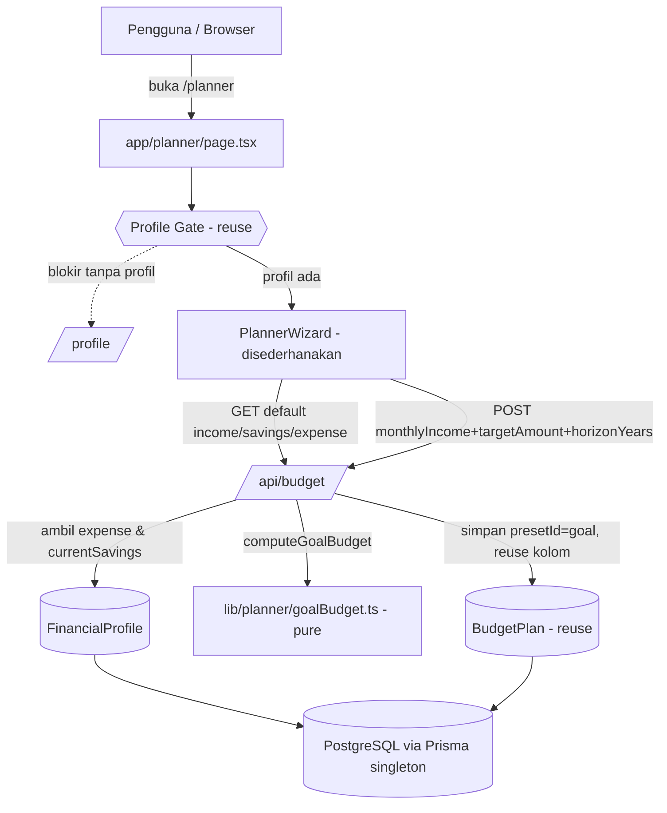
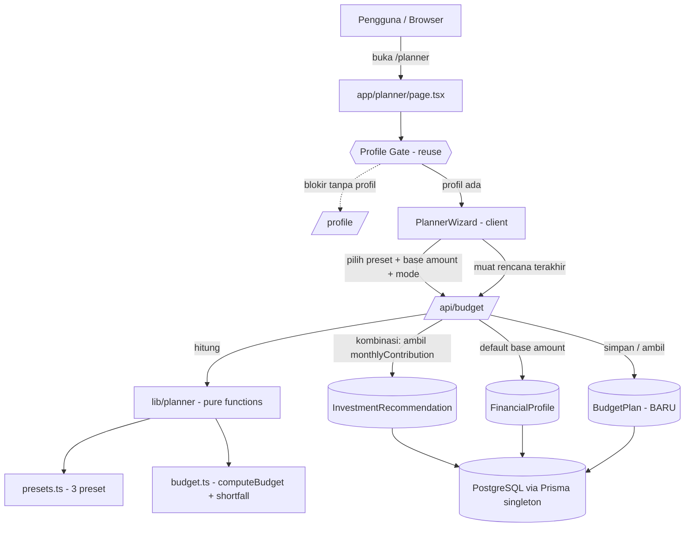
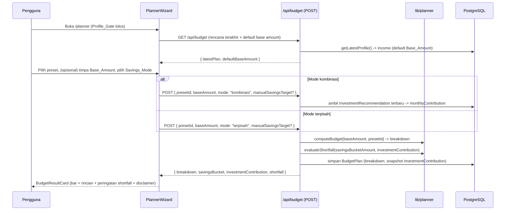

# Design Document

## Overview (Iterasi Goal-Driven) — OTORITATIF

> **Pivot arah Planner: dari preset/persentase-driven ke goal-driven.** Mulai iterasi ini, Planner **membalik** arah perhitungan. Alih-alih memilih persentase (preset/Custom) dengan target sebagai efek samping, pengguna memberi **`Monthly_Income`, `Current_Savings`, `Target_Amount`, `Horizon_Years`**, lalu sistem **menghitung `Ditabung` per bulan** dengan **akumulasi murni (plain accumulation) tanpa bunga**, menurunkan `Kebutuhan`/`Keinginan`, dan menyajikan **persentase sebagai OUTPUT** (`Derived_Percentage`).
>
> Bagian **"Desain Model Goal-Driven"** di bawah adalah **otoritatif** dan memenuhi **Requirement 17–21**. Bagian desain lama (Overview preset di bawah ini, Architecture, Components preset, Data Models preset, Correctness Properties 1–16, dan Delta 1–3) **DISUPERSEKSI** dan dipertahankan hanya sebagai konteks historis.
>
> **Ringkasan keputusan desain goal-driven:**
> - **Fungsi murni baru** `lib/planner/goalBudget.ts` — `computeGoalBudget(input)` → `GoalBudgetResult`. Akumulasi murni, tanpa anuitas/pertumbuhan.
> - **Modul lama disuperseksi (dipertahankan, tak dipakai UI/API Planner):** `presets.ts`, `budget.ts`, `savingsProjection.ts` tidak lagi dipanggil oleh alur Planner goal-driven. Boleh tetap ada di repo (tidak dihapus) tetapi tidak terhubung ke UI/API.
> - **UI disederhanakan:** `PresetPicker` **dihapus** dari alur; wizard menjadi form tunggal → hasil.
> - **Persistensi memakai ulang kolom `BudgetPlan`** dengan penanda `presetId = "goal"` — **tanpa migrasi Prisma**.

---

## Desain Model Goal-Driven (OTORITATIF)

### Prinsip

- **Perhitungan murni & terisolasi.** Seluruh matematika goal-driven berada di satu pure function `computeGoalBudget` di `lib/planner/goalBudget.ts`, hanya mengimpor tipe dari `@/types/planner` (mengikuti pola `lib/investment/*` dan konvensi `lib/planner/*` lama). Deterministik dan mudah diuji dengan PBT (Req 18.8).
- **Reuse infrastruktur.** Memakai ulang `Profile_Gate` (Req 21.1), `getLatestProfile()`, Prisma singleton (`lib/db.ts`), pola API runtime Node.js dengan error ramah, helper input Rupiah `lib/format/rupiahInput.ts`, dan pola visual `RecommendationCard` (bar proporsi + rincian pos + Rupiah + disclaimer).
- **Akumulasi murni (no growth).** Model sengaja tidak memakai bunga/pertumbuhan: `Ditabung = max(0, Target_Amount − Current_Savings) / Months_N`.
- **Persentase = OUTPUT.** Tidak ada input persentase; `Derived_Percentage` diturunkan untuk tampilan (Req 19).
- **Reuse kolom, tanpa migrasi.** `BudgetPlan.presetId` sudah `String` bebas dan `breakdown` sudah `Json`; penanda `presetId = "goal"` cukup (Req 21.6).

### Diagram Alur Goal-Driven



### Tipe Domain Goal-Driven (`types/planner.ts`)

Ditambahkan tanpa menghapus tipe lama (tipe preset/persentase tetap ada tetapi disuperseksi untuk alur ini). `BudgetLine` dipakai ulang untuk ketiga pos (dengan `percentage` = `Derived_Percentage`).

```ts
// Input goal-driven yang diterima computeGoalBudget (nilai presisi, Rupiah).
export interface GoalBudgetInput {
  monthlyIncome: number;   // > 0, berhingga
  currentSavings: number;  // >= 0, berhingga (saldo awal, selalu dihitung)
  targetAmount: number;    // > 0, berhingga
  horizonYears: number;    // bilangan bulat positif
  monthlyExpense: number;  // >= 0, berhingga (0 → rasio fallback Kebutuhan)
}

export type FeasibilitySeverity = "ok" | "tight" | "impossible";

export interface GoalFeasibility {
  feasible: boolean;             // false bila ditabung+kebutuhan > income
  severity: FeasibilitySeverity; // "ok" | "tight" | "impossible"
  reason: string;                // pesan + saran (Bahasa Indonesia) untuk UI
}

export interface GoalBudgetResult {
  monthlyIncome: number;   // echo input (dasar Derived_Percentage)
  monthsN: number;         // horizonYears * 12
  ditabung: number;        // Rupiah presisi (isSavings pos)
  kebutuhan: number;       // Rupiah presisi
  keinginan: number;       // Rupiah presisi (bisa < 0 pada kondisi tak layak)
  // Persentase turunan (OUTPUT), pos / monthlyIncome * 100:
  ditabungPct: number;
  kebutuhanPct: number;
  keinginanPct: number;
  // Ketiga pos sebagai BudgetLine (reuse tipe lama; percentage = Derived_Percentage,
  // amount = nominal Rupiah, isSavings = true hanya untuk Ditabung):
  lines: BudgetLine[];
  alreadyReached: boolean; // currentSavings >= targetAmount → ditabung 0
  feasibility: GoalFeasibility;
}
```

Catatan tipe: `PresetId`, `CustomAllocation`, `SavingsProjection`, `SavingsMode`, dsb. **tetap** di `types/planner.ts` tetapi **ditandai superseded/unused** untuk alur goal-driven (tidak diimpor `goalBudget.ts`).

### Fungsi Murni `lib/planner/goalBudget.ts`

Pure function — tanpa I/O, hanya mengimpor tipe dari `@/types/planner`. **Tidak** mengimpor `savingsProjection.ts`/`budget.ts`/`presets.ts` (yang kini disuperseksi).

```ts
import type { GoalBudgetInput, GoalBudgetResult } from "@/types/planner";

// computeGoalBudget: hitung Ditabung/Kebutuhan/Keinginan + persentase turunan +
// alreadyReached + feasibility dari input goal-driven. Akumulasi murni (no growth).
// Guard (throw Error): monthlyIncome berhingga > 0; currentSavings berhingga >= 0;
// targetAmount berhingga > 0; horizonYears bilangan bulat positif; monthlyExpense
// berhingga >= 0. Pembulatan hanya di tampilan (nilai hasil tetap presisi).
export function computeGoalBudget(input: GoalBudgetInput): GoalBudgetResult;
```

**Rumus & aturan (Req 18–20):**

1. **Guard input** (Req 17.6–17.10): `monthlyIncome` finite `> 0`; `currentSavings` finite `>= 0`; `targetAmount` finite `> 0`; `horizonYears` `Number.isInteger` & `> 0`; `monthlyExpense` finite `>= 0`. Bila gagal → `throw Error` (pesan Bahasa Indonesia).
2. **`monthsN = horizonYears * 12`** (Req 18.1).
3. **`ditabung = max(0, targetAmount − currentSavings) / monthsN`** (Req 18.2).
4. **`alreadyReached = currentSavings >= targetAmount`**; bila benar → `ditabung = 0` (Req 18.3). (Konsisten: `max(0, target−savings)=0` saat `savings>=target`.)
5. **`kebutuhan`** (Req 18.4, 18.5):
   - WHERE `monthlyExpense` finite `> 0` → `kebutuhan = monthlyExpense`.
   - ELSE (0/tidak valid/absen) → `kebutuhan = Math.round(0.65 * (monthlyIncome − ditabung))` (rasio fallback atas sisa setelah `Ditabung`).
6. **`keinginan = monthlyIncome − ditabung − kebutuhan`** (Req 18.6). Bisa negatif (dipakai `feasibility`).
7. **`Derived_Percentage`** (Req 19.1): `ditabungPct = ditabung/monthlyIncome*100`; `kebutuhanPct = kebutuhan/monthlyIncome*100`; `keinginanPct = keinginan/monthlyIncome*100`. (Karena `monthlyIncome > 0` dijamin guard, tidak ada pembagian nol.)
8. **`lines`**: tiga `BudgetLine` berurutan — Kebutuhan (`isSavings:false`), Keinginan (`isSavings:false`), Ditabung (`isSavings:true`) — dengan `amount` = nominal presisi dan `percentage` = `Derived_Percentage` masing-masing.
9. **`feasibility`** (Req 20), dievaluasi berurutan:
   - `ditabung > monthlyIncome` → `{ feasible:false, severity:"impossible", reason: "…menabung sebesar ini melebihi pemasukan; perpanjang jangka waktu atau turunkan target." }` (Req 20.2).
   - ELSE bila `ditabung + kebutuhan > monthlyIncome` → `{ feasible:false, severity:"tight" | … }` — target belum layak. Karena `ditabung+kebutuhan>income ⇔ keinginan<0`, ini termasuk kondisi `tight` (lihat berikut). Untuk kejelasan tingkat: bila `keinginan < 0` klasifikasikan `tight` dengan `feasible:false` dan saran memperpanjang horizon/menurunkan target (Req 20.1).
   - ELSE bila `keinginan < AMBANG` (`AMBANG = 0.05 * monthlyIncome`) → `{ feasible:true, severity:"tight", reason: "…sedikit/tidak ada sisa untuk keinginan; pertimbangkan menyesuaikan target atau jangka waktu." }` (Req 20.3). Catatan: bila `keinginan < 0` maka `feasible:false` (baris sebelumnya); bila `0 <= keinginan < AMBANG` maka `feasible:true, severity:"tight"`.
   - ELSE → `{ feasible:true, severity:"ok", reason:"" }` (Req 20.4).

   Ringkasnya (aturan tunggal yang konsisten dengan Req 20): `impossible` iff `ditabung>income`; jika bukan impossible, `feasible = (ditabung+kebutuhan <= income)`; `severity = "ok"` iff (`feasible` benar DAN `keinginan >= AMBANG`), selain itu `severity = "tight"`.
10. **Presisi (Req 18.7, 19.3):** `ditabung`, `kebutuhan` (kecuali fallback yang di-`round` sesuai Req 18.5), dan `keinginan` disimpan presisi; saat `ok`, `kebutuhan + keinginan + ditabung = monthlyIncome` (eksak untuk aritmetika riil; deviasi hanya galat float kecil + pembulatan `kebutuhan` fallback), dan jumlah `Derived_Percentage` = 100 dalam toleransi kecil.

### Modul yang Dipensiunkan vs Dipertahankan

| Berkas | Status Goal-Driven | Catatan |
|---|---|---|
| `lib/planner/goalBudget.ts` | **BARU (dipakai)** | Inti model goal-driven (`computeGoalBudget`). |
| `types/planner.ts` | **DIUBAH** | Tambah `GoalBudgetInput`, `FeasibilitySeverity`, `GoalFeasibility`, `GoalBudgetResult`; tipe lama dipertahankan (superseded/unused). |
| `lib/planner/presets.ts` | **PENSIUN (dipertahankan)** | `BUDGET_PRESETS`, `getPreset`, `buildCustomPreset` tak dipakai UI/API goal-driven. Boleh tetap di repo. |
| `lib/planner/budget.ts` | **PENSIUN (dipertahankan)** | `computeBudget`/`computeBudgetFromPreset`/`savingsBucketAmount`/`evaluateShortfall` tak dipakai. |
| `lib/planner/savingsProjection.ts` | **PENSIUN (dipertahankan)** | `monthsToReachTarget`/`requiredMonthlySaving` tak dipakai (model kini akumulasi murni tanpa anuitas). |

Keputusan: berkas lama **tidak dihapus** (menghindari perubahan luas & menjaga histori), tetapi **tidak lagi terhubung** ke `app/api/budget/route.ts` maupun komponen Planner goal-driven.

### Kontrak API Goal-Driven (`app/api/budget`)

**`GET /api/budget`** (Req 21.2) — konteks awal form:
- Alur: `getLatestProfile()` → `defaultMonthlyIncome = profile?.income ?? null`, `currentSavings = profile?.currentSavings ?? null`, `monthlyExpense = profile?.expense ?? null`. (Opsional: sertakan `latestPlan` bila dipertahankan.)
- Sukses → 200 `{ defaultMonthlyIncome, currentSavings, monthlyExpense, latestPlan? }`.
- `export const runtime = "nodejs"`; error DB → 500 pesan ramah.

**`POST /api/budget`** (Req 21.3–21.7) — hitung + simpan:
- Body: `{ monthlyIncome: number, targetAmount: number, horizonYears: number, userId?: string | null }`. `currentSavings` & `monthlyExpense` diambil dari profil server-side; `monthlyIncome` overrideable (default `income` profil).
- Validasi (→ 400, Req 21.4): `monthlyIncome` finite `> 0`; `targetAmount` finite `> 0`; `horizonYears` `Number.isInteger` & `> 0`.
- Alur:
  1. `getLatestProfile()` → `currentSavings = profile?.currentSavings ?? 0`, `monthlyExpense = profile?.expense ?? 0`.
  2. `result = computeGoalBudget({ monthlyIncome, currentSavings, targetAmount, horizonYears, monthlyExpense })` (guard error internal → 400 jaring pengaman).
  3. Persist `BudgetPlan` (Req 21.6): `presetId = "goal"`, `baseAmount = monthlyIncome`, `savingsTargetAmount = targetAmount`, `savingsHorizonYears = horizonYears`, `breakdown = result.lines` (Json), `mode`/`includeSavings`/`investmentContribution` = null/diomit (Req 21.7). **Tanpa migrasi.**
  4. Sukses → 200 `GoalBudgetResult` (tiga pos + `Derived_Percentage` + `feasibility` + `alreadyReached`).
- Error DB → 500 pesan ramah; `runtime = "nodejs"` (Req 21.8).

### Persistensi (Reuse Kolom `BudgetPlan`, Tanpa Migrasi)

Model `BudgetPlan` **tidak berubah** (tidak ada kolom baru, tidak ada migrasi Prisma). Pemetaan goal-driven:

| Kolom `BudgetPlan` | Nilai goal-driven |
|---|---|
| `presetId` (String) | `"goal"` (penanda) |
| `baseAmount` (Float) | `monthlyIncome` |
| `savingsTargetAmount` (Float?) | `targetAmount` |
| `savingsHorizonYears` (Int?) | `horizonYears` |
| `breakdown` (Json) | `result.lines` (tiga pos: nama, percentage=Derived_Percentage, amount, isSavings) |
| `mode` (String) | null/diomit |
| `includeSavings` (Boolean?) | null/diomit |
| `investmentContribution` (Float?) | null/diomit |
| `userId` (String?) | placeholder auth |

`currentSavings` dan `monthlyExpense` **tidak** dipersistensi (turunan profil, dihitung ulang dari profil terbaru — konsisten dengan keputusan lama untuk tidak menyimpan nilai turunan).

### Halaman & Komponen UI Goal-Driven

- **`app/planner/page.tsx`** (server): tetap dibungkus `ProfileGate` (reuse), `dynamic = "force-dynamic"`, header bergaya sama, me-render `PlannerWizard` yang disederhanakan.
- **`PlannerWizard.tsx`** (DIUBAH): **hapus** langkah `PresetPicker`. Disederhanakan menjadi **form → hasil** (2 langkah: "Tujuan & Pendapatan" → "Hasil", atau satu halaman). `GET /api/budget` untuk prefill `monthlyIncome`, `currentSavings` (konteks read-only), `monthlyExpense`; `POST /api/budget` untuk hitung/simpan; teruskan `GoalBudgetResult` ke result card.
- **`GoalBudgetForm` (form baru / rework `BudgetForm.tsx`)**: field `monthlyIncome` (prefill dari `defaultMonthlyIncome`, Rupiah dengan pemisah ribuan via `formatThousands`/`parseThousands`), `targetAmount` (Rupiah, pemisah ribuan), `horizonYears` (bilangan bulat tahun). Tampilkan `currentSavings` **read-only** sebagai konteks. Semua wajib; validasi klien mencerminkan server (income>0, target>0, horizon bulat>0) — cegah submit bila tidak valid.
- **`BudgetResultCard.tsx`** (DIUBAH): tampilkan tiga pos (Kebutuhan/Keinginan/Ditabung) dengan **nominal Rupiah + `Derived_Percentage`**, bar proporsi, baris "Ditabung Rp X/bulan untuk mencapai target Rp Y dalam Z tahun", status `alreadyReached`, dan **panel peringatan feasibility + saran** saat `severity` bukan `"ok"` (tight/impossible). Pertahankan token Miami blue, format Rupiah `Rp ${Math.round(v).toLocaleString("id-ID")}`, disclaimer edukatif.
- **`PresetPicker.tsx`**: **dihapus dari alur** (tidak dirender). Berkas boleh tetap ada tetapi tidak diimpor wizard goal-driven.
- **`app/page.tsx`**: tautan dashboard ke `/planner` **tidak berubah**.

---

## Overview (Model Preset/Persentase — SUPERSEDED, historis)

> Bagian berikut (Overview lama, Architecture, Components preset, Data Models preset, Correctness Properties 1–16, Delta 1–3) mendeskripsikan **arah lama** dan **DISUPERSEKSI** oleh "Desain Model Goal-Driven" di atas. Dipertahankan untuk keterlacakan.

**Budget Planner** menambahkan cakupan **Planner** ke aplikasi Financial Planner: alat penganggaran alokasi yang membagi pemasukan bulanan (`Base_Amount`) ke pos-pos anggaran menurut **metode preset** (`50/30/20`, `70/20/10`, `80/20`). Fitur ini menjawab pertanyaan pelengkap terhadap cakupan Investasi: *"Berapa yang sebaiknya saya alokasikan tiap bulan untuk kebutuhan, keinginan, dan tabungan?"*

Prinsip desain (selaras dengan pola `financial-planner` yang sudah ada):

- **Logika Planner murni dan terisolasi.** Definisi preset dan perhitungan alokasi ditulis sebagai pure function di `lib/planner/` (`presets.ts`, `budget.ts`), tanpa I/O — deterministik, mudah diuji (PBT), dan dapat dipakai ulang. Ini mengikuti pola `lib/investment/*`.
- **Reuse, bukan duplikasi.** Memakai ulang `Profile_Gate` (server component), `getLatestProfile()`, Prisma Client singleton (`lib/db.ts`), pola API route runtime Node.js dengan error ramah Bahasa Indonesia, dan pola visual `RecommendationCard` (bar proporsi + rincian per pos + format Rupiah + disclaimer).
- **Integrasi lintas cakupan.** Mode `kombinasi` menarik `monthlyContribution` dari `InvestmentRecommendation` terbaru sebagai pos "Investasi" otomatis, dan membandingkannya dengan alokasi tabungan preset untuk menandai *shortfall*.
- **Persistensi via model baru `BudgetPlan`.** Migrasi Prisma baru (tanpa reset DB), dengan `userId` nullable sebagai placeholder auth.
- **Allocation-only.** Pencatatan transaksi harian dan cash-flow tetap di luar cakupan (roadmap).

- **Proyeksi target tabungan opsional (tambahan).** Di atas alokasi, pengguna dapat mengisi `Savings_Target_Amount` (opsional) dan `Savings_Horizon` (opsional). Logika proyeksi ditambahkan sebagai pure function baru terisolasi di `lib/planner/savingsProjection.ts`, memakai ulang pendekatan Future Value of Annuity dari `lib/investment/projection.ts` untuk mode `kombinasi`. Ini murni **penambahan inkremental** ke berkas/kontrak yang sudah ada — bukan penulisan ulang.

Design ini memenuhi Requirements 1–12. Bagian bertanda **TAMBAHAN** menandai delta untuk kapabilitas proyeksi target tabungan; bagian lain tetap sesuai implementasi yang sudah ada (build-green).

## Architecture

### Diagram Konteks



### Alur Data Penganggaran



### Struktur Folder

Berkas dari iterasi alokasi (Req 1–10) sudah **ADA** (build-green). Delta proyeksi target tabungan (Req 11–12) ditandai `# TAMBAHAN`.

```text
/
├── app/
│   ├── api/
│   │   └── budget/route.ts            # ADA (DIUBAH): POST menerima savingsTargetAmount? + savingsHorizonYears? + includeSavings? (PV), GET juga kembalikan currentSavings; sertakan savingsProjection (incl. includeSavings/presentValue/alreadyReached) di respons
│   ├── planner/
│   │   └── page.tsx                   # ADA: server component, dibungkus Profile_Gate
│   └── page.tsx                       # ADA: tautan ke /planner
├── components/
│   └── planner/
│       ├── PlannerWizard.tsx          # ADA (DIUBAH): teruskan field proyeksi opsional + savingsProjection ke hasil
│       ├── PresetPicker.tsx           # ADA: pilih 1 dari 3 preset
│       ├── BudgetForm.tsx             # ADA (DIUBAH): + input opsional Savings_Target_Amount & Savings_Horizon; + toggle Include_Savings (tampil bila target diisi & currentSavings>0)
│       └── BudgetResultCard.tsx       # ADA (DIUBAH): + tampilan Savings_Projection (Arah A/B + status "tidak akan tercapai" + "sudah tercapai" + catatan saldo awal)
├── lib/
│   └── planner/
│       ├── presets.ts                 # ADA: konstanta 3 preset (pure)
│       ├── budget.ts                  # ADA: computeBudget + savingsBucketAmount + evaluateShortfall (pure)
│       └── savingsProjection.ts       # TAMBAHAN: monthsToReachTarget + requiredMonthlySaving (pure)
├── types/
│   └── planner.ts                     # ADA (DIUBAH): + tipe SavingsProjection & input proyeksi
└── prisma/
    └── schema.prisma                  # ADA (DIUBAH): + BudgetPlan.savingsTargetAmount Float? & savingsHorizonYears Int? (migrasi tambahan); + BudgetPlan.includeSavings Boolean? (migrasi aditif TAMBAHAN)
```

## Components and Interfaces

### Tipe Domain (`types/planner.ts`)

```ts
export type PresetId = "50/30/20" | "70/20/10" | "80/20";

export type SavingsMode = "terpisah" | "kombinasi";

export interface BudgetCategory {
  name: string;       // mis. "Kebutuhan", "Keinginan", "Tabungan & Investasi"
  percentage: number; // 0..100
  isSavings: boolean;  // menandai Savings_Bucket preset
}

export interface BudgetPreset {
  id: PresetId;
  label: string;                 // mis. "50/30/20"
  categories: BudgetCategory[];  // total percentage = 100
}

export interface BudgetLine {
  name: string;
  percentage: number;
  amount: number;    // Rupiah = baseAmount * percentage / 100
  isSavings: boolean;
}

export interface BudgetBreakdown {
  presetId: PresetId;
  baseAmount: number;
  lines: BudgetLine[]; // total amount ~= baseAmount (toleransi pembulatan)
}

export interface ShortfallResult {
  hasShortfall: boolean;
  savingsBucketAmount: number;     // total alokasi Savings_Bucket preset (Rupiah)
  investmentContribution: number;  // monthlyContribution dari rekomendasi (0 bila tak ada)
  gap: number;                     // max(0, investmentContribution - savingsBucketAmount)
}
```

**TAMBAHAN — tipe proyeksi target tabungan (Req 11, 12).** Ditambahkan ke `types/planner.ts` tanpa mengubah tipe yang sudah ada.

```ts
// Arah proyeksi: "time-to-goal" (target tanpa horizon) atau "required-monthly"
// (target + horizon). "none" bila target tidak diisi (tanpa proyeksi).
export type SavingsProjectionDirection = "none" | "time-to-goal" | "required-monthly";

// Hasil Arah A (Time_To_Goal): berapa bulan untuk mencapai target.
export interface MonthsToReachResult {
  reachable: boolean;        // false bila monthlySaving<=0 tanpa pertumbuhan (dan PV<target)
  months: number | null;     // null saat reachable === false; 0 bila alreadyReached
  alreadyReached: boolean;   // TAMBAHAN (Req 13.6): presentValue >= targetAmount → target sudah tercapai
}

// Hasil proyeksi lengkap yang dikembalikan API + dirender di UI.
export interface SavingsProjection {
  direction: SavingsProjectionDirection;
  targetAmount: number;         // Savings_Target_Amount (Rupiah)
  horizonYears: number | null;  // Savings_Horizon (null pada Arah A)
  monthlySavingRate: number;    // Monthly_Saving_Rate = savingsBucketAmount(breakdown)
  annualReturn: number;         // Growth_Rate dipakai (0 pada terpisah / fallback)
  // TAMBAHAN (Req 13, 14) — konteks present value:
  includeSavings: boolean;      // Include_Savings: apakah currentSavings dipakai sebagai saldo awal
  presentValue: number;         // Present_Value dipakai (currentSavings bila includeSavings, else 0)
  alreadyReached: boolean;      // Already_Reached: presentValue >= targetAmount
  // Arah A:
  reachable: boolean;           // false → "tidak akan tercapai dengan alokasi saat ini"
  months: number | null;        // estimasi bulan (null bila tidak reachable / Arah B; 0 bila alreadyReached)
  years: number | null;         // months / 12 (untuk tampilan "~Y tahun")
  // Arah B:
  requiredMonthly: number | null;   // Required_Monthly_Saving (null pada Arah A; 0 bila alreadyReached)
  allocationSufficient: boolean | null; // monthlySavingRate >= requiredMonthly
  monthlyGap: number | null;         // max(0, requiredMonthly - monthlySavingRate)
}
```

### Modul Logika Planner (`lib/planner/`)

Semua fungsi **pure** — tanpa I/O, hanya mengimpor tipe dari `@/types/planner` (mengikuti pola `lib/investment/*`).

**`presets.ts`**
```ts
import type { BudgetPreset, PresetId } from "@/types/planner";

// Konstanta terstruktur; persentase tiap preset berjumlah 100.
export const BUDGET_PRESETS: Record<PresetId, BudgetPreset>;

// Ambil preset by id; lempar error bila id tidak dikenal (Req 3.7).
export function getPreset(id: PresetId): BudgetPreset;
```

Definisi preset (Req 3.2–3.4):

| Preset | Kategori (persentase) | Savings_Bucket |
|---|---|---|
| `50/30/20` | Kebutuhan 50%, Keinginan 30%, Tabungan & Investasi 20% | "Tabungan & Investasi" |
| `70/20/10` | Kebutuhan 70%, Tabungan 20%, Keinginan 10% | "Tabungan" |
| `80/20` | Pengeluaran 80%, Tabungan 20% | "Tabungan" |

**`budget.ts`**
```ts
import type { BudgetBreakdown, PresetId, ShortfallResult } from "@/types/planner";

// computeBudget: baseAmount * (persentase/100) per kategori.
// Guard: lempar error bila baseAmount bukan angka berhingga non-negatif (Req 4.5),
// atau presetId tidak dikenal (Req 3.7).
export function computeBudget(baseAmount: number, presetId: PresetId): BudgetBreakdown;

// Jumlahkan alokasi kategori Savings_Bucket dari sebuah breakdown.
export function savingsBucketAmount(breakdown: BudgetBreakdown): number;

// evaluateShortfall: hasShortfall = savingsBucketAmount < investmentContribution.
// gap = max(0, investmentContribution - savingsBucketAmount).
export function evaluateShortfall(
  savingsBucketAmount: number,
  investmentContribution: number,
): ShortfallResult;
```

Catatan presisi: jumlah tiap kategori dihitung `baseAmount * percentage / 100`. Karena persentase preset berjumlah 100, jumlah seluruh kategori sama dengan `baseAmount` secara eksak untuk aritmetika riil; deviasi hanya berupa galat floating-point kecil (diuji dengan toleransi, Req 4.3). Pembulatan ke Rupiah dilakukan hanya di lapisan tampilan (format), bukan di dalam breakdown, agar total tetap presisi.

**TAMBAHAN — `savingsProjection.ts` (Req 11, 12).** Modul pure baru, hanya mengimpor tipe dari `@/types/planner`. Memakai ulang pendekatan Future Value of Annuity dari `lib/investment/projection.ts` (tidak mengimpornya — menjaga isolasi tipe Planner — melainkan menyalin pola rumus yang sama).

```ts
import type { MonthsToReachResult } from "@/types/planner";

// Arah A (Time_To_Goal): berapa bulan untuk mencapai targetAmount pada
// monthlySaving, dengan annualReturn desimal (0 → tanpa pertumbuhan).
// TAMBAHAN (Req 13): presentValue opsional (default 0) sebagai saldo awal.
export function monthsToReachTarget(args: {
  targetAmount: number;    // > 0
  monthlySaving: number;   // Monthly_Saving_Rate (>= 0)
  annualReturn: number;    // desimal >= 0 (0 → tanpa bunga)
  presentValue?: number;   // TAMBAHAN: Present_Value (>= 0, default 0)
}): MonthsToReachResult;

// Arah B (Required_Monthly_Saving): tabungan bulanan yang diperlukan untuk
// mencapai targetAmount dalam horizonYears, dengan annualReturn desimal.
// TAMBAHAN (Req 13): presentValue opsional (default 0) sebagai saldo awal.
export function requiredMonthlySaving(args: {
  targetAmount: number;    // > 0
  horizonYears: number;    // bilangan bulat positif
  annualReturn: number;    // desimal >= 0 (0 → tanpa bunga)
  presentValue?: number;   // TAMBAHAN: Present_Value (>= 0, default 0)
}): number;
```

Rumus (dengan `i = annualReturn / 12` sebagai tingkat bunga bulanan, dan `PV = presentValue` dengan default 0):

**TAMBAHAN — cek Already_Reached (Req 13.6).** Sebelum menghitung, kedua fungsi memeriksa: bila `PV >= targetAmount`, target sudah tercapai tanpa perlu menabung lagi:
- Arah A → `{ reachable: true, months: 0, alreadyReached: true }`.
- Arah B → `requiredMonthly = 0` (dan lapisan API menandai `alreadyReached: true`).

- **Arah A — `monthsToReachTarget`** (setelah cek Already_Reached)
  - Tanpa pertumbuhan (`i === 0`, mencakup fallback `annualReturn <= 0`):
    - Jika `monthlySaving <= 0` → sisa target (`targetAmount − PV > 0`) tak pernah terpenuhi → `{ reachable: false, months: null, alreadyReached: false }` (Req 12.6, 13.7). Ini satu-satunya penanganan agar tidak merender nilai tak hingga; nilai berhingga besar tetap ditampilkan apa adanya (Req 12.5).
    - Selain itu → `months = ceil(max(0, targetAmount − PV) / monthlySaving)` (Req 12.1, 13.4), `reachable: true`, `alreadyReached: false`.
  - Dengan pertumbuhan (`i > 0`, mode kombinasi):
    - Jika `monthlySaving <= 0` **dan** `PV < targetAmount` → dana tidak bertambah → `{ reachable: false, months: null, alreadyReached: false }` (Req 12.6). (Bila `PV*(1+i)^n` tumbuh melampaui target tanpa kontribusi tidak ditangani sebagai kasus khusus; dengan `monthlySaving <= 0` proyeksi dianggap tak tercapai untuk menjaga kesederhanaan dan konsistensi dengan perilaku lama.)
    - Selain itu, selesaikan anuitas dengan saldo awal `PV` untuk `n` (Req 12.3, 13.4):
      `n = ln((targetAmount × i + monthlySaving) / (PV × i + monthlySaving)) / ln(1 + i)`, lalu `months = ceil(n)`, `reachable: true`, `alreadyReached: false`.
  - Fallback: bila `annualReturn <= 0` atau tidak berhingga, gunakan cabang tanpa pertumbuhan (Req 12.4).
  - Ekuivalensi: dengan `PV = 0` (default / Include_Savings mati) rumus di atas menyederhana menjadi rumus lama (`ceil(targetAmount / monthlySaving)` dan `ln(1 + targetAmount × i / monthlySaving)/ln(1+i)`), sehingga perilaku identik dengan implementasi from-zero (Req 13.2).

- **Arah B — `requiredMonthlySaving`** (dengan `n = horizonYears × 12`, setelah cek Already_Reached)
  - Tanpa pertumbuhan (`i === 0`, mencakup fallback `annualReturn <= 0`): `requiredMonthly = (targetAmount − PV) / n` (Req 12.1, 13.5).
  - Dengan pertumbuhan (`i > 0`, mode kombinasi): Future Value of Annuity dengan saldo awal diselesaikan untuk PMT (rumus sama dengan `calculateMonthlyContribution` di `lib/investment/projection.ts`, Req 12.3, 13.5):
    `PMT = (targetAmount − PV × (1 + i)^n) × i / ((1 + i)^n − 1)`.
  - Fallback: `annualReturn <= 0`/tidak berhingga → cabang tanpa pertumbuhan (Req 12.4).
  - Hasil di-clamp minimum 0 (bila `PV` besar membuat PMT negatif → 0).
  - Ekuivalensi: dengan `PV = 0` rumus di atas menyederhana menjadi rumus lama (`targetAmount / n` dan `targetAmount × i / ((1 + i)^n − 1)`), identik dengan perilaku from-zero (Req 13.2).

Guard (konsisten gaya pure function lain): `targetAmount` harus angka berhingga `> 0`; `horizonYears` harus bilangan bulat positif berhingga; `annualReturn` harus angka berhingga `>= 0` (nilai negatif/`NaN`/tak hingga → error). `monthlySaving` harus angka berhingga `>= 0`. **TAMBAHAN (Req 13.9):** `presentValue` (bila diberikan) harus angka berhingga `>= 0`; nilai negatif/`NaN`/tak hingga → error. Default `presentValue = 0` bila tak diberikan.

**Orkestrasi proyeksi (di lapisan API, bukan di modul murni):** API menentukan `direction` dari kehadiran `savingsTargetAmount`/`savingsHorizonYears`, memilih `annualReturn` (0 untuk `terpisah`; `Growth_Rate` rekomendasi untuk `kombinasi`, 0 bila tak ada), **TAMBAHAN (Req 14.2):** menentukan `presentValue` (bila `includeSavings === true` → `profile?.currentSavings ?? 0` dari `getLatestProfile()`; else 0), memanggil fungsi murni yang sesuai dengan meneruskan `presentValue`, lalu menyusun objek `SavingsProjection` (mis. `years = months / 12`, `allocationSufficient = monthlySavingRate >= requiredMonthly`, `monthlyGap = max(0, requiredMonthly − monthlySavingRate)`, `includeSavings`, `presentValue`, dan `alreadyReached` — dari hasil fungsi Arah A atau dari cek `presentValue >= targetAmount` pada Arah B). `savingsProjection.ts` tetap murni dan tidak tahu soal mode/DB/profil; `presentValue` selalu dihitung di lapisan API.

### API Contracts (BARU)

**`GET /api/budget`** — muat konteks awal Planner
- Alur server: `getLatestProfile()` → `defaultBaseAmount = income` (atau null); **TAMBAHAN (Req 14.5):** `currentSavings = profile?.currentSavings ?? null`; ambil `BudgetPlan` terbaru bila ada.
- Sukses → HTTP 200 `{ defaultBaseAmount: number | null, currentSavings: number | null /* TAMBAHAN */, latestPlan: BudgetPlan | null }`.

**`POST /api/budget`** — hitung + simpan rencana anggaran
- Body (field proyeksi bertanda **TAMBAHAN**, opsional): `{ presetId: PresetId, baseAmount: number, mode: SavingsMode, manualSavingsTarget?: number | null, savingsTargetAmount?: number | null /* TAMBAHAN */, savingsHorizonYears?: number | null /* TAMBAHAN */, includeSavings?: boolean /* TAMBAHAN Req 14.1, default false */, userId?: string | null }`.
- Validasi: `presetId` ∈ 3 preset; `baseAmount` angka berhingga ≥ 0; `mode` ∈ {`terpisah`, `kombinasi`}; `manualSavingsTarget` bila ada ≥ 0. **TAMBAHAN:** bila diberikan, `savingsTargetAmount` harus angka berhingga `> 0` (Req 11.7); `savingsHorizonYears` harus bilangan bulat positif berhingga (`Number.isInteger` dan `> 0`, Req 11.8); `includeSavings` bila diberikan harus boolean (nilai non-boolean di-coerce/tolak, default `false`). Invalid → HTTP 400 `{ error }`.
- Alur server:
  1. `computeBudget(baseAmount, presetId)` → `breakdown`.
  2. `savingsBucketAmount(breakdown)` → jumlah `Savings_Bucket` (= `Monthly_Saving_Rate` untuk proyeksi).
  3. Bila `mode === "kombinasi"`: ambil `InvestmentRecommendation` terbaru (`orderBy createdAt desc`) → `investmentContribution = monthlyContribution` (atau `0` bila tidak ada, Req 5.5); simpan juga `annualReturn` (atau `0` bila tidak ada) sebagai `Growth_Rate` proyeksi.
  4. Bila `mode === "terpisah"`: `investmentContribution = 0`; `Growth_Rate = 0`; target = `manualSavingsTarget`.
  5. `evaluateShortfall(savingsBucketAmount, investmentContribution)` → `shortfall`.
  6. **TAMBAHAN — proyeksi:** bila `savingsTargetAmount` diberikan (> 0):
     - **Present_Value (Req 14.2):** `presentValue = includeSavings ? (getLatestProfile()?.currentSavings ?? 0) : 0`. (Profil sudah diambil untuk `defaultBaseAmount`/gate; reuse hasilnya bila memungkinkan.)
     - Tanpa `savingsHorizonYears` → Arah A: `monthsToReachTarget({ targetAmount, monthlySaving: savingsBucketAmount, annualReturn: growthRate, presentValue })`; ambil `reachable`, `months`, `alreadyReached` dari hasil.
     - Dengan `savingsHorizonYears` → Arah B: `requiredMonthlySaving({ targetAmount, horizonYears, annualReturn: growthRate, presentValue })`, lalu bandingkan dengan `savingsBucketAmount`; `alreadyReached = presentValue >= targetAmount` (requiredMonthly akan 0 pada kasus ini).
     - Susun objek `SavingsProjection` (lihat tipe), termasuk `includeSavings`, `presentValue`, dan `alreadyReached`. Bila `savingsTargetAmount` tidak diberikan → `savingsProjection = null` (tanpa proyeksi, Req 11.2), dan `includeSavings` diabaikan (toggle hanya bermakna saat ada target).
  7. Simpan `BudgetPlan` (snapshot `investmentContribution` di kombinasi; **TAMBAHAN:** simpan `savingsTargetAmount`, `savingsHorizonYears` bila ada, dan `includeSavings` — Req 14.3). Catatan: `presentValue` **tidak** dipersistensi karena turunan dari profil; hanya pilihan `includeSavings` yang direkam.
- Sukses → HTTP 200 `{ breakdown, savingsBucketAmount, investmentContribution, manualSavingsTarget, shortfall, savingsProjection /* TAMBAHAN: SavingsProjection | null, memuat includeSavings/presentValue/alreadyReached */, recommendationMissing? }`.
- Error mesin (input tidak valid) → HTTP 400; error DB → HTTP 500 `{ error }` ramah pengguna.
- `export const runtime = "nodejs"` (konsisten dengan route lain).

### Halaman & Komponen UI

- **`app/planner/page.tsx`** (server component): dibungkus `ProfileGate` (reuse), `export const dynamic = "force-dynamic"` (karena gate query DB), header bergaya sama dengan `app/investment/page.tsx` (badge aksen, tautan kembali ke dashboard), lalu me-render `PlannerWizard`.
- **`PlannerWizard.tsx`** (client): orkestrasi langkah `PresetPicker` → `BudgetForm` → `BudgetResultCard`; memanggil `GET /api/budget` untuk default `Base_Amount` + **TAMBAHAN `currentSavings`** + rencana terakhir, dan `POST /api/budget` untuk menghitung/menyimpan. **TAMBAHAN:** meneruskan `currentSavings` ke `BudgetForm` (agar toggle `Include_Savings` dapat menampilkan nominalnya) dan mengirim `includeSavings` pada body `POST`.
- **`PresetPicker.tsx`**: menampilkan 3 preset sebagai kartu pilih (persentase per kategori terlihat), menandai preset terpilih dengan token `--accent`.
- **`BudgetForm.tsx`** (DIUBAH): input `Base_Amount` (prefilled dari `defaultBaseAmount`, dapat ditimpa), pemilih `Savings_Mode` (`terpisah`/`kombinasi`), input opsional `Manual_Savings_Target`. Dalam mode `kombinasi`, menampilkan `investmentContribution` yang ditarik (read-only informatif). **TAMBAHAN:** dua field opsional baru — `Savings_Target_Amount` (Rupiah) dan `Savings_Horizon` (tahun) — dengan hint yang menjelaskan Arah A vs B: "isi target saja → estimasi waktu tercapai; isi target + jangka waktu → tabungan bulanan yang diperlukan". Nilai proyeksi diteruskan ke `onSubmit` sebagai `savingsTargetAmount: number | null` dan `savingsHorizonYears: number | null` (validasi lapisan form: bila target diisi harus `> 0`; bila horizon diisi harus bilangan bulat `> 0`). **TAMBAHAN — toggle `Include_Savings` (Req 14.6):** sebuah checkbox "Sertakan tabungan saat ini" yang ditampilkan **hanya** ketika `Savings_Target_Amount` telah diisi **dan** `currentSavings` (dari props wizard) `> 0`; label menampilkan nominal `currentSavings` (mis. "Sertakan tabungan saat ini (Rp …)"). Default tidak dicentang (`false`). Nilainya diteruskan ke `onSubmit` sebagai `includeSavings: boolean`. Bila kondisi tampil tidak terpenuhi, toggle tidak dirender dan `includeSavings` default `false` — API tetap menangani `includeSavings` secara defensif apa pun kondisinya.
- **`BudgetResultCard.tsx`** (DIUBAH): mengikuti pola visual `RecommendationCard` — bar proporsi gabungan (warna berputar), rincian per pos (`name`, `percentage`, `amount` dalam Rupiah), panel peringatan `Savings_Shortfall` bila ada, dan disclaimer edukatif wajib. Format Rupiah: `Rp ${Math.round(v).toLocaleString("id-ID")}`. **TAMBAHAN:** panel `Savings_Projection` opsional (dirender hanya bila `savingsProjection` tidak null):
  - Arah A (`direction: "time-to-goal"`) dan `reachable` → "Target Rp … tercapai dalam ~X bulan (~Y tahun)".
  - Arah B (`direction: "required-monthly"`) → "Butuh Rp …/bulan untuk mencapai Rp … dalam Y tahun" plus badge status: alokasi preset cukup (hijau) atau kurang Rp … (amber) berdasarkan `allocationSufficient`/`monthlyGap`.
  - `reachable === false` → status "Tidak akan tercapai dengan alokasi saat ini" (Req 12.6), tanpa merender nilai tak hingga.
  - Nilai berhingga besar ditampilkan apa adanya, tanpa cap/peringatan (Req 12.5).
  - **TAMBAHAN — Include_Savings (Req 14.7):** bila `savingsProjection.includeSavings === true`, tampilkan catatan bahwa tabungan saat ini (`presentValue`) dihitung sebagai saldo awal (mis. "Termasuk tabungan saat ini Rp … sebagai saldo awal"). Bila `savingsProjection.alreadyReached === true`, tampilkan status "Sudah tercapai" (Arah A: ~0 bulan; Arah B: tidak perlu tabungan tambahan) alih-alih Arah A/B biasa. Selain kasus itu, tampilan Arah A/B tetap seperti biasa dan otomatis mencerminkan sisa target yang berkurang karena saldo awal.
- **`app/page.tsx`** (diubah minimal): tambahkan satu kartu/tautan menuju `/planner` di dashboard.

## Data Models

### Model Prisma Baru (`prisma/schema.prisma`)

Ditambahkan **tanpa mengubah** model yang ada. Migrasi baru (`prisma migrate dev --name add_budget_plan`), **bukan** reset DB.

```prisma
model BudgetPlan {
  id                     String   @id @default(cuid())
  userId                 String?  // placeholder auth (nullable)
  presetId               String   // "50/30/20" | "70/20/10" | "80/20"
  baseAmount             Float
  mode                   String   // "terpisah" | "kombinasi"
  manualSavingsTarget    Float?   // opsional
  investmentContribution Float?   // snapshot monthlyContribution (kombinasi)
  savingsTargetAmount    Float?   // TAMBAHAN (Req 12.7): nominal target tabungan opsional
  savingsHorizonYears    Int?     // TAMBAHAN (Req 12.7): jangka waktu opsional (tahun)
  includeSavings         Boolean? // TAMBAHAN (Req 14.3): pilihan sertakan tabungan saat ini sbg saldo awal
  breakdown              Json     // BudgetLine[] hasil computeBudget
  createdAt              DateTime @default(now())
}
```

**TAMBAHAN — migrasi aditif.** Field `savingsTargetAmount`/`savingsHorizonYears` bersifat **nullable** sehingga migrasi murni tambahan (`prisma migrate dev --name add_savings_projection`), **tidak** mengubah kolom lama dan **tidak** mereset DB — data `BudgetPlan` yang sudah ada tetap valid (kolom baru bernilai `NULL`).

**TAMBAHAN — migrasi aditif Include_Savings (Req 14.3).** Field `includeSavings Boolean?` juga **nullable** dan ditambahkan lewat migrasi aditif terpisah (`prisma migrate dev --name add_include_savings`), **tanpa** mengubah kolom lain dan **tanpa** reset DB — baris `BudgetPlan` lama bernilai `NULL` (diinterpretasikan sebagai `false`/tidak menyertakan). `presentValue` **tidak** dipersistensi karena murni turunan dari `Financial_Profile.currentSavings` saat perhitungan.

Catatan:
- `breakdown` disimpan sebagai `Json` (daftar `BudgetLine`) agar fleksibel terhadap jumlah kategori per preset (2 atau 3).
- `investmentContribution` adalah **snapshot** nilai `monthlyContribution` dari `InvestmentRecommendation` terbaru pada saat penyimpanan (mode `kombinasi`); menyimpannya membuat rencana tetap konsisten meski rekomendasi berubah kemudian.
- `presetId` dan `mode` disimpan sebagai `String` (konsisten dengan penyimpanan `riskProfile`/`profile` sebagai `String` pada model yang ada); validasi nilai dilakukan di lapisan API + tipe TypeScript.

### Struktur Konstanta Preset

`BUDGET_PRESETS` adalah `Record<PresetId, BudgetPreset>` konstan di `lib/planner/presets.ts`. Contoh entri:

```ts
"50/30/20": {
  id: "50/30/20",
  label: "50/30/20",
  categories: [
    { name: "Kebutuhan", percentage: 50, isSavings: false },
    { name: "Keinginan", percentage: 30, isSavings: false },
    { name: "Tabungan & Investasi", percentage: 20, isSavings: true },
  ],
}
```

Invarian: untuk setiap preset, `sum(categories[].percentage) === 100` dan tepat satu (atau lebih) kategori memiliki `isSavings: true` untuk menandai `Savings_Bucket`.

### Snapshot `monthlyContribution` (kontrak lintas cakupan)

Mode `kombinasi` membaca `InvestmentRecommendation` terbaru via Prisma (`orderBy: { createdAt: "desc" }`) dan mengambil `monthlyContribution`. Nilai ini menjadi `Investment_Contribution`, di-snapshot ke `BudgetPlan.investmentContribution`, dan dibandingkan dengan alokasi `Savings_Bucket` untuk menghitung `Savings_Shortfall`. Bila belum ada rekomendasi, `Investment_Contribution = 0` (Req 5.5).

## Correctness Properties

*A property is a characteristic or behavior that should hold true across all valid executions of a system — essentially, a formal statement about what the system should do. Properties serve as the bridge between human-readable specifications and machine-verifiable correctness guarantees.*

Bagian ini berlaku untuk logika murni di `lib/planner/` (`presets.ts`, `budget.ts`) yang merupakan pure function dengan ruang input besar (nilai `Base_Amount` sembarang, tiap preset) — cocok untuk property-based testing. Lapisan API wiring (baca profil/rekomendasi, persistensi `BudgetPlan`), `Profile_Gate`, dan rendering UI diuji dengan example-based/integration/component test (lihat Testing Strategy), bukan properti.

Hasil prework dirangkum menjadi 5 properti untuk alokasi (Property 1–5) ditambah 4 properti TAMBAHAN untuk proyeksi target tabungan (Property 6–9) setelah refleksi redundansi. Untuk proyeksi: Arah B + fallback tanpa pertumbuhan digabung ke satu properti round-trip (Property 6); Arah A digabung ke satu properti konsistensi (Property 7) yang mencakup cabang tanpa-bunga (ceil) dan berpertumbuhan (solve-n) sekaligus; kondisi tepi laju-nol dipisah (Property 8) karena menguji jaminan berbeda (tidak menghasilkan nilai tak hingga); dan kondisi error digabung (Property 9).

### Property 1: Alokasi per pos sesuai preset dan proporsi

*For any* `Base_Amount` berhingga yang tidak negatif dan setiap `PresetId` yang valid, `computeBudget` SHALL mengembalikan `lines` yang jumlah dan nama posnya persis sama dengan kategori preset, dengan `amount` tiap pos sama dengan `Base_Amount × percentage ÷ 100`.

**Validates: Requirements 4.1, 4.2, 3.6**

### Property 2: Total alokasi sama dengan jumlah dasar

*For any* `Base_Amount` berhingga yang tidak negatif dan setiap `PresetId` yang valid, jumlah seluruh `lines[].amount` dari `computeBudget` SHALL sama dengan `Base_Amount` dalam toleransi pembulatan numerik kecil.

**Validates: Requirements 4.3**

### Property 3: Persentase setiap preset berjumlah 100

*For any* `Budget_Preset` di dalam `BUDGET_PRESETS`, jumlah `percentage` seluruh kategorinya SHALL sama dengan 100.

**Validates: Requirements 3.5**

### Property 4: Penandaan kekurangan dana investasi konsisten

*For any* nilai `savingsBucketAmount` dan `investmentContribution` yang tidak negatif, `evaluateShortfall` SHALL mengembalikan `hasShortfall` bernilai benar jika dan hanya jika `savingsBucketAmount < investmentContribution`, dan `gap` sama dengan `max(0, investmentContribution − savingsBucketAmount)`.

**Validates: Requirements 6.1, 6.2, 6.3, 6.4**

### Property 5: Input tidak valid ditolak

*For any* `Base_Amount` yang bukan angka berhingga tidak negatif (negatif, `NaN`, atau tak hingga) atau `PresetId` di luar himpunan `{50/30/20, 70/20/10, 80/20}`, `computeBudget`/`getPreset` SHALL melempar error alih-alih mengembalikan hasil.

**Validates: Requirements 2.3, 4.5, 3.7**

*Properti berikut bertanda TAMBAHAN dan berlaku untuk modul murni `lib/planner/savingsProjection.ts` (Req 11–12). Fungsi ini murni dengan ruang input besar (target, laju tabungan, horizon, imbal hasil sembarang) sehingga cocok untuk property-based testing. Nilai `annualReturn` mencakup 0 (tanpa pertumbuhan, mode terpisah / fallback) dan > 0 (mode kombinasi), sehingga satu properti menguji kedua cabang sekaligus.*

### Property 6: Required_Monthly_Saving mencapai target (round-trip FV annuity) — TAMBAHAN

*For any* `targetAmount` berhingga > 0, `horizonYears` bilangan bulat positif, dan `annualReturn` berhingga ≥ 0, menabung `requiredMonthlySaving({ targetAmount, horizonYears, annualReturn })` setiap bulan selama `horizonYears × 12` periode (mengakumulasi dengan bunga bulanan `annualReturn/12` bila > 0, atau tanpa bunga bila 0) SHALL menghasilkan nilai akhir yang sama dengan `targetAmount` dalam toleransi numerik relatif kecil.

**Validates: Requirements 11.4, 12.1, 12.3, 12.4**

### Property 7: Konsistensi Time_To_Goal (monthsToReachTarget) — TAMBAHAN

*For any* `targetAmount` berhingga > 0, `monthlySaving` berhingga > 0, dan `annualReturn` berhingga ≥ 0, `monthsToReachTarget` SHALL mengembalikan `reachable = true` dengan `months` bilangan bulat terkecil sehingga akumulasi tabungan selama `months` periode ≥ `targetAmount` sedangkan akumulasi selama `months − 1` periode < `targetAmount`.

**Validates: Requirements 11.3, 12.1, 12.3, 12.4**

### Property 8: Laju tabungan nol tanpa pertumbuhan → tidak akan tercapai — TAMBAHAN

*For any* `targetAmount` berhingga > 0 dan `monthlySaving ≤ 0` dengan `annualReturn = 0` (tanpa pertumbuhan), `monthsToReachTarget` SHALL mengembalikan `{ reachable: false, months: null }` alih-alih nilai tak hingga; untuk `monthlySaving > 0` yang menghasilkan `months` berhingga besar, fungsi SHALL tetap mengembalikan nilai berhingga tersebut apa adanya (tanpa membatasinya).

**Validates: Requirements 12.5, 12.6**

### Property 9: Input proyeksi tidak valid ditolak — TAMBAHAN

*For any* `targetAmount` yang bukan angka berhingga > 0, atau `horizonYears` yang bukan bilangan bulat positif berhingga (untuk `requiredMonthlySaving`), atau `annualReturn` yang bukan angka berhingga ≥ 0, **atau `presentValue` yang diberikan namun bukan angka berhingga ≥ 0 (TAMBAHAN Req 13.9)**, fungsi proyeksi terkait SHALL melempar error alih-alih mengembalikan hasil.

**Validates: Requirements 11.7, 11.8, 13.9**

*Properti berikut (Property 10–13) bertanda TAMBAHAN untuk kapabilitas Include_Savings / Present_Value (Requirement 13). Parameter `presentValue` (default 0) menambah dimensi input pada `monthsToReachTarget` dan `requiredMonthlySaving` yang tetap murni — cocok untuk property-based testing. Setelah refleksi redundansi: ekuivalensi default (Property 10) unik karena menjamin tidak ada regresi terhadap perilaku from-zero; round-trip Arah B dengan PV (Property 11) dan konsistensi boundary Arah A dengan PV (Property 12) menguji pencapaian target dan sudah menyubsumsi cabang tanpa/berpertumbuhan; already-reached digabung untuk Arah A & B ke satu properti (Property 13). Kasus laju-nol tanpa pertumbuhan dengan PV < target tetap tercakup Property 8 (perilaku tidak berubah), dan guard `presentValue` tidak valid digabung ke Property 9.*

### Property 10: presentValue = 0 mereproduksi hasil from-zero (ekuivalensi) — TAMBAHAN

*For any* `targetAmount` berhingga > 0, `monthlySaving`/`horizonYears` valid, dan `annualReturn` berhingga ≥ 0, memanggil `monthsToReachTarget`/`requiredMonthlySaving` dengan `presentValue = 0` (atau tanpa argumen `presentValue`) SHALL menghasilkan nilai yang sama persis dengan perhitungan akumulasi murni dari 0 (perilaku Property 6 dan 7), sehingga toggle Include_Savings yang mati tidak mengubah perilaku apa pun.

**Validates: Requirements 13.2**

### Property 11: Required_Monthly_Saving dengan saldo awal mencapai target (round-trip FV annuity + PV) — TAMBAHAN

*For any* `targetAmount` berhingga > 0, `horizonYears` bilangan bulat positif, `annualReturn` berhingga ≥ 0, dan `presentValue` berhingga dengan `0 ≤ presentValue < targetAmount`, menabung `requiredMonthlySaving({ targetAmount, horizonYears, annualReturn, presentValue })` setiap bulan selama `horizonYears × 12` periode DITAMBAH pertumbuhan saldo awal `presentValue` (yakni `presentValue × (1 + i)^n` bila `i > 0`, atau `presentValue` bila `i = 0`) SHALL menghasilkan nilai akhir yang sama dengan `targetAmount` dalam toleransi numerik relatif kecil.

**Validates: Requirements 13.5**

### Property 12: Konsistensi Time_To_Goal dengan saldo awal (monthsToReachTarget + PV) — TAMBAHAN

*For any* `targetAmount` berhingga > 0, `monthlySaving` berhingga > 0, `annualReturn` berhingga ≥ 0, dan `presentValue` berhingga dengan `0 ≤ presentValue < targetAmount`, `monthsToReachTarget` SHALL mengembalikan `reachable = true`, `alreadyReached = false`, dan `months` bilangan bulat terkecil sehingga akumulasi (saldo awal `presentValue` yang tumbuh + tabungan bulanan) selama `months` periode ≥ `targetAmount` sedangkan akumulasi selama `months − 1` periode < `targetAmount`.

**Validates: Requirements 13.4**

### Property 13: presentValue ≥ target → sudah tercapai (Arah A & B) — TAMBAHAN

*For any* `targetAmount` berhingga > 0 dan `presentValue` berhingga dengan `presentValue ≥ targetAmount`, `monthsToReachTarget` SHALL mengembalikan `{ reachable: true, months: 0, alreadyReached: true }` dan `requiredMonthlySaving` SHALL mengembalikan 0, apa pun nilai `monthlySaving`/`horizonYears`/`annualReturn` yang valid.

**Validates: Requirements 13.6**

## Error Handling

| Kondisi | Deteksi | Respons | Req |
|---|---|---|---|
| Profil belum ada saat akses Planner | `Profile_Gate` cek `getLatestProfile()` | Redirect ke `/profile` | 1.1 |
| `Base_Amount` negatif/non-berhingga | Guard di `computeBudget` + validasi API | Lempar error → HTTP 400 + JSON error | 2.3, 4.5 |
| `presetId` tidak dikenal | Guard di `getPreset`/`computeBudget` + validasi API | HTTP 400 + JSON error | 3.7 |
| `mode` bukan `terpisah`/`kombinasi` | Validasi API | HTTP 400 + JSON error | 5.1 |
| `manualSavingsTarget` negatif | Validasi API | HTTP 400 + JSON error | 5.2, 5.4 |
| Mode `kombinasi` tanpa `InvestmentRecommendation` | Cek query DB null | `investmentContribution = 0` + info ke pengguna | 5.5 |
| `savingsTargetAmount` bukan berhingga > 0 (diisi) | Guard `savingsProjection.ts` + validasi API | Lempar error → HTTP 400 + JSON error | 11.7 |
| `savingsHorizonYears` bukan bilangan bulat positif (diisi) | `Number.isInteger` & > 0 di API + guard `requiredMonthlySaving` | HTTP 400 + JSON error | 11.8 |
| `Monthly_Saving_Rate` = 0 tanpa pertumbuhan & `PV < target` (target tak tercapai) | Cabang `monthsToReachTarget` | `{ reachable: false, months: null, alreadyReached: false }` → status "tidak akan tercapai" (bukan Infinity) | 12.6, 13.7 |
| `presentValue` diberikan tapi bukan berhingga ≥ 0 | Guard `savingsProjection.ts` (kedua fungsi) | Lempar error → HTTP 400 + JSON error | 13.9 |
| `PV ≥ target` (sudah tercapai) | Cek awal di `monthsToReachTarget`/orkestrasi API | Arah A `months 0` + `alreadyReached: true`; Arah B `requiredMonthly 0`; UI tampil status "sudah tercapai" | 13.6, 14.7 |
| `includeSavings` true tapi profil/currentSavings tidak ada | Orkestrasi API (`profile?.currentSavings ?? 0`) | `presentValue = 0` (fallback aman), proyeksi berjalan seperti from-zero | 14.2 |
| Operasi database gagal | `try/catch` di route | HTTP 500 + pesan ramah tanpa detail internal | 7.5 |

## Testing Strategy

**Pendekatan ganda** (mengikuti pola `financial-planner`):

- **Property-based tests** (Vitest + `fast-check`) untuk logika murni `lib/planner/*` (`computeBudget`, `getPreset`, `evaluateShortfall`, invarian preset, **dan TAMBAHAN `savingsProjection.ts`** — `monthsToReachTarget`, `requiredMonthlySaving`, **termasuk parameter `presentValue` untuk Property 10–13**). Minimum 100 iterasi per properti. Setiap test diberi tag `Feature: budget-planner, Property {n}: {teks properti}` dan merujuk nomor properti pada dokumen ini. Generator TAMBAHAN: `presentValue` `fc.double` non-negatif berhingga, dengan sub-generator `0 ≤ PV < target` (Property 11, 12) dan `PV ≥ target` (Property 13).
- **Unit tests (example-based)** untuk nilai konstanta preset spesifik (kategori & persentase per preset), format Rupiah, dan angka yang diverifikasi manual.
- **Integration/component tests** untuk:
  - `GET /api/budget` mengembalikan default `Base_Amount` dari profil + rencana terakhir.
  - `POST /api/budget` mode `terpisah` (investmentContribution 0) dan `kombinasi` (menarik `monthlyContribution`, snapshot tersimpan; kasus tanpa rekomendasi → 0).
  - Persistensi `BudgetPlan` (field benar, **TAMBAHAN:** `savingsTargetAmount`/`savingsHorizonYears` tersimpan bila ada, `NULL` bila tidak) dan penanganan error DB (mock throw → HTTP 500 ramah).
  - **TAMBAHAN** — `POST /api/budget` proyeksi: tanpa `savingsTargetAmount` → `savingsProjection` null (perilaku alokasi seperti biasa); Arah A (target tanpa horizon); Arah B (target + horizon) cukup vs kurang; mode `kombinasi` memakai `annualReturn` rekomendasi; validasi `savingsTargetAmount`/`savingsHorizonYears` → 400.
  - **TAMBAHAN — Include_Savings (Req 14):** `POST /api/budget` dengan `includeSavings: true` memakai `currentSavings` sebagai `presentValue` (proyeksi memperhitungkan saldo awal, respons memuat `includeSavings/presentValue/alreadyReached`); `includeSavings: false`/tanpa → `presentValue 0` (hasil identik from-zero); `PV ≥ target` → `alreadyReached true`; persistensi `includeSavings` (ada vs `NULL`); `GET /api/budget` mengembalikan `currentSavings`. Diuji dengan 1–3 contoh representatif (integration), bukan properti.
  - `Profile_Gate` (reuse): redirect saat profil null.
  - `BudgetResultCard`: rincian per pos, bar proporsi, peringatan shortfall, disclaimer edukatif, **dan TAMBAHAN panel `Savings_Projection`** (Arah A "~X bulan (~Y tahun)"; Arah B nominal/bulan + cukup/kurang; status "tidak akan tercapai"; nilai besar apa adanya; **TAMBAHAN** status "sudah tercapai" saat `alreadyReached` + catatan saldo awal saat `includeSavings`).
  - **TAMBAHAN** — `BudgetForm`: toggle `Include_Savings` muncul hanya saat target diisi & `currentSavings > 0` (component test contoh).
  - Dashboard menautkan `/planner`.

**Mengapa PBT hanya untuk `lib/planner/*`:**
- Fungsi murni dengan perilaku bervariasi terhadap input (`Base_Amount` sembarang) → 100 iterasi menemukan galat pembulatan dan kasus tepi.
- Persistensi PostgreSQL, konfigurasi Prisma, pembacaan rekomendasi, dan rendering UI **tidak** cocok PBT: gunakan integration/component test dengan 1–3 contoh representatif.

**Konfigurasi property test:**
- Library PBT (`fast-check`) — jangan implementasi dari nol; minimum 100 iterasi.
- Generator `Base_Amount`: `fc.double` non-negatif berhingga (termasuk 0 dan nilai besar); generator preset dari kunci `BUDGET_PRESETS`; generator pasangan (savings, contribution) non-negatif untuk shortfall.

**TDD:** logika murni `lib/planner/*` ditulis test-first sebelum API dan UI.

**Catatan sub-task test opsional:** semua sub-task test ditandai `*` di `tasks.md` dan boleh dilewati untuk MVP cepat (konsisten dengan spec `financial-planner`).

## Keputusan Teknis Utama (Rationale)

- **Preset terstruktur, bukan kategori kustom penuh.** Menyediakan 3 metode teruji menjaga UX sederhana dan perhitungan deterministik; memodelkan preset sebagai konstanta `Record<PresetId, BudgetPreset>` membuat penambahan preset baru mudah tanpa mengubah `computeBudget`.
- **Pembulatan hanya di lapisan tampilan.** `computeBudget` mempertahankan nilai presisi (float) agar total pos tetap sama dengan `Base_Amount`; pembulatan Rupiah (`Math.round`) dilakukan saat format (`BudgetResultCard`), mencegah "kebocoran" akibat pembulatan per pos.
- **Snapshot `investmentContribution`.** Menyimpan nilai kontribusi investasi pada saat penyimpanan menjaga rencana anggaran tetap koheren meski `InvestmentRecommendation` berubah kemudian, dan menghindari join runtime.
- **Reuse `Profile_Gate` & Prisma singleton.** Tidak menduplikasi guard maupun manajemen koneksi; konsisten dengan cakupan Investasi dan aman terhadap hot reload dev.
- **`lib/planner/*` sebagai pure function terisolasi** (impor hanya dari `@/types/planner`) memungkinkan pengujian menyeluruh dan pemakaian ulang, mengikuti pola `lib/investment/*` (Req 10).
- **Allocation-only, transaksi/cash-flow ditunda.** Menjaga cakupan iterasi kecil dan dapat dikirim; pencatatan transaksi tetap roadmap.
- **Proyeksi target tabungan sebagai tambahan opsional & adaptif (TAMBAHAN).** Field `Savings_Target_Amount` menjadi *pemicu* proyeksi; kehadiran `Savings_Horizon` menentukan *arah*: tanpa horizon → estimasi waktu (Arah A, output), dengan horizon → tabungan bulanan yang diperlukan + penilaian cukup/kurang (Arah B, input). Ini menjaga alur lama tidak berubah bila field kosong (Req 11.2) dan memberi nilai tambah tanpa menambah langkah wajib.
- **`Monthly_Saving_Rate` = alokasi `Savings_Bucket` preset.** Memilih laju tabungan dari alokasi preset (bukan `Manual_Savings_Target`) menjaga proyeksi sebagai turunan murni dari anggaran alokasi, konsisten, dan mudah diuji. Untuk mode `terpisah` proyeksi adalah akumulasi murni dari 0 (tidak menarik `currentSavings`) agar tetap murni turunan alokasi (Req 12.2); ini disengaja berbeda dari cakupan Investasi yang memakai `presentValue`.
- **Reuse rumus FV annuity, bukan mengimpor modul Investasi.** `savingsProjection.ts` menyalin pola rumus `lib/investment/projection.ts` (solve-PMT dan solve-n) agar `lib/planner/*` tetap hanya bergantung pada `@/types/planner` (Req 11.6), menghindari kopling lintas cakupan.
- **Tampilkan apa adanya, kecuali laju nol tanpa pertumbuhan.** Nilai berhingga besar (ratusan tahun) ditampilkan tanpa cap/peringatan (Req 12.5); satu-satunya pengecualian adalah laju tabungan efektif nol tanpa pertumbuhan yang secara matematis tak berhingga — direpresentasikan sebagai `reachable: false` + status "tidak akan tercapai", bukan `Infinity` (Req 12.6).
- **Migrasi aditif nullable.** `savingsTargetAmount Float?` dan `savingsHorizonYears Int?` ditambahkan tanpa mengubah kolom lama → aman terhadap data `BudgetPlan` yang sudah ada, tanpa reset DB.
- **Include_Savings sebagai toggle opsional default mati (TAMBAHAN).** Menyertakan `currentSavings` sebagai `Present_Value` membuat proyeksi lebih realistis, tetapi bisa mengubah hasil secara signifikan; karena itu default **mati** agar perilaku from-zero yang sudah teruji tetap menjadi baseline (Req 13.2, dijaga oleh Property 10 ekuivalensi). `presentValue` diwujudkan sebagai parameter opsional pada pure function (default 0) sehingga `savingsProjection.ts` tetap murni dan tidak bergantung pada profil/DB — lapisan API yang mengambil `currentSavings` via `getLatestProfile()`. Ini konsisten dengan cakupan Investasi yang sudah memakai `presentValue` pada `lib/investment/projection.ts`, memakai ulang pola rumus FV annuity dengan saldo awal alih-alih mengimpornya (menjaga isolasi tipe Planner, Req 13.8).
- **`presentValue` tidak dipersistensi; hanya `includeSavings`.** `presentValue` adalah turunan `Financial_Profile.currentSavings` saat perhitungan, jadi menyimpannya berisiko basi bila profil berubah; yang direkam hanyalah **pilihan** pengguna (`includeSavings`), sehingga rencana dapat dihitung ulang konsisten terhadap profil terbaru.
- **`already-reached` sebagai status eksplisit.** Ketika `PV ≥ target`, target sudah tercapai tanpa menabung; direpresentasikan sebagai `alreadyReached: true` (Arah A `months 0`, Arah B `requiredMonthly 0`) alih-alih nilai negatif/janggal, dan ditampilkan sebagai "sudah tercapai" di UI (Req 13.6, 14.7).
## Delta 3: Preset Penganggaran Kustom (Custom) — Requirements 15–16

> **Catatan.** Bagian ini adalah **penambahan inkremental** (Delta 3) di atas implementasi yang sudah ada (alokasi Req 1–10, proyeksi Req 11–12, present value Req 13–14). Ia menambah opsi preset keempat "Custom" berbasis persentase yang ditentukan pengguna untuk tiga kategori tetap (**Kebutuhan**, **Keinginan**, **Ditabung**), tanpa menulis ulang berkas yang ada dan **tanpa migrasi Prisma** (kolom `presetId` sudah `String` bebas, `breakdown` sudah `Json`).

### Ringkasan Pendekatan

- Kategori `Custom_Preset` **tetap** (tiga); hanya persentasenya yang dikustomisasi lewat `Custom_Allocation`. Kategori **Ditabung** adalah `Savings_Bucket` (`isSavings: true`) sehingga shortfall dan proyeksi target tabungan (termasuk present value Delta 2) bekerja identik dengan preset tetap.
- Logika kustom murni: builder `buildCustomPreset(pct)` membangun `BudgetPreset` beridentitas `"custom"`; perhitungan breakdown digeneralisasi lewat `computeBudgetFromPreset(baseAmount, preset)` yang juga dipakai ulang oleh `computeBudget` untuk preset tetap.
- Persistensi memakai penanda `presetId = "custom"`; komposisi terekam implisit di `breakdown` Json. **Tidak ada kolom baru, tidak ada migrasi.**

### Tipe Domain (`types/planner.ts`) — DIUBAH (Delta 3)

```ts
// DIUBAH (Req 15.1): union preset diperluas dengan "custom".
export type PresetId = "50/30/20" | "70/20/10" | "80/20" | "custom";

// TAMBAHAN (Req 15): persentase kustom untuk tiga kategori tetap.
export interface CustomAllocation {
  kebutuhan: number; // >= 0, berhingga
  keinginan: number; // >= 0, berhingga
  ditabung: number;  // >= 0, berhingga; kategori Savings_Bucket
  // Invarian: kebutuhan + keinginan + ditabung === 100 (toleransi epsilon 1e-9)
}
```

Catatan kompatibilitas: memperluas `PresetId` dengan `"custom"` tidak memengaruhi `BUDGET_PRESETS` (tetap `Record` untuk 3 preset tetap) karena akses ke record kustom tidak dilakukan (custom dibangun via `buildCustomPreset`). Tipe `BudgetBreakdown.presetId` kini dapat bernilai `"custom"` (breakdown custom akan menyimpan `presetId: "custom"`).

### Modul Logika Planner — DIUBAH (Delta 3)

Semua fungsi tetap **pure** — hanya mengimpor tipe dari `@/types/planner`.

**`presets.ts`** (DIUBAH)
```ts
import type { BudgetPreset, PresetId, CustomAllocation } from "@/types/planner";

// TETAP: 3 preset tetap saja (kunci Record TIDAK memuat "custom").
export const BUDGET_PRESETS: Record<Exclude<PresetId, "custom">, BudgetPreset>;

// getPreset: hanya untuk preset tetap. Untuk id "custom" (atau id tak dikenal)
// SHALL melempar error — jalur custom memakai buildCustomPreset, bukan getPreset (Req 15.9).
export function getPreset(id: PresetId): BudgetPreset;

// TAMBAHAN (Req 15.2–15.4, 15.7, 15.8): builder pure untuk Custom_Preset.
// Membangun BudgetPreset { id: "custom", label: "Custom", categories: [
//   { name: "Kebutuhan", percentage: pct.kebutuhan, isSavings: false },
//   { name: "Keinginan", percentage: pct.keinginan, isSavings: false },
//   { name: "Ditabung",  percentage: pct.ditabung,  isSavings: true  },
// ] }.
// Guard: setiap persentase harus angka berhingga >= 0 (else throw, Req 15.7);
// jumlah ketiganya harus === 100 dengan toleransi epsilon abs(sum-100) < 1e-9 (else throw, Req 15.8).
export function buildCustomPreset(pct: CustomAllocation): BudgetPreset;
```

**`budget.ts`** (DIUBAH)
```ts
import type { BudgetBreakdown, BudgetPreset, PresetId, ShortfallResult } from "@/types/planner";

// TAMBAHAN (Req 15.5, 15.9): perhitungan breakdown murni dari sebuah BudgetPreset apa pun
// (tetap atau custom). amount = baseAmount * (percentage/100) per kategori;
// breakdown.presetId = preset.id (jadi "custom" untuk custom).
// Guard: lempar error bila baseAmount bukan angka berhingga non-negatif (Req 4.5).
export function computeBudgetFromPreset(baseAmount: number, preset: BudgetPreset): BudgetBreakdown;

// DIUBAH: kini delegasi ke computeBudgetFromPreset untuk preset TETAP.
// computeBudget(baseAmount, presetId) = computeBudgetFromPreset(baseAmount, getPreset(presetId)).
// Perilaku untuk preset tetap TIDAK berubah (getPreset menolak "custom" → jalur custom TIDAK lewat sini).
export function computeBudget(baseAmount: number, presetId: PresetId): BudgetBreakdown;

// TETAP tanpa perubahan.
export function savingsBucketAmount(breakdown: BudgetBreakdown): number;
export function evaluateShortfall(
  savingsBucketAmount: number,
  investmentContribution: number,
): ShortfallResult;
```

Presisi & konservasi total: `computeBudgetFromPreset` memakai rumus yang sama (`baseAmount * percentage / 100`). Karena `Custom_Allocation` dijamin berjumlah 100 (guard `buildCustomPreset`), total seluruh pos sama dengan `baseAmount` untuk aritmetika riil; deviasi hanya galat floating-point kecil (diuji dengan toleransi, sama seperti Property 2). Pembulatan Rupiah tetap hanya di lapisan tampilan.

`savingsBucketAmount` untuk breakdown custom menjumlahkan pos `isSavings` — yakni **Ditabung** — sehingga otomatis menjadi `Monthly_Saving_Rate` proyeksi (Req 15.6), identik mekanismenya dengan `Savings_Bucket` preset tetap. Tidak perlu fungsi baru.

### API Contract — DIUBAH (Delta 3)

**`POST /api/budget`** (DIUBAH):
- Body (field Delta 3 bertanda **TAMBAHAN**): `{ presetId: PresetId /* kini termasuk "custom" */, baseAmount, mode, manualSavingsTarget?, savingsTargetAmount?, savingsHorizonYears?, includeSavings?, customAllocation?: CustomAllocation /* TAMBAHAN Req 16.1 */, userId? }`.
- Validasi `presetId` **DIUBAH (Req 16.6):** menerima `"50/30/20" | "70/20/10" | "80/20" | "custom"`.
- Validasi custom **TAMBAHAN (Req 16.2, 16.3):** WHERE `presetId === "custom"`:
  - `customAllocation` wajib hadir → bila tidak, HTTP 400 `{ error }` (Req 16.2).
  - Tiap `customAllocation.kebutuhan/keinginan/ditabung` harus angka berhingga `>= 0`, dan `abs(kebutuhan + keinginan + ditabung − 100) < 1e-9` → bila gagal, HTTP 400 `{ error }` (Req 16.3). Validasi ini setara dengan guard `buildCustomPreset`; API dapat memvalidasi eksplisit lalu memanggil builder (builder tetap menjadi penjaga akhir).
- Alur server **DIUBAH (Req 16.4, 16.5):**
  - Bila `presetId === "custom"`: `preset = buildCustomPreset(customAllocation)`; `breakdown = computeBudgetFromPreset(baseAmount, preset)`.
  - Bila `presetId` preset tetap: `breakdown = computeBudget(baseAmount, presetId)` (tanpa perubahan; `customAllocation` diabaikan bila terkirim — Req 16.5).
  - Selanjutnya `savingsBucketAmount`, `evaluateShortfall`, dan orkestrasi proyeksi target tabungan (termasuk present value Delta 2) **berjalan identik** untuk kedua jalur, karena Ditabung sudah `isSavings`.
- Persistensi **DIUBAH (Req 16.7):** `BudgetPlan.create` menyimpan `presetId` apa adanya (`"custom"` sebagai penanda) dan `breakdown` Json hasil perhitungan (komposisi custom terekam implisit di sini). **Tidak ada kolom baru, tidak ada migrasi.**
- Respons 200 tidak berubah bentuknya (`breakdown.presetId` akan bernilai `"custom"` pada jalur custom).

`GET /api/budget` **tidak berubah** pada Delta 3.

### Halaman & Komponen UI — DIUBAH (Delta 3)

- **`PresetPicker.tsx`** (DIUBAH — Req 16.8): menampilkan **kartu keempat "Custom"** di samping tiga preset tetap. WHEN kartu Custom dipilih, komponen menampilkan **tiga input persentase** (Kebutuhan, Keinginan, Ditabung) beserta **indikator total berjalan** yang menandai (mis. warna amber) ketika total ≠ 100 (Req 16.8, 16.9). Kartu terpilih ditandai dengan token `--accent`.
- **`BudgetForm.tsx` / `PlannerWizard.tsx`** (DIUBAH — Req 16.1, 16.9): mengumpulkan tiga persentase Custom saat preset custom aktif dan meneruskannya ke `POST` sebagai `customAllocation`. **Validasi sisi klien (Req 16.9):** setiap persentase harus `0..100` berhingga dan jumlah tepat 100 (toleransi epsilon); WHILE total ≠ 100, tombol submit dicegah/dinonaktifkan dan kondisi ditandai lewat indikator total. Untuk preset tetap, perilaku form tidak berubah dan `customAllocation` tidak dikirim.
- **`BudgetResultCard.tsx`** (TIDAK berubah — Req 16.10): sudah merender `breakdown`/`lines` apa pun yang diterima; breakdown custom (`presetId: "custom"`, label "Custom") tampil secara alami dengan rincian per pos yang sama. Panel proyeksi/shortfall juga bekerja tanpa perubahan.

### Data Models — Delta 3 (tanpa perubahan skema)

**Tidak ada perubahan `prisma/schema.prisma` untuk Delta 3.** Kolom `BudgetPlan.presetId` sudah bertipe `String` bebas sehingga nilai `"custom"` valid tanpa migrasi; `breakdown Json` sudah menyimpan `BudgetLine[]` sehingga komposisi custom terekam implisit. `presentValue`/komposisi custom tidak disimpan sebagai kolom terpisah (konsisten dengan keputusan Delta 2 untuk tidak mempersistensi turunan).

## Correctness Properties — Delta 3 (TAMBAHAN)

*Properti berikut (Property 14–16) bertanda TAMBAHAN untuk kapabilitas Custom_Preset (Requirement 15). Fungsi `buildCustomPreset` dan `computeBudgetFromPreset` murni dengan ruang input besar (persentase & Base_Amount sembarang) sehingga cocok untuk property-based testing. Setelah refleksi redundansi: invarian struktur builder (nama kategori, isSavings, id/label, pemetaan persentase) digabung ke satu properti (Property 14); konservasi jumlah breakdown untuk preset apa pun (termasuk custom) menjadi Property 15 dan menyubsumsi Req 15.5 & 15.6 (Monthly_Saving_Rate = alokasi Ditabung); kondisi error (persentase tidak valid ATAU jumlah ≠ 100) digabung ke Property 16. Req 15.1/15.9 bersifat konfigurasi/arsitektur (bukan properti), dan seluruh Requirement 16 adalah wiring API/UI yang diuji dengan integration/component/example test (lihat Testing Strategy).*

### Property 14: buildCustomPreset menghasilkan struktur kategori tetap yang benar — TAMBAHAN

*For any* `Custom_Allocation` valid (tiap persentase berhingga ≥ 0 dan jumlah ketiganya = 100 dalam toleransi epsilon), `buildCustomPreset` SHALL mengembalikan `BudgetPreset` dengan `id` = `"custom"`, `label` = `"Custom"`, dan tepat tiga kategori berurutan bernama Kebutuhan, Keinginan, dan Ditabung, di mana kategori Ditabung memiliki `isSavings` benar sementara Kebutuhan dan Keinginan memiliki `isSavings` salah, dan `percentage` tiap kategori sama persis dengan nilai `Custom_Allocation` yang bersesuaian.

**Validates: Requirements 15.2, 15.3, 15.4**

### Property 15: computeBudgetFromPreset mengonservasi jumlah dasar — TAMBAHAN

*For any* `Base_Amount` berhingga tidak negatif dan setiap `Budget_Preset` yang persentase kategorinya berjumlah 100 (termasuk `Custom_Preset` hasil `buildCustomPreset`), `computeBudgetFromPreset` SHALL mengembalikan `lines` yang `amount` tiap posnya sama dengan `Base_Amount × percentage ÷ 100` dan jumlah seluruh `amount` sama dengan `Base_Amount` dalam toleransi pembulatan numerik kecil, dengan `breakdown.presetId` sama dengan `preset.id`.

**Validates: Requirements 15.5, 15.6**

### Property 16: Custom_Allocation tidak valid ditolak — TAMBAHAN

*For any* `Custom_Allocation` yang memuat setidaknya satu persentase bukan angka berhingga tidak negatif (negatif, `NaN`, atau tak hingga), ATAU yang jumlah ketiga persentasenya berbeda dari 100 lebih dari toleransi epsilon (`abs(sum − 100) ≥ 1e-9`), `buildCustomPreset` SHALL melempar error alih-alih mengembalikan `BudgetPreset`.

**Validates: Requirements 15.7, 15.8**

## Error Handling — Delta 3 (TAMBAHAN)

| Kondisi | Deteksi | Respons | Req |
|---|---|---|---|
| `presetId` `"custom"` tanpa `customAllocation` | Validasi API | HTTP 400 + JSON error | 16.2 |
| Persentase `customAllocation` bukan berhingga ≥ 0 | Guard `buildCustomPreset` + validasi API | Lempar error → HTTP 400 + JSON error | 15.7, 16.3 |
| Jumlah `customAllocation` ≠ 100 (epsilon `abs(sum−100) < 1e-9`) | Guard `buildCustomPreset` + validasi API (+ validasi sisi klien di form) | Lempar error → HTTP 400; form mencegah submit | 15.8, 16.3, 16.9 |
| `getPreset("custom")` dipanggil (jalur tetap) | Guard `getPreset` (id di luar `BUDGET_PRESETS`) | Lempar error (jalur custom memakai `buildCustomPreset`, bukan `getPreset`) | 15.9 |

## Testing Strategy — Delta 3 (TAMBAHAN)

- **Property-based tests** (Vitest + `fast-check`, min. 100 iterasi) untuk logika murni Delta 3 di `lib/planner/*`:
  - Property 14 (`buildCustomPreset` struktur) — generator `Custom_Allocation` valid: bangkitkan dua persentase acak `0..100` lalu turunkan yang ketiga sebagai `100 − a − b` (di-clamp ≥ 0; buang kasus negatif) agar jumlahnya tepat 100.
  - Property 15 (`computeBudgetFromPreset` konservasi) — generator `Base_Amount` (`fc.double` non-negatif berhingga) × preset (tetap dari `BUDGET_PRESETS` **dan** custom valid); menyubsumsi cek `Monthly_Saving_Rate` (alokasi Ditabung) via `savingsBucketAmount`.
  - Property 16 (tolak `Custom_Allocation` tidak valid) — generator: (a) triple dengan salah satu persentase `NaN`/`Infinity`/negatif; (b) triple berhingga ≥ 0 dengan `abs(sum − 100) ≥ 1e-9`; assert `buildCustomPreset` melempar.
  - Setiap test diberi tag `Feature: budget-planner, Property {n}: {teks}` dan merujuk nomor properti dokumen ini.
- **Unit tests (example-based):** `"custom"` termasuk opsi `presetId` yang sah (Req 15.1); `getPreset("custom")` melempar.
- **Integration tests** `POST /api/budget` (1–3 contoh representatif, **bukan** properti — wiring API):
  - `presetId "custom"` + `customAllocation` valid → 200 dengan breakdown custom (label/preset `"custom"`) dan, bila ada target, `savingsProjection` (Req 16.4).
  - `presetId "custom"` tanpa `customAllocation` → 400 (Req 16.2); `customAllocation` negatif atau sum ≠ 100 → 400 (Req 16.3).
  - `presetId` tetap + `customAllocation` nyasar → hasil identik seolah tanpa `customAllocation` (Req 16.5); `"custom"` diterima oleh validasi presetId (Req 16.6).
  - Persistensi: `BudgetPlan.create` dipanggil dengan `presetId "custom"` + `breakdown` Json; **tidak ada migrasi** (Req 16.7).
- **Component tests:** `PresetPicker` menampilkan kartu keempat "Custom"; memilihnya memunculkan tiga input persentase + indikator total; total ≠ 100 menandai & mencegah submit, total = 100 mengizinkan (Req 16.8, 16.9); `BudgetResultCard` merender breakdown custom dengan label "Custom" (Req 16.10).

## Keputusan Teknis Utama — Delta 3 (Rationale)

- **Kategori tetap, hanya persentase kustom.** Membatasi kustomisasi ke tiga kategori tetap (Kebutuhan/Keinginan/Ditabung) menjaga UX dan perhitungan tetap sederhana dan deterministik, serta membuat **Ditabung** langsung berperan sebagai `Savings_Bucket` — seluruh alur shortfall/proyeksi/present value dipakai ulang tanpa perubahan.
- **`buildCustomPreset` + `computeBudgetFromPreset` sebagai pure function.** Memisahkan pembentukan preset (builder) dari perhitungan breakdown (generik atas `BudgetPreset`) menjaga `lib/planner/*` tetap murni dan mudah diuji; `computeBudget` lama cukup mendelegasi ke `computeBudgetFromPreset` sehingga perilaku preset tetap tidak berubah.
- **Sum harus tepat 100 dengan toleransi epsilon.** Memvalidasi `abs(sum − 100) < 1e-9` (bukan kesetaraan floating eksak) menghindari penolakan palsu akibat galat pembulatan, sekaligus menjaga invarian konservasi total breakdown (Property 15).
- **`getPreset("custom")` melempar.** Menjaga `BUDGET_PRESETS` sebagai record 3 preset tetap; jalur custom sengaja tidak melewati `getPreset` melainkan `buildCustomPreset`, sehingga tipe record tetap ketat dan tidak ada entri "kosong" untuk custom.
- **Tanpa migrasi, penanda `presetId "custom"`.** Karena `presetId` sudah `String` bebas dan `breakdown` sudah `Json`, komposisi custom terekam implisit tanpa menambah kolom. Ini menjaga Delta 3 murni pada lapisan logika/API/UI — konsisten dengan keputusan Delta 2 untuk tidak mempersistensi nilai turunan.
- **Validasi ganda (klien + server).** Form mencegah submit saat total ≠ 100 demi umpan balik cepat; API tetap memvalidasi (dan `buildCustomPreset` menjadi penjaga akhir) demi keamanan terhadap permintaan langsung ke endpoint.

---

## Correctness Properties — Model Goal-Driven (OTORITATIF, Iterasi Goal-Driven)

*A property is a characteristic or behavior that should hold true across all valid executions of a system — essentially, a formal statement about what the system should do. Properties serve as the bridge between human-readable specifications and machine-verifiable correctness guarantees.*

Bagian ini berlaku untuk pure function `computeGoalBudget` di `lib/planner/goalBudget.ts`, yang memiliki ruang input besar (`monthlyIncome`, `currentSavings`, `targetAmount`, `horizonYears`, `monthlyExpense` sembarang) — cocok untuk property-based testing. Lapisan API (baca profil, validasi 400, persistensi reuse kolom, gate) dan rendering UI diuji dengan integration/component test (lihat Testing Strategy), bukan properti.

Penomoran **melanjutkan** setelah Property 16 (Delta 3 preset Custom yang kini disuperseksi). Setelah refleksi redundansi (lihat prework): akumulasi murni (Property 17), already-reached + clamp (Property 18), kebutuhan dua-cabang (Property 19), konservasi jumlah + persentase turunan digabung menjadi satu properti komprehensif (Property 20), klasifikasi feasibility satu-aturan (Property 21), dan penolakan input tidak valid (Property 22).

### Property 17: Ditabung mengikuti akumulasi murni

*For any* `GoalBudgetInput` yang valid (`monthlyIncome` berhingga > 0, `currentSavings` berhingga ≥ 0, `targetAmount` berhingga > 0, `horizonYears` bilangan bulat positif, `monthlyExpense` berhingga ≥ 0), `computeGoalBudget` SHALL mengembalikan `ditabung` yang sama dengan `max(0, targetAmount − currentSavings) ÷ (horizonYears × 12)` dalam toleransi numerik relatif kecil, dan `ditabung` SHALL tidak pernah negatif.

**Validates: Requirements 18.1, 18.2**

### Property 18: Sudah tercapai → Ditabung nol

*For any* `GoalBudgetInput` valid dengan `currentSavings ≥ targetAmount`, `computeGoalBudget` SHALL mengembalikan `ditabung` bernilai 0 dan `alreadyReached` bernilai benar.

**Validates: Requirements 18.3**

### Property 19: Kebutuhan dari expense dengan rasio fallback

*For any* `GoalBudgetInput` valid: jika `monthlyExpense` berhingga > 0, `computeGoalBudget` SHALL menetapkan `kebutuhan` sama dengan `monthlyExpense`; jika `monthlyExpense` bernilai 0, `computeGoalBudget` SHALL menetapkan `kebutuhan` sama dengan `Math.round(0.65 × (monthlyIncome − ditabung))`.

**Validates: Requirements 18.4, 18.5**

### Property 20: Konservasi pos dan persentase turunan (kondisi layak)

*For any* `GoalBudgetInput` valid, `computeGoalBudget` SHALL memenuhi identitas `keinginan = monthlyIncome − ditabung − kebutuhan` dan `Derived_Percentage` tiap pos sama dengan `pos ÷ monthlyIncome × 100`; DAN untuk input yang menghasilkan `feasibility.severity` bernilai `"ok"`, jumlah `kebutuhan + keinginan + ditabung` SHALL sama dengan `monthlyIncome` dan jumlah `ditabungPct + kebutuhanPct + keinginanPct` SHALL sama dengan 100, keduanya dalam toleransi numerik kecil.

**Validates: Requirements 18.6, 19.1, 19.3**

### Property 21: Klasifikasi feasibility konsisten

*For any* `GoalBudgetInput` valid, `computeGoalBudget` SHALL menetapkan `feasibility` menurut aturan tunggal: `severity` bernilai `"impossible"` jika dan hanya jika `ditabung > monthlyIncome`; jika bukan impossible maka `feasible` bernilai benar jika dan hanya jika `ditabung + kebutuhan ≤ monthlyIncome`; dan `severity` bernilai `"ok"` jika dan hanya jika (`feasible` benar DAN `keinginan ≥ 0.05 × monthlyIncome`), selain itu `severity` bernilai `"tight"`.

**Validates: Requirements 20.1, 20.2, 20.3, 20.4**

### Property 22: Input tidak valid ditolak

*For any* input yang melanggar setidaknya satu guard — `monthlyIncome` bukan angka berhingga > 0, `currentSavings` bukan angka berhingga ≥ 0, `targetAmount` bukan angka berhingga > 0, `horizonYears` bukan bilangan bulat positif berhingga, atau `monthlyExpense` bukan angka berhingga ≥ 0 — `computeGoalBudget` SHALL melempar error alih-alih mengembalikan hasil.

**Validates: Requirements 17.6, 17.7, 17.8, 17.9, 17.10**

## Error Handling — Model Goal-Driven (OTORITATIF)

| Kondisi | Deteksi | Respons | Req |
|---|---|---|---|
| Profil belum ada saat akses Planner | `Profile_Gate` cek `getLatestProfile()` | Redirect ke `/profile` | 21.1 |
| `monthlyIncome` bukan berhingga > 0 | Guard `computeGoalBudget` + validasi API | Lempar error → HTTP 400 + JSON error ramah | 17.6, 21.4 |
| `targetAmount` bukan berhingga > 0 | Guard `computeGoalBudget` + validasi API | HTTP 400 + JSON error ramah | 17.7, 21.4 |
| `horizonYears` bukan bilangan bulat positif | `Number.isInteger` & > 0 di API + guard | HTTP 400 + JSON error ramah | 17.8, 21.4 |
| `currentSavings` bukan berhingga ≥ 0 | Guard `computeGoalBudget` (nilai profil di-normalisasi `?? 0`) | Lempar error → HTTP 400 (jaring pengaman) | 17.9 |
| `monthlyExpense` bukan berhingga ≥ 0 | Guard `computeGoalBudget` (nilai profil di-normalisasi `?? 0`) | Lempar error → HTTP 400 (jaring pengaman) | 17.10 |
| `currentSavings ≥ targetAmount` (sudah tercapai) | Perhitungan `computeGoalBudget` | `ditabung 0` + `alreadyReached true` → UI tampil "sudah tercapai" | 18.3 |
| `ditabung > monthlyIncome` (mustahil) | Klasifikasi feasibility | `severity "impossible"` + saran → panel peringatan terkuat | 20.2 |
| `ditabung + kebutuhan > monthlyIncome` / `keinginan` sangat kecil | Klasifikasi feasibility | `severity "tight"` (+ `feasible false` bila keinginan < 0) + saran perpanjang horizon/turunkan target | 20.1, 20.3 |
| Operasi database gagal | `try/catch` di route | HTTP 500 + pesan ramah tanpa detail internal | 21.8 |

## Testing Strategy — Model Goal-Driven (OTORITATIF)

**Pendekatan ganda** (konsisten dengan pola `financial-planner`):

- **Property-based tests** (Vitest + `fast-check`, minimum 100 iterasi) untuk logika murni `lib/planner/goalBudget.ts` (`computeGoalBudget`) — Property 17–22. Setiap test diberi tag `Feature: budget-planner, Property {n}: {teks properti}` dan merujuk nomor properti pada dokumen ini.
  - **Generator input valid**: `monthlyIncome` `fc.double` berhingga > 0; `currentSavings`/`monthlyExpense` `fc.double` berhingga ≥ 0; `targetAmount` `fc.double` berhingga > 0; `horizonYears` `fc.integer` ≥ 1. Sub-generator: `currentSavings ≥ targetAmount` (Property 18); `monthlyExpense > 0` vs `= 0` (Property 19); input yang menghasilkan `severity "ok"` untuk cek konservasi (Property 20 — mis. income besar relatif terhadap ditabung+kebutuhan).
  - **Generator input tidak valid** (Property 22): satu field dilanggar (`NaN`/`Infinity`/negatif untuk income/target; horizon non-integer/≤0; currentSavings/monthlyExpense negatif).
- **Unit tests (example-based)**: `monthsN = horizonYears × 12` (contoh: 5 → 60); satu contoh diverifikasi manual (income/target/horizon/expense → ditabung/kebutuhan/keinginan/persen); nilai `presetId "goal"`.
- **Integration/component tests** (1–3 contoh representatif, **bukan** properti — wiring):
  - `GET /api/budget` mengembalikan `defaultMonthlyIncome`, `currentSavings`, `monthlyExpense` dari profil terbaru (Req 21.2).
  - `POST /api/budget`: body valid → 200 `GoalBudgetResult` (memakai `currentSavings`/`expense` profil; `monthlyIncome` default income & override body — Req 21.3, 21.5); validasi `monthlyIncome`/`targetAmount`/`horizonYears` tidak valid → 400 (Req 21.4); persistensi `BudgetPlan` dengan `presetId "goal"`, `baseAmount=monthlyIncome`, `savingsTargetAmount=targetAmount`, `savingsHorizonYears=horizonYears`, `breakdown` Json, `mode`/`includeSavings`/`investmentContribution` null (Req 21.6, 21.7); error DB → 500 ramah (Req 21.8).
  - `Profile_Gate` (reuse): redirect saat profil null (Req 21.1).
  - `BudgetResultCard`: tiga pos (nominal + `Derived_Percentage`), bar proporsi, baris "Ditabung Rp X/bulan … dalam Z tahun", status `alreadyReached`, panel feasibility (tight/impossible) + saran, disclaimer, format Rupiah, Miami blue (Req 19.4, 20.6).
  - `GoalBudgetForm`: field `monthlyIncome`/`targetAmount` (Rupiah pemisah ribuan), `horizonYears`, `currentSavings` read-only; validasi klien cegah submit bila tidak valid (component test).
  - Dashboard menautkan `/planner` (tidak berubah).

**Mengapa PBT hanya untuk `goalBudget.ts`:** fungsi murni dengan perilaku bervariasi terhadap input → 100 iterasi menemukan galat pembulatan, cabang fallback, batas feasibility. Persistensi PostgreSQL, konfigurasi Prisma, pembacaan profil, dan rendering UI **tidak** cocok PBT → integration/component test dengan contoh representatif.

**TDD:** `goalBudget.ts` ditulis test-first sebelum API dan UI. Modul lama (`presets.ts`/`budget.ts`/`savingsProjection.ts`) dan Property 1–16 disuperseksi — test lama boleh dibiarkan atau ditandai skip; tidak ada test baru yang menargetkannya pada iterasi goal-driven.
