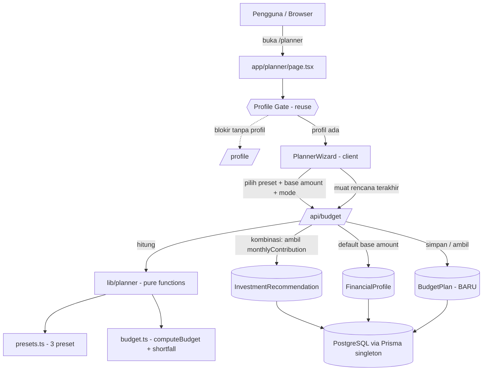
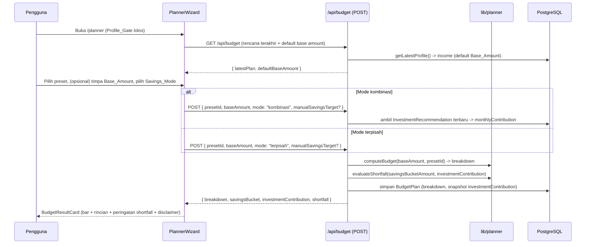

# Design Document

## Overview

**Budget Planner** menambahkan cakupan **Planner** ke aplikasi Financial Planner: alat penganggaran alokasi yang membagi pemasukan bulanan (`Base_Amount`) ke pos-pos anggaran menurut **metode preset** (`50/30/20`, `70/20/10`, `80/20`). Fitur ini menjawab pertanyaan pelengkap terhadap cakupan Investasi: *"Berapa yang sebaiknya saya alokasikan tiap bulan untuk kebutuhan, keinginan, dan tabungan?"*

Prinsip desain (selaras dengan pola `financial-planner` yang sudah ada):

- **Logika Planner murni dan terisolasi.** Definisi preset dan perhitungan alokasi ditulis sebagai pure function di `lib/planner/` (`presets.ts`, `budget.ts`), tanpa I/O — deterministik, mudah diuji (PBT), dan dapat dipakai ulang. Ini mengikuti pola `lib/investment/*`.
- **Reuse, bukan duplikasi.** Memakai ulang `Profile_Gate` (server component), `getLatestProfile()`, Prisma Client singleton (`lib/db.ts`), pola API route runtime Node.js dengan error ramah Bahasa Indonesia, dan pola visual `RecommendationCard` (bar proporsi + rincian per pos + format Rupiah + disclaimer).
- **Integrasi lintas cakupan.** Mode `kombinasi` menarik `monthlyContribution` dari `InvestmentRecommendation` terbaru sebagai pos "Investasi" otomatis, dan membandingkannya dengan alokasi tabungan preset untuk menandai *shortfall*.
- **Persistensi via model baru `BudgetPlan`.** Migrasi Prisma baru (tanpa reset DB), dengan `userId` nullable sebagai placeholder auth.
- **Allocation-only.** Pencatatan transaksi harian dan cash-flow tetap di luar cakupan (roadmap).

Design ini memenuhi Requirements 1–10.

## Architecture

### Diagram Konteks



### Alur Data Penganggaran



### Struktur Folder

Penambahan ditandai `# BARU`. Berkas yang sudah ada dari cakupan Investasi tetap.

```text
/
├── app/
│   ├── api/
│   │   └── budget/route.ts            # BARU: POST hitung+simpan, GET rencana terakhir + default base
│   ├── planner/
│   │   └── page.tsx                   # BARU: server component, dibungkus Profile_Gate
│   └── page.tsx                       # DIUBAH (minimal): tambah tautan ke /planner
├── components/
│   └── planner/
│       ├── PlannerWizard.tsx          # BARU: client, orkestrasi preset -> form -> hasil
│       ├── PresetPicker.tsx           # BARU: pilih 1 dari 3 preset
│       ├── BudgetForm.tsx             # BARU: Base_Amount (default profil) + Savings_Mode + target
│       └── BudgetResultCard.tsx       # BARU: hasil (pola visual RecommendationCard)
├── lib/
│   └── planner/
│       ├── presets.ts                 # BARU: konstanta 3 preset (pure)
│       └── budget.ts                  # BARU: computeBudget + evaluateShortfall (pure)
├── types/
│   └── planner.ts                     # BARU: tipe domain Planner
└── prisma/
    └── schema.prisma                  # DIUBAH: tambah model BudgetPlan (migrasi baru)
```

## Components and Interfaces

### Tipe Domain (`types/planner.ts`)

```ts
export type PresetId = "50/30/20" | "70/20/10" | "80/20";

export type SavingsMode = "terpisah" | "kombinasi";

export interface BudgetCategory {
  name: string;       // mis. "Kebutuhan", "Keinginan", "Tabungan & Investasi"
  percentage: number; // 0..100
  isSavings: boolean;  // menandai Savings_Bucket preset
}

export interface BudgetPreset {
  id: PresetId;
  label: string;                 // mis. "50/30/20"
  categories: BudgetCategory[];  // total percentage = 100
}

export interface BudgetLine {
  name: string;
  percentage: number;
  amount: number;    // Rupiah = baseAmount * percentage / 100
  isSavings: boolean;
}

export interface BudgetBreakdown {
  presetId: PresetId;
  baseAmount: number;
  lines: BudgetLine[]; // total amount ~= baseAmount (toleransi pembulatan)
}

export interface ShortfallResult {
  hasShortfall: boolean;
  savingsBucketAmount: number;     // total alokasi Savings_Bucket preset (Rupiah)
  investmentContribution: number;  // monthlyContribution dari rekomendasi (0 bila tak ada)
  gap: number;                     // max(0, investmentContribution - savingsBucketAmount)
}
```

### Modul Logika Planner (`lib/planner/`)

Semua fungsi **pure** — tanpa I/O, hanya mengimpor tipe dari `@/types/planner` (mengikuti pola `lib/investment/*`).

**`presets.ts`**
```ts
import type { BudgetPreset, PresetId } from "@/types/planner";

// Konstanta terstruktur; persentase tiap preset berjumlah 100.
export const BUDGET_PRESETS: Record<PresetId, BudgetPreset>;

// Ambil preset by id; lempar error bila id tidak dikenal (Req 3.7).
export function getPreset(id: PresetId): BudgetPreset;
```

Definisi preset (Req 3.2–3.4):

| Preset | Kategori (persentase) | Savings_Bucket |
|---|---|---|
| `50/30/20` | Kebutuhan 50%, Keinginan 30%, Tabungan & Investasi 20% | "Tabungan & Investasi" |
| `70/20/10` | Kebutuhan 70%, Tabungan 20%, Keinginan 10% | "Tabungan" |
| `80/20` | Pengeluaran 80%, Tabungan 20% | "Tabungan" |

**`budget.ts`**
```ts
import type { BudgetBreakdown, PresetId, ShortfallResult } from "@/types/planner";

// computeBudget: baseAmount * (persentase/100) per kategori.
// Guard: lempar error bila baseAmount bukan angka berhingga non-negatif (Req 4.5),
// atau presetId tidak dikenal (Req 3.7).
export function computeBudget(baseAmount: number, presetId: PresetId): BudgetBreakdown;

// Jumlahkan alokasi kategori Savings_Bucket dari sebuah breakdown.
export function savingsBucketAmount(breakdown: BudgetBreakdown): number;

// evaluateShortfall: hasShortfall = savingsBucketAmount < investmentContribution.
// gap = max(0, investmentContribution - savingsBucketAmount).
export function evaluateShortfall(
  savingsBucketAmount: number,
  investmentContribution: number,
): ShortfallResult;
```

Catatan presisi: jumlah tiap kategori dihitung `baseAmount * percentage / 100`. Karena persentase preset berjumlah 100, jumlah seluruh kategori sama dengan `baseAmount` secara eksak untuk aritmetika riil; deviasi hanya berupa galat floating-point kecil (diuji dengan toleransi, Req 4.3). Pembulatan ke Rupiah dilakukan hanya di lapisan tampilan (format), bukan di dalam breakdown, agar total tetap presisi.

### API Contracts (BARU)

**`GET /api/budget`** — muat konteks awal Planner
- Alur server: `getLatestProfile()` → `defaultBaseAmount = income` (atau null); ambil `BudgetPlan` terbaru bila ada.
- Sukses → HTTP 200 `{ defaultBaseAmount: number | null, latestPlan: BudgetPlan | null }`.

**`POST /api/budget`** — hitung + simpan rencana anggaran
- Body: `{ presetId: PresetId, baseAmount: number, mode: SavingsMode, manualSavingsTarget?: number | null, userId?: string | null }`.
- Validasi: `presetId` ∈ 3 preset; `baseAmount` angka berhingga ≥ 0; `mode` ∈ {`terpisah`, `kombinasi`}; `manualSavingsTarget` bila ada ≥ 0. Invalid → HTTP 400 `{ error }`.
- Alur server:
  1. `computeBudget(baseAmount, presetId)` → `breakdown`.
  2. `savingsBucketAmount(breakdown)` → jumlah `Savings_Bucket`.
  3. Bila `mode === "kombinasi"`: ambil `InvestmentRecommendation` terbaru (`orderBy createdAt desc`) → `investmentContribution = monthlyContribution` (atau `0` bila tidak ada, Req 5.5).
  4. Bila `mode === "terpisah"`: `investmentContribution = 0`; target = `manualSavingsTarget`.
  5. `evaluateShortfall(savingsBucketAmount, investmentContribution)` → `shortfall`.
  6. Simpan `BudgetPlan` (snapshot `investmentContribution` di kombinasi).
- Sukses → HTTP 200 `{ breakdown, savingsBucketAmount, investmentContribution, manualSavingsTarget, shortfall }`.
- Error mesin (input tidak valid) → HTTP 400; error DB → HTTP 500 `{ error }` ramah pengguna.
- `export const runtime = "nodejs"` (konsisten dengan route lain).

### Halaman & Komponen UI

- **`app/planner/page.tsx`** (server component): dibungkus `ProfileGate` (reuse), `export const dynamic = "force-dynamic"` (karena gate query DB), header bergaya sama dengan `app/investment/page.tsx` (badge aksen, tautan kembali ke dashboard), lalu me-render `PlannerWizard`.
- **`PlannerWizard.tsx`** (client): orkestrasi langkah `PresetPicker` → `BudgetForm` → `BudgetResultCard`; memanggil `GET /api/budget` untuk default `Base_Amount` + rencana terakhir, dan `POST /api/budget` untuk menghitung/menyimpan.
- **`PresetPicker.tsx`**: menampilkan 3 preset sebagai kartu pilih (persentase per kategori terlihat), menandai preset terpilih dengan token `--accent`.
- **`BudgetForm.tsx`**: input `Base_Amount` (prefilled dari `defaultBaseAmount`, dapat ditimpa), pemilih `Savings_Mode` (`terpisah`/`kombinasi`), input opsional `Manual_Savings_Target`. Dalam mode `kombinasi`, menampilkan `investmentContribution` yang ditarik (read-only informatif).
- **`BudgetResultCard.tsx`**: mengikuti pola visual `RecommendationCard` — bar proporsi gabungan (warna berputar), rincian per pos (`name`, `percentage`, `amount` dalam Rupiah), panel peringatan `Savings_Shortfall` bila ada, dan disclaimer edukatif wajib. Format Rupiah: `Rp ${Math.round(v).toLocaleString("id-ID")}`.
- **`app/page.tsx`** (diubah minimal): tambahkan satu kartu/tautan menuju `/planner` di dashboard.

## Data Models

### Model Prisma Baru (`prisma/schema.prisma`)

Ditambahkan **tanpa mengubah** model yang ada. Migrasi baru (`prisma migrate dev --name add_budget_plan`), **bukan** reset DB.

```prisma
model BudgetPlan {
  id                     String   @id @default(cuid())
  userId                 String?  // placeholder auth (nullable)
  presetId               String   // "50/30/20" | "70/20/10" | "80/20"
  baseAmount             Float
  mode                   String   // "terpisah" | "kombinasi"
  manualSavingsTarget    Float?   // opsional
  investmentContribution Float?   // snapshot monthlyContribution (kombinasi)
  breakdown              Json     // BudgetLine[] hasil computeBudget
  createdAt              DateTime @default(now())
}
```

Catatan:
- `breakdown` disimpan sebagai `Json` (daftar `BudgetLine`) agar fleksibel terhadap jumlah kategori per preset (2 atau 3).
- `investmentContribution` adalah **snapshot** nilai `monthlyContribution` dari `InvestmentRecommendation` terbaru pada saat penyimpanan (mode `kombinasi`); menyimpannya membuat rencana tetap konsisten meski rekomendasi berubah kemudian.
- `presetId` dan `mode` disimpan sebagai `String` (konsisten dengan penyimpanan `riskProfile`/`profile` sebagai `String` pada model yang ada); validasi nilai dilakukan di lapisan API + tipe TypeScript.

### Struktur Konstanta Preset

`BUDGET_PRESETS` adalah `Record<PresetId, BudgetPreset>` konstan di `lib/planner/presets.ts`. Contoh entri:

```ts
"50/30/20": {
  id: "50/30/20",
  label: "50/30/20",
  categories: [
    { name: "Kebutuhan", percentage: 50, isSavings: false },
    { name: "Keinginan", percentage: 30, isSavings: false },
    { name: "Tabungan & Investasi", percentage: 20, isSavings: true },
  ],
}
```

Invarian: untuk setiap preset, `sum(categories[].percentage) === 100` dan tepat satu (atau lebih) kategori memiliki `isSavings: true` untuk menandai `Savings_Bucket`.

### Snapshot `monthlyContribution` (kontrak lintas cakupan)

Mode `kombinasi` membaca `InvestmentRecommendation` terbaru via Prisma (`orderBy: { createdAt: "desc" }`) dan mengambil `monthlyContribution`. Nilai ini menjadi `Investment_Contribution`, di-snapshot ke `BudgetPlan.investmentContribution`, dan dibandingkan dengan alokasi `Savings_Bucket` untuk menghitung `Savings_Shortfall`. Bila belum ada rekomendasi, `Investment_Contribution = 0` (Req 5.5).

## Correctness Properties

*A property is a characteristic or behavior that should hold true across all valid executions of a system — essentially, a formal statement about what the system should do. Properties serve as the bridge between human-readable specifications and machine-verifiable correctness guarantees.*

Bagian ini berlaku untuk logika murni di `lib/planner/` (`presets.ts`, `budget.ts`) yang merupakan pure function dengan ruang input besar (nilai `Base_Amount` sembarang, tiap preset) — cocok untuk property-based testing. Lapisan API wiring (baca profil/rekomendasi, persistensi `BudgetPlan`), `Profile_Gate`, dan rendering UI diuji dengan example-based/integration/component test (lihat Testing Strategy), bukan properti.

Hasil prework dirangkum menjadi 5 properti setelah refleksi redundansi (properti perhitungan per-line dan invarian penjumlahan dipisah karena menguji jaminan berbeda; kondisi error digabung per sumber input).

### Property 1: Alokasi per pos sesuai preset dan proporsi

*For any* `Base_Amount` berhingga yang tidak negatif dan setiap `PresetId` yang valid, `computeBudget` SHALL mengembalikan `lines` yang jumlah dan nama posnya persis sama dengan kategori preset, dengan `amount` tiap pos sama dengan `Base_Amount × percentage ÷ 100`.

**Validates: Requirements 4.1, 4.2, 3.6**

### Property 2: Total alokasi sama dengan jumlah dasar

*For any* `Base_Amount` berhingga yang tidak negatif dan setiap `PresetId` yang valid, jumlah seluruh `lines[].amount` dari `computeBudget` SHALL sama dengan `Base_Amount` dalam toleransi pembulatan numerik kecil.

**Validates: Requirements 4.3**

### Property 3: Persentase setiap preset berjumlah 100

*For any* `Budget_Preset` di dalam `BUDGET_PRESETS`, jumlah `percentage` seluruh kategorinya SHALL sama dengan 100.

**Validates: Requirements 3.5**

### Property 4: Penandaan kekurangan dana investasi konsisten

*For any* nilai `savingsBucketAmount` dan `investmentContribution` yang tidak negatif, `evaluateShortfall` SHALL mengembalikan `hasShortfall` bernilai benar jika dan hanya jika `savingsBucketAmount < investmentContribution`, dan `gap` sama dengan `max(0, investmentContribution − savingsBucketAmount)`.

**Validates: Requirements 6.1, 6.2, 6.3, 6.4**

### Property 5: Input tidak valid ditolak

*For any* `Base_Amount` yang bukan angka berhingga tidak negatif (negatif, `NaN`, atau tak hingga) atau `PresetId` di luar himpunan `{50/30/20, 70/20/10, 80/20}`, `computeBudget`/`getPreset` SHALL melempar error alih-alih mengembalikan hasil.

**Validates: Requirements 2.3, 4.5, 3.7**

## Error Handling

| Kondisi | Deteksi | Respons | Req |
|---|---|---|---|
| Profil belum ada saat akses Planner | `Profile_Gate` cek `getLatestProfile()` | Redirect ke `/profile` | 1.1 |
| `Base_Amount` negatif/non-berhingga | Guard di `computeBudget` + validasi API | Lempar error → HTTP 400 + JSON error | 2.3, 4.5 |
| `presetId` tidak dikenal | Guard di `getPreset`/`computeBudget` + validasi API | HTTP 400 + JSON error | 3.7 |
| `mode` bukan `terpisah`/`kombinasi` | Validasi API | HTTP 400 + JSON error | 5.1 |
| `manualSavingsTarget` negatif | Validasi API | HTTP 400 + JSON error | 5.2, 5.4 |
| Mode `kombinasi` tanpa `InvestmentRecommendation` | Cek query DB null | `investmentContribution = 0` + info ke pengguna | 5.5 |
| Operasi database gagal | `try/catch` di route | HTTP 500 + pesan ramah tanpa detail internal | 7.5 |

## Testing Strategy

**Pendekatan ganda** (mengikuti pola `financial-planner`):

- **Property-based tests** (Vitest + `fast-check`) untuk logika murni `lib/planner/*` (`computeBudget`, `getPreset`, `evaluateShortfall`, invarian preset). Minimum 100 iterasi per properti. Setiap test diberi tag `Feature: budget-planner, Property {n}: {teks properti}` dan merujuk nomor properti pada dokumen ini.
- **Unit tests (example-based)** untuk nilai konstanta preset spesifik (kategori & persentase per preset), format Rupiah, dan angka yang diverifikasi manual.
- **Integration/component tests** untuk:
  - `GET /api/budget` mengembalikan default `Base_Amount` dari profil + rencana terakhir.
  - `POST /api/budget` mode `terpisah` (investmentContribution 0) dan `kombinasi` (menarik `monthlyContribution`, snapshot tersimpan; kasus tanpa rekomendasi → 0).
  - Persistensi `BudgetPlan` (field benar) dan penanganan error DB (mock throw → HTTP 500 ramah).
  - `Profile_Gate` (reuse): redirect saat profil null.
  - `BudgetResultCard`: rincian per pos, bar proporsi, peringatan shortfall, disclaimer edukatif.
  - Dashboard menautkan `/planner`.

**Mengapa PBT hanya untuk `lib/planner/*`:**
- Fungsi murni dengan perilaku bervariasi terhadap input (`Base_Amount` sembarang) → 100 iterasi menemukan galat pembulatan dan kasus tepi.
- Persistensi PostgreSQL, konfigurasi Prisma, pembacaan rekomendasi, dan rendering UI **tidak** cocok PBT: gunakan integration/component test dengan 1–3 contoh representatif.

**Konfigurasi property test:**
- Library PBT (`fast-check`) — jangan implementasi dari nol; minimum 100 iterasi.
- Generator `Base_Amount`: `fc.double` non-negatif berhingga (termasuk 0 dan nilai besar); generator preset dari kunci `BUDGET_PRESETS`; generator pasangan (savings, contribution) non-negatif untuk shortfall.

**TDD:** logika murni `lib/planner/*` ditulis test-first sebelum API dan UI.

**Catatan sub-task test opsional:** semua sub-task test ditandai `*` di `tasks.md` dan boleh dilewati untuk MVP cepat (konsisten dengan spec `financial-planner`).

## Keputusan Teknis Utama (Rationale)

- **Preset terstruktur, bukan kategori kustom penuh.** Menyediakan 3 metode teruji menjaga UX sederhana dan perhitungan deterministik; memodelkan preset sebagai konstanta `Record<PresetId, BudgetPreset>` membuat penambahan preset baru mudah tanpa mengubah `computeBudget`.
- **Pembulatan hanya di lapisan tampilan.** `computeBudget` mempertahankan nilai presisi (float) agar total pos tetap sama dengan `Base_Amount`; pembulatan Rupiah (`Math.round`) dilakukan saat format (`BudgetResultCard`), mencegah "kebocoran" akibat pembulatan per pos.
- **Snapshot `investmentContribution`.** Menyimpan nilai kontribusi investasi pada saat penyimpanan menjaga rencana anggaran tetap koheren meski `InvestmentRecommendation` berubah kemudian, dan menghindari join runtime.
- **Reuse `Profile_Gate` & Prisma singleton.** Tidak menduplikasi guard maupun manajemen koneksi; konsisten dengan cakupan Investasi dan aman terhadap hot reload dev.
- **`lib/planner/*` sebagai pure function terisolasi** (impor hanya dari `@/types/planner`) memungkinkan pengujian menyeluruh dan pemakaian ulang, mengikuti pola `lib/investment/*` (Req 10).
- **Allocation-only, transaksi/cash-flow ditunda.** Menjaga cakupan iterasi kecil dan dapat dikirim; pencatatan transaksi tetap roadmap.
