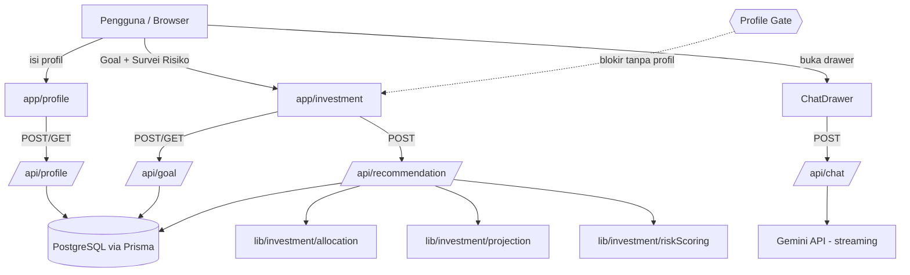
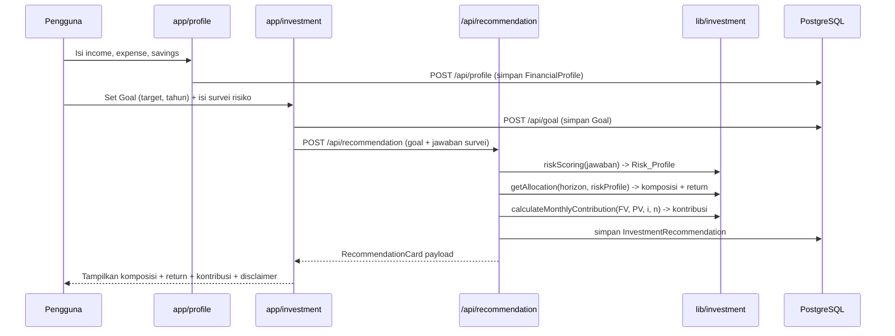

# Design Document

## Overview

Financial Planner adalah aplikasi Next.js (App Router) yang bergeser dari PoC chatbot menjadi **aplikasi perencana keuangan terstruktur**. Fitur utama MVP adalah **cakupan Investasi**: alur berpandu dari Profil Finansial → Goal → Survei Risiko → Rekomendasi Alokasi + Proyeksi Kontribusi Bulanan. Chatbot yang sudah ada tetap dipertahankan sebagai **fitur pelengkap** dan dikemas ulang menjadi panel drawer geser dari kanan.

Prinsip desain utama:
- **Financial_Profile sebagai model data terpusat.** Profil finansial menjadi sumber kebenaran kondisi keuangan pengguna dan gate wajib sebelum Investment_Scope. Fitur lanjutan (Planner, integrasi Chatbot) akan membaca profil ini.
- **Logika investasi murni (pure) dan terisolasi.** Mesin aturan alokasi, kalkulator kontribusi bulanan, dan skoring risiko ditulis sebagai pure function di `lib/investment/` — deterministik, mudah diuji, dan dapat dipakai ulang oleh roadmap.
- **Rule-based, bukan AI, untuk angka.** Rekomendasi investasi dihitung deterministik dari matriks aturan dan rumus keuangan, bukan dari LLM. Chatbot AI hanya untuk konsultasi naratif.
- **Chatbot tak tersentuh secara logika.** Kontrak `POST /api/chat`, `lib/prompt.ts`, dan `types/chat.ts` tetap. Hanya pengemasan UI yang berubah.
- **Persistensi via PostgreSQL + Prisma** dengan `userId` placeholder untuk auth masa depan.

Design ini memenuhi Requirements 1–9.

## Architecture

### Diagram Konteks



### Alur Data Investasi (Investment Scope)



### Struktur Folder

Penambahan ditandai `# BARU`. Berkas chatbot yang ada tetap.

```text
/
├── app/
│   ├── api/
│   │   ├── chat/route.ts          # Chatbot proxy (TETAP, tidak berubah)
│   │   ├── profile/route.ts       # BARU: POST/GET FinancialProfile
│   │   ├── goal/route.ts          # BARU: POST/GET Goal
│   │   └── recommendation/route.ts# BARU: POST hitung + simpan rekomendasi
│   ├── layout.tsx                 # DIUBAH: mount ChatDrawer + toggle kanan-atas
│   ├── page.tsx                   # DIUBAH: dashboard (link ke Profile & Investment)
│   ├── profile/page.tsx           # BARU: onboarding Financial Profile
│   ├── investment/page.tsx        # BARU: Goal -> Survei -> Rekomendasi
│   └── globals.css                # Tailwind base (tetap)
├── components/
│   ├── ChatInterface.tsx          # TETAP (dibungkus oleh ChatDrawer)
│   ├── MessageBubble.tsx          # TETAP
│   ├── ChatDrawer.tsx             # BARU: pembungkus drawer + state buka/tutup
│   ├── profile/
│   │   └── ProfileForm.tsx        # BARU
│   └── investment/
│       ├── GoalForm.tsx           # BARU
│       ├── RiskSurvey.tsx         # BARU
│       └── RecommendationCard.tsx # BARU
├── lib/
│   ├── prompt.ts                  # TETAP (system instruction chatbot)
│   ├── db.ts                      # BARU: Prisma Client singleton
│   └── investment/
│       ├── allocation.ts          # BARU: getAllocation (pure)
│       ├── projection.ts          # BARU: calculateMonthlyContribution (pure)
│       └── riskScoring.ts         # BARU: scoreRisk (pure)
├── types/
│   ├── chat.ts                    # TETAP
│   └── finance.ts                 # BARU: tipe domain investasi
├── prisma/
│   └── schema.prisma              # BARU: model + datasource
├── .env.local                    # GEMINI_API_KEY, DATABASE_URL
└── package.json
```

## Components and Interfaces

### Tipe Domain (`types/finance.ts`)

```ts
export type RiskProfile = "Konservatif" | "Moderat" | "Agresif";

// Bucket horizon hasil klasifikasi tahun.
export type HorizonBucket = "<2" | "2-5" | ">5";

export interface AllocationSlice {
  instrument: string; // mis. "RDPU", "SBN/Deposito", "Saham/Indeks"
  percentage: number; // 0..100
}

export interface Allocation {
  composition: AllocationSlice[]; // total percentage = 100
  annualReturn: number;           // desimal, mis. 0.055 untuk 5.5%
}

export interface Goal {
  targetAmount: number; // FV
  horizonYears: number;
}

export interface ProjectionInput {
  futureValue: number;   // FV = target
  presentValue: number;  // PV = tabungan saat ini
  annualReturn: number;  // desimal
  horizonYears: number;
}
```

### Modul Logika Investasi (`lib/investment/`)

Semua fungsi **pure** — tanpa I/O, tanpa dependensi UI/DB.

**`allocation.ts`**
```ts
export function bucketHorizon(horizonYears: number): HorizonBucket;
// getAllocation memetakan (horizon, riskProfile) -> Allocation via Allocation_Matrix.
// Untuk bucket "<2", riskProfile diabaikan.
export function getAllocation(horizonYears: number, riskProfile: RiskProfile): Allocation;
```

**`projection.ts`**
```ts
// Future Value of Annuity:
//   PMT = (FV - PV*(1+i)^n) * i / ((1+i)^n - 1)
//   i = annualReturn/12, n = horizonYears*12
// Fallback linear (FV - PV)/n saat i = 0. Hasil dibatasi minimum 0.
export function calculateMonthlyContribution(input: ProjectionInput): number;
```

**`riskScoring.ts`**
```ts
// Menjumlahkan bobot jawaban survei lalu klasifikasi via ambang batas tetap.
export function scoreRisk(answers: number[]): { score: number; profile: RiskProfile };
```

### API Contracts (BARU)

**`POST /api/profile`** — simpan Financial_Profile
- Body: `{ income: number, expense: number, currentSavings: number, userId?: string | null }`
- Validasi: ketiganya `>= 0`. Invalid → HTTP 400 `{ error }`.
- Sukses → HTTP 201 `{ id, income, expense, currentSavings }`.

**`GET /api/profile`** — ambil profil terakhir (untuk gate)
- Sukses → HTTP 200 `{ profile: FinancialProfile | null }`.

**`POST /api/goal`** — simpan Goal
- Body: `{ targetAmount: number, horizonYears: number, userId?: string | null }`
- Validasi: `targetAmount > 0`, `horizonYears > 0`. Invalid → HTTP 400.
- Sukses → HTTP 201 `{ id, targetAmount, horizonYears }`.

**`GET /api/goal`** — ambil goal terakhir.

**`POST /api/recommendation`** — hitung + simpan rekomendasi
- Body: `{ goalId?: string, targetAmount: number, horizonYears: number, riskAnswers: number[], currentSavings: number, userId?: string | null }`
- Alur server: `scoreRisk(riskAnswers)` → `getAllocation(horizonYears, profile)` → `calculateMonthlyContribution(...)` → simpan `RiskAssessment` + `InvestmentRecommendation`.
- Sukses → HTTP 200 `{ riskProfile, composition, annualReturn, monthlyContribution }`.
- Error DB/logika → HTTP 500 `{ error }` ramah pengguna.

### Chatbot Drawer (`components/ChatDrawer.tsx` + `app/layout.tsx`)

- `ChatDrawer` membungkus `ChatInterface` yang sudah ada (tanpa mengubah logikanya).
- State buka/tutup dikelola oleh client wrapper (React context atau state lokal di komponen client yang di-mount di layout).
- Tombol ikon (lucide-react, mis. `MessageCircle`) di sudut kanan atas, tersedia di semua halaman karena di-mount di `app/layout.tsx`.
- Panel: `fixed inset-y-0 right-0`, lebar `w-full max-w-md`, transisi `translate-x` (`translate-x-full` saat tertutup → `translate-x-0` saat terbuka).
- Backdrop semi-transparan menutupi konten; klik backdrop menutup drawer.
- Tutup via: tombol X, klik backdrop, atau tombol Escape (listener `keydown`).
- A11y: `role="dialog"`, `aria-modal="true"`, `aria-label`, fokus dipindah ke drawer saat terbuka.
- `POST /api/chat` dan seluruh perilaku streaming/sentinel tidak berubah.

Kerangka:
```tsx
<>
  <button aria-label="Buka asisten AI" onClick={open} className="fixed right-4 top-4 z-40">
    <MessageCircle />
  </button>
  {isOpen && <div className="fixed inset-0 z-40 bg-black/40" onClick={close} />}
  <aside
    role="dialog" aria-modal="true" aria-label="Asisten AI"
    className={`fixed inset-y-0 right-0 z-50 w-full max-w-md transform transition-transform ${isOpen ? "translate-x-0" : "translate-x-full"}`}
  >
    <button aria-label="Tutup" onClick={close}><X /></button>
    <ChatInterface />
  </aside>
</>
```

### Dashboard & Halaman

- `app/page.tsx`: dashboard ringkas dengan tautan ke `/profile` dan `/investment` serta ringkasan status profil.
- `app/profile/page.tsx`: `ProfileForm` untuk income/expense/savings.
- `app/investment/page.tsx`: alur bertahap `GoalForm` → `RiskSurvey` → `RecommendationCard`. Dilindungi Profile_Gate: bila `GET /api/profile` mengembalikan `null`, redirect ke `/profile`.

## Data Models

### Prisma Schema (`prisma/schema.prisma`)

```prisma
datasource db {
  provider = "postgresql"
  url      = env("DATABASE_URL")
}

generator client {
  provider = "prisma-client-js"
}

model FinancialProfile {
  id             String   @id @default(cuid())
  userId         String?  // placeholder auth (nullable di MVP)
  income         Float
  expense        Float
  currentSavings Float
  createdAt      DateTime @default(now())
  updatedAt      DateTime @updatedAt
}

model Goal {
  id           String   @id @default(cuid())
  userId       String?
  targetAmount Float
  horizonYears Int
  createdAt    DateTime @default(now())
}

model RiskAssessment {
  id        String   @id @default(cuid())
  userId    String?
  answers   Int[]    // jawaban survei mentah
  score     Int
  profile   String   // "Konservatif" | "Moderat" | "Agresif"
  createdAt DateTime @default(now())
}

model InvestmentRecommendation {
  id                 String   @id @default(cuid())
  userId             String?
  goalId             String?
  riskProfile        String
  composition        Json     // AllocationSlice[]
  annualReturn       Float
  monthlyContribution Float
  createdAt          DateTime @default(now())
}
```

Catatan:
- `DATABASE_URL` = `postgresql://alxtim@localhost:5432/financial_planner` (user `alxtim`, tanpa password). Database `financial_planner` dibuat saat eksekusi (createdb/psql), tabel dikelola `prisma migrate`.
- `composition` disimpan sebagai `Json` agar fleksibel terhadap variasi jumlah instrumen per sel matriks.

### Allocation Matrix (inti Allocation_Engine)

| Horizon | Risk Profile | Komposisi | Est. Return Tahunan |
|---|---|---|---|
| < 2 Tahun | Semua | 100% RDPU | 4,75% |
| 2–5 Tahun | Konservatif | 70% RDPU + 30% SBN/Deposito | 5,5% |
| 2–5 Tahun | Moderat | 50% RDPU + 50% Emas/SBN Ritel | 6,5% |
| 2–5 Tahun | Agresif | 30% RDPU + 40% SBN/RDPT + 30% Emas | 7,5% |
| > 5 Tahun | Konservatif | 50% SBN/RDPT + 30% Emas + 20% Saham | 7,0% |
| > 5 Tahun | Moderat | 40% Saham/Indeks + 40% SBN + 20% Emas | 9,5% |
| > 5 Tahun | Agresif | 70% Saham/Indeks + 20% SBN + 10% Emas | 11,0% |

Aturan bucket: `horizonYears < 2` → `<2` (abaikan Risk_Profile); `2 <= horizonYears <= 5` → `2-5`; `horizonYears > 5` → `>5`.

### Rumus Kontribusi Bulanan (Future Value of Annuity)

```
PMT = (FV - PV*(1+i)^n) * i / ((1+i)^n - 1)
i = annualReturn / 12
n = horizonYears * 12
```
Fallback linear `(FV - PV) / n` saat `i = 0`. Hasil dibatasi minimum `0`.

## Correctness Properties

*A property is a characteristic or behavior that should hold true across all valid executions of a system — essentially, a formal statement about what the system should do. Properties serve as the bridge between human-readable specifications and machine-verifiable correctness guarantees.*

Bagian ini berlaku untuk logika murni di `lib/investment/` (allocation, projection, riskScoring) yang merupakan pure function dengan ruang input besar — sangat cocok untuk property-based testing. Lapisan UI, API wiring, dan persistensi PostgreSQL diuji dengan example-based/integration test (lihat Testing Strategy), bukan properti.

### Property 1: Komposisi alokasi selalu berjumlah 100%

*For any* horizon tahun yang valid dan Risk_Profile yang valid, komposisi alokasi yang dikembalikan `getAllocation` SHALL memiliki total persentase tepat 100%.

**Validates: Requirements 4.10**

### Property 2: Horizon dan Risk_Profile terpetakan sesuai matriks

*For any* pasangan (horizonYears, riskProfile) yang valid, `getAllocation` SHALL mengembalikan komposisi dan estimasi return tahunan yang tepat sama dengan sel Allocation_Matrix untuk bucket horizon dan Risk_Profile tersebut.

**Validates: Requirements 4.1, 4.2, 4.3, 4.4, 4.5, 4.6, 4.7, 4.8**

### Property 3: Horizon pendek mengabaikan Risk_Profile

*For any* horizonYears kurang dari 2, `getAllocation` SHALL mengembalikan hasil yang identik (100% RDPU, return 4,75%) untuk semua nilai Risk_Profile.

**Validates: Requirements 4.2**

### Property 4: Klasifikasi bucket horizon konsisten di batas

*For any* horizonYears, `bucketHorizon` SHALL memetakan nilai < 2 ke `<2`, nilai dalam rentang [2, 5] ke `2-5`, dan nilai > 5 ke `>5`, termasuk tepat pada batas 2 dan 5.

**Validates: Requirements 2.2, 4.2, 4.3, 4.6**

### Property 5: Risk_Profile hasil skoring selalu valid

*For any* rangkaian jawaban survei yang valid, `scoreRisk` SHALL mengembalikan Risk_Profile yang merupakan salah satu dari `Konservatif`, `Moderat`, atau `Agresif`, dan pemetaan skor→profil bersifat monoton (skor lebih tinggi tidak menghasilkan profil yang lebih konservatif).

**Validates: Requirements 3.2, 3.3**

### Property 6: Kontribusi bulanan mencapai target (round-trip finansial)

*For any* input proyeksi valid dengan `annualReturn > 0`, menaruh `calculateMonthlyContribution` sebagai anuitas selama `n` bulan dengan bunga `i` ditambah pertumbuhan `PV` SHALL menghasilkan future value yang sama dengan `targetAmount` dalam toleransi numerik kecil.

**Validates: Requirements 5.1, 5.2**

### Property 7: Fallback linear saat return nol

*For any* input proyeksi dengan `annualReturn = 0` dan `targetAmount >= presentValue`, `calculateMonthlyContribution` SHALL sama dengan `(targetAmount - presentValue) / (horizonYears*12)`.

**Validates: Requirements 5.3**

### Property 8: Kontribusi bulanan tidak pernah negatif

*For any* input proyeksi valid, `calculateMonthlyContribution` SHALL mengembalikan nilai lebih besar dari atau sama dengan 0, termasuk saat `presentValue` sudah cukup untuk mencapai target.

**Validates: Requirements 5.4**

### Property 9: Input tidak valid ditolak

*For any* Risk_Profile di luar himpunan `{Konservatif, Moderat, Agresif}` atau horizon non-positif, `getAllocation` SHALL menandai input sebagai tidak valid (melempar error), alih-alih mengembalikan komposisi.

**Validates: Requirements 4.9**

## Error Handling

| Kondisi | Deteksi | Respons | Req |
|---|---|---|---|
| Profil belum ada saat akses Investment | Profile_Gate cek `GET /api/profile` | Redirect ke `/profile` | 1.3 |
| Input profil/goal negatif atau non-positif | Validasi API | HTTP 400 + JSON error | 1.2, 2.3, 2.4 |
| Risk_Profile/horizon tidak valid di engine | Guard di `getAllocation` | Lempar error → API kembalikan HTTP 400/500 | 4.9 |
| Operasi database gagal | `try/catch` di route | HTTP 500 + pesan ramah tanpa detail internal | 7.3 |
| Kontribusi bulanan negatif | Clamp ke 0 di `projection.ts` | Kembalikan 0 | 5.4 |
| Chatbot gagal inisiasi Gemini | (TETAP) try/catch sebelum stream | HTTP 500/429 + JSON error | 8.5 |
| Chatbot gagal mid-stream | (TETAP) sentinel `[[STREAM_ERROR]]` | UI hentikan loading + tandai | 8.5 |

## Testing Strategy

**Pendekatan ganda:**
- **Property-based tests** (Vitest + library PBT, mis. `fast-check`) untuk logika murni `lib/investment/*`. Minimum 100 iterasi per properti. Setiap test diberi tag `Feature: financial-planner, Property {n}: {teks properti}`.
- **Unit tests (example-based)** untuk sel matriks spesifik (table tests per baris), kasus batas (horizon 2 dan 5), angka kontribusi yang diverifikasi manual, dan input invalid.
- **Integration/component tests** untuk API wiring (`/api/recommendation` menggabungkan skoring→alokasi→proyeksi→persist), Profile_Gate (redirect saat profil null), alur UI Investment, dan interaksi ChatDrawer (toggle buka/tutup, Escape, kiriman tetap jalan, a11y dasar).

**Mengapa PBT hanya untuk `lib/investment/*`:**
- Fungsi murni dengan perilaku bervariasi terhadap input → 100 iterasi menemukan kasus tepi (batas horizon, savings besar, return ekstrem).
- Persistensi PostgreSQL, konfigurasi Prisma, dan rendering UI **tidak** cocok PBT: gunakan integration test dengan 1–3 contoh representatif dan snapshot/component test.

**Konfigurasi property test:**
- Library PBT (jangan implementasi dari nol), minimum 100 iterasi.
- Tiap property test merujuk nomor properti pada design ini.

**TDD:** Task 3, 4, 5 (allocation, projection, risk scoring + route logic) ditulis dengan pendekatan test-first.

## Keputusan Teknis Utama (Rationale)

- **Rule-based untuk angka investasi** menjaga rekomendasi deterministik, teruji, dan bebas halusinasi LLM; AI hanya untuk konsultasi naratif via chatbot.
- **`lib/investment/*` sebagai pure function terisolasi** memungkinkan fitur Planner (mengonsumsi Monthly_Contribution) dan integrasi Chatbot (mengonsumsi profil + rekomendasi) memakai ulang logika tanpa duplikasi (Req 9).
- **`userId` nullable sejak awal** menyiapkan migrasi ke auth tanpa perubahan skema besar, walau MVP tanpa auth.
- **PostgreSQL + Prisma** dipilih untuk persistensi permanen dan migrasi terkelola; singleton Prisma Client mencegah kebocoran koneksi di dev (hot reload Next.js).
- **Chatbot drawer** menjaga chatbot mudah diakses lintas halaman tanpa merombak logika stream yang sudah stabil.
