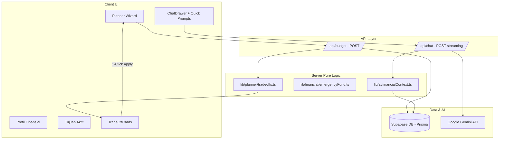

# Design Document: USP Enhancements (Trade-Off Optimizer & Context-Aware AI Copilot)

## 1. Overview & Architecture

Fitur USP Enhancements menambahkan lapisan kecerdasan terstruktur pada **TabungOne** dengan dua pilar utama:
1. **Algoritma Deterministik Trade-Off:** Memberikan solusi alternatif yang dapat dieksekusi secara instan saat alokasi anggaran mengalami hambatan kelayakan.
2. **Context-Aware Financial Twin:** Mengintegrasikan memori finansial terpusat ke dalam sistem asisten AI Gemini secara otomatis.



---

## 2. Type Definitions (`types/usp.ts`)

```typescript
export type TradeOffType = 'EXTEND_HORIZON' | 'REDUCE_TARGET' | 'REDUCE_WANTS';

export interface TradeOffOption {
  type: TradeOffType;
  title: string;
  description: string;
  currentValue: number;
  suggestedValue: number;
  unit: string;
  impactSummary: string;
  actionPayload: {
    targetAmount?: number;
    horizonMonths?: number;
    wantsAmount?: number;
  };
}

export interface TradeOffInput {
  income: number;
  expense: number;
  targetAmount: number;
  horizonMonths: number;
  monthlySavingsRequired: number;
  maxMonthlySavings: number;
}

export type EmergencyFundTier = 'VULNERABLE' | 'ADEQUATE' | 'STRONG';

export interface EmergencyFundAnalysis {
  coverageMonths: number;
  tier: EmergencyFundTier;
  targetMonths: number;
  shortfallAmount: number;
  advisoryMessage: string;
}

export interface FinancialTwinSnapshot {
  hasProfile: boolean;
  income?: number;
  expense?: number;
  currentSavings?: number;
  emergencyFundCoverage?: number;
  emergencyTier?: EmergencyFundTier;
  activeGoal?: {
    name?: string | null;
    targetAmount: number;
    horizonMonths: number;
  };
  riskProfile?: string;
  latestBudget?: {
    feasibility: 'ok' | 'tight' | 'impossible';
    savingsBucket: number;
    needsBucket: number;
    wantsBucket: number;
  };
}
```

---

## 3. Pure Logic Modules

### 3.1 `lib/planner/tradeoffs.ts`
Fungsi murni tanpa efek samping untuk menghitung opsi solusi trade-off:
```typescript
export function computeTradeOffs(input: TradeOffInput): TradeOffOption[] {
  const options: TradeOffOption[] = [];
  const { income, expense, targetAmount, horizonMonths, maxMonthlySavings, monthlySavingsRequired } = input;
  
  if (maxMonthlySavings <= 0) {
    // Kasus ekstrim: pengeluaran >= pemasukan
    return options;
  }

  // 1. EXTEND_HORIZON: Target tetap, waktu disesuaikan
  const newHorizon = Math.ceil(targetAmount / maxMonthlySavings);
  if (newHorizon > horizonMonths) {
    options.push({
      type: 'EXTEND_HORIZON',
      title: 'Perpanjang Jangka Waktu',
      description: `Sesuaikan jangka waktu pencapaian agar setoran per bulan sesuai batas surplus Anda (Rp ${Math.round(maxMonthlySavings).toLocaleString('id-ID')}/bln).`,
      currentValue: horizonMonths,
      suggestedValue: newHorizon,
      unit: 'bulan',
      impactSummary: `+${newHorizon - horizonMonths} bulan lebih lama`,
      actionPayload: { horizonMonths: newHorizon }
    });
  }

  // 2. REDUCE_TARGET: Waktu tetap, nominal target disesuaikan
  const newTarget = maxMonthlySavings * horizonMonths;
  if (newTarget < targetAmount && newTarget > 0) {
    options.push({
      type: 'REDUCE_TARGET',
      title: 'Sesuaikan Nominal Target',
      description: `Rasionalisasikan target dana yang dapat tercapai dalam ${horizonMonths} bulan sesuai kapasitas saat ini.`,
      currentValue: targetAmount,
      suggestedValue: newTarget,
      unit: 'Rupiah',
      impactSummary: `Target disesuaikan menjadi Rp ${Math.round(newTarget).toLocaleString('id-ID')}`,
      actionPayload: { targetAmount: newTarget }
    });
  }

  // 3. REDUCE_WANTS (Opsional jika pos keinginan masih ada)
  // Menghitung porsi pemotongan pengeluaran non-esensial

  return options;
}
```

### 3.2 `lib/financial/emergencyFund.ts`
Menilai kesiapan dana darurat:
```typescript
export function evaluateEmergencyFund(currentSavings: number, expense: number): EmergencyFundAnalysis {
  if (expense <= 0) {
    return {
      coverageMonths: 0,
      tier: 'ADEQUATE',
      targetMonths: 6,
      shortfallAmount: 0,
      advisoryMessage: 'Belum ada data pengeluaran bulanan yang tercatat.'
    };
  }

  const coverage = currentSavings / expense;
  const targetMonths = 6; // Standar 6 bulan pengeluaran
  const targetAmount = expense * targetMonths;
  const shortfall = Math.max(0, targetAmount - currentSavings);

  let tier: EmergencyFundTier = 'STRONG';
  let advisoryMessage = 'Dana darurat Anda sangat kuat (> 6 bulan). Anda siap berinvestasi secara terukur.';

  if (coverage < 3) {
    tier = 'VULNERABLE';
    advisoryMessage = 'Dana darurat Anda masih di bawah 3 bulan pengeluaran. Prioritaskan akumulasi instrumen likuid (RDPU/Tabungan) sebelum aset berisiko tinggi.';
  } else if (coverage < 6) {
    tier = 'ADEQUATE';
    advisoryMessage = 'Dana darurat Anda memadai (3–6 bulan). Seimbangkan antara menambah tabungan likuid dan investasi.';
  }

  return {
    coverageMonths: Number(coverage.toFixed(1)),
    tier,
    targetMonths,
    shortfallAmount: Math.round(shortfall),
    advisoryMessage
  };
}
```

### 3.3 `lib/ai/financialContext.ts`
Membangun snapshot data pengguna untuk Gemini System Instruction:
- Mengambil data dari `FinancialProfile`, `Goal`, `RiskAssessment`, dan `BudgetPlan` via Prisma singleton.
- Mengubahnya menjadi deskripsi naratif terstruktur:
```text
KONTEKS FINANSIAL PENGGUNA SAAT INI:
- Pemasukan Bulanan: Rp 12.000.000
- Pengeluaran Bulanan: Rp 7.000.000
- Tabungan Likuid: Rp 15.000.000 (Kesiapan Dana Darurat: 2.1 bulan - VULNERABLE)
- Tujuan Aktif: "Beli Mobil", Target: Rp 100.000.000 dalam 24 bulan
- Profil Risiko: Moderat
- Status Budget Planner: Tight (Dibutuhkan tabungan Rp 4.166.667/bln)
```

---

## 4. UI & Component Design

### 4.1 `components/planner/TradeOffCards.tsx`
- Menampilkan grid kartu rekomendasi trade-off jika `feasibility !== 'ok'`.
- Setiap kartu memiliki icon, badge dampak, penjelasan komparatif, dan tombol:
  - `<button onClick={() => onApply(option.actionPayload)}>Terapkan Solusi</button>`
- Memberikan transisi animasi halus saat solusi diaplikasikan ke form.

### 4.2 `components/ChatDrawer.tsx` Enhancements
- Menambahkan baris tombol **Contextual Quick Prompts** di atas input chat.
- Menampilkan indikator pill *"Data Finansial Tersinkronisasi"* dengan status aktif untuk memberikan rasa percaya diri (*trust*) kepada pengguna bahwa AI memahami kondisi mereka secara real-time.

---

## 5. Security & Privacy
- Tidak ada data kredensial bank atau nomor rekening yang disimpan/diproses (hanya nominal agregat).
- Konteks pengguna diinjeksikan secara *ephemeral* di API route dan tidak disimpan permanen oleh pihak ketiga di luar sesi dialog Gemini.
