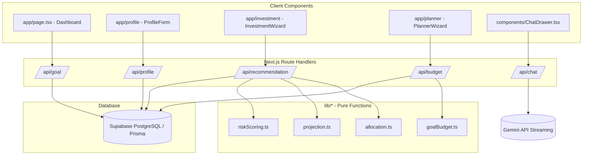

# System Design & Architecture: TabungOne (Financial Planner)

> **Dokumen Terkait:** Dokumen arah produk lengkap yang otoritatif dapat dilihat pada [`dokumentasi.md`](./dokumentasi.md), dengan spesifikasi formal per modul pada folder [`.kiro/specs/`](./.kiro/specs/).

---

## 1. Struktur Folder

```text
financial-planner/
├── app/
│   ├── api/
│   │   ├── budget/route.ts         # GET (prefill) & POST (simpan anggaran goal-driven)
│   │   ├── chat/route.ts           # POST (streaming AI assistant via GoogleGenAI)
│   │   ├── goal/route.ts           # GET & POST (kelola Tujuan Aktif tersentralisasi)
│   │   ├── profile/route.ts        # GET & POST (kelola Profil Finansial)
│   │   └── recommendation/route.ts # POST (hitung & simpan rekomendasi investasi)
│   ├── globals.css                 # Konfigurasi Tailwind CSS v4 & theme variables
│   ├── investment/page.tsx         # Halaman Wizard Perencanaan Investasi
│   ├── layout.tsx                  # Root layout + ChatDrawer (global)
│   ├── page.tsx                    # Dashboard (Profil + ActiveGoalCard + Navigasi)
│   ├── planner/page.tsx            # Halaman Wizard Perencanaan Anggaran Goal-Driven
│   └── profile/page.tsx            # Halaman Formulir Profil Finansial
├── components/
│   ├── ChatDrawer.tsx              # Panel drawer geser kanan untuk asisten AI
│   ├── ChatInterface.tsx           # UI chat, auto-scroll, typewriter stream reader
│   ├── MessageBubble.tsx           # Bubble chat markdown (user vs assistant)
│   ├── goal/
│   │   ├── ActiveGoalCard.tsx      # Kartu ringkasan tujuan aktif di dashboard
│   │   └── GoalEditor.tsx          # Modal/form editor Tujuan Aktif
│   ├── investment/
│   │   ├── GoalForm.tsx            # Langkah 1: input target dana & horizon (bulan)
│   │   ├── InvestmentWizard.tsx    # Orkestrator alur Investasi 3-step
│   │   ├── RecommendationCard.tsx  # Langkah 3: kartu alokasi & kontribusi bulanan
│   │   └── RiskSurvey.tsx          # Langkah 2: survei profil risiko 5 pertanyaan
│   ├── planner/
│   │   ├── BudgetForm.tsx          # Langkah 1: input target, horizon, dan income
│   │   ├── BudgetResultCard.tsx    # Langkah 2: kartu rincian alokasi pos & kelayakan
│   │   ├── PlannerWizard.tsx       # Orkestrator alur Planner 2-step
│   │   └── PresetPicker.tsx        # (Legacy dipensiunkan, dipertahankan di repo)
│   └── profile/
│       ├── ProfileForm.tsx         # Formulir input pemasukan, pengeluaran, tabungan
│       └── ProfileGate.tsx         # Wrapper pembatas akses halaman
├── lib/
│   ├── db.ts                       # Prisma Client singleton
│   ├── goal.ts                     # Helper getActiveGoal() (server-side latest wins)
│   ├── profileGate.ts              # Helper getLatestProfile() (server-side latest wins)
│   ├── prompt.ts                   # System prompt TabungOne AI
│   ├── smoke.test.ts               # Test suite runner
│   ├── format/
│   │   └── rupiahInput.ts          # Parser & formatter angka ribuan Rupiah
│   ├── investment/                 # Domain logic murni (pure functions)
│   │   ├── allocation.ts           # Matriks alokasi Horizon x Profil Risiko
│   │   ├── projection.ts           # Kalkulator Future Value of Annuity
│   │   └── riskScoring.ts          # Kalkulator skor & klasifikasi survei risiko
│   └── planner/                    # Domain logic murni (pure functions)
│       ├── goalBudget.ts           # Engine aktif model goal-driven (computeGoalBudget)
│       ├── budget.ts               # (Legacy dipensiunkan)
│       ├── presets.ts              # (Legacy dipensiunkan)
│       └── savingsProjection.ts    # (Legacy dipensiunkan)
├── prisma/
│   ├── migrations/                 # Catatan migrasi database Prisma
│   ├── schema.prisma               # Definisi model data PostgreSQL
│   └── seed.ts                     # Database seed
├── types/
│   ├── chat.ts                     # Tipe data chat request/response
│   ├── finance.ts                  # Tipe data profil finansial & investasi
│   └── planner.ts                  # Tipe data planner goal-driven & legacy
└── vitest.config.mts               # Konfigurasi runner Vitest
```

---

## 2. Arsitektur Teknis & Aliran Data



---

## 3. Skema Basis Data (Prisma Models)

```prisma
model FinancialProfile {
  id             String   @id @default(cuid())
  userId         String?  // placeholder auth
  income         Float
  expense        Float
  currentSavings Float
  createdAt      DateTime @default(now())
  updatedAt      DateTime @updatedAt
}

model Goal {
  id            String   @id @default(cuid())
  userId        String?
  name          String?  // label opsional, mis. "Beli Rumah"
  targetAmount  Float
  horizonMonths Int      // jangka waktu dalam bulan
  createdAt     DateTime @default(now())
}

model RiskAssessment {
  id        String   @id @default(cuid())
  userId    String?
  answers   Int[]    // array jawaban survei
  score     Int
  profile   String   // "Konservatif" | "Moderat" | "Agresif"
  createdAt DateTime @default(now())
}

model InvestmentRecommendation {
  id                  String   @id @default(cuid())
  userId              String?
  goalId              String?
  riskProfile         String
  composition         Json     // AllocationSlice[]
  annualReturn        Float
  monthlyContribution Float
  createdAt           DateTime @default(now())
}

model BudgetPlan {
  id                     String   @id @default(cuid())
  userId                 String?
  presetId               String   // "goal" untuk alur goal-driven aktif
  baseAmount             Float    // monthlyIncome
  mode                   String   // "goal"
  manualSavingsTarget    Float?   // legacy (nullable)
  investmentContribution Float?   // legacy (nullable)
  savingsTargetAmount    Float?   // nominal target tabungan
  savingsHorizonMonths   Int?     // horizon dalam bulan
  includeSavings         Boolean? // legacy (nullable)
  breakdown              Json     // BudgetLine[] (Kebutuhan, Keinginan, Ditabung)
  createdAt              DateTime @default(now())
}
```

---

## 4. Spesifikasi Kontrak API

### 4.1 `GET & POST /api/profile`
- **GET:** Mengembalikan profil finansial terbaru `{ profile: FinancialProfile | null }`.
- **POST:** Menyimpan profil baru `{ income, expense, currentSavings, userId? }`.

### 4.2 `GET & POST /api/goal`
- **GET:** Mengembalikan tujuan aktif terbaru `{ goal: { id, name, targetAmount, horizonMonths, createdAt } | null }`.
- **POST:** Menyimpan tujuan aktif baru `{ name?, targetAmount, horizonMonths, userId? }`.

### 4.3 `POST /api/recommendation`
- **Request:** `{ goalId?, targetAmount, horizonMonths, riskAnswers, currentSavings, userId? }`.
- **Response:** `{ id, goalId, riskProfile, score, composition, annualReturn, monthlyContribution }`.

### 4.4 `GET & POST /api/budget`
- **GET:** Mengembalikan konteks form Planner `{ defaultMonthlyIncome, currentSavings, monthlyExpense, latestPlan, goalTargetAmount, goalHorizonMonths, goalName }`.
- **POST:** Menerima `{ monthlyIncome, monthlyExpense?, targetAmount, horizonMonths, userId? }`, menghitung via `computeGoalBudget`, menyimpan ke `BudgetPlan`, dan mengembalikan `GoalBudgetResult`.

### 4.5 `POST /api/chat`
- **Request:** `{ message: string, history: Array<{ role: "user" | "model", content: string }> }`.
- **Response:** Streaming chunks teks polos dengan prompt `TabungOne`.

---

## 5. Keputusan Arsitektur Kunci (ADR)

1. **Satuan Jangka Waktu Standar (Bulan):** Seluruh input, database (`horizonMonths`, `savingsHorizonMonths`), dan kalkulasi menggunakan satuan bulan. Bucket alokasi investasi terbagi menjadi: `<24` bulan, `24..60` bulan, dan `>60` bulan.
2. **Koneksi Ganda Supabase:** Runtime menggunakan koneksi *pooled* PgBouncer (`DATABASE_URL`, port 6543) untuk skalabilitas *serverless*, sedangkan migrasi Prisma menggunakan koneksi langsung (`DIRECT_URL`, port 5432).
3. **Pemisahan Logika Murni (*Pure Functions*):** Seluruh formula finansial berada di `lib/` tanpa dependensi ke database atau React, memudahkan pengujian unit/property-based test serta penggunaan lintas komponen.
4. **Pola "Latest Wins" & One-Off Override:** Pengambilan profil dan tujuan aktif menggunakan baris terbaru (`orderBy: { createdAt: "desc" }`). Form di Investasi dan Planner mem-*prefill* data tersebut namun memfasilitasi *one-off override* tanpa menimpa data tersimpan secara tidak sengaja.