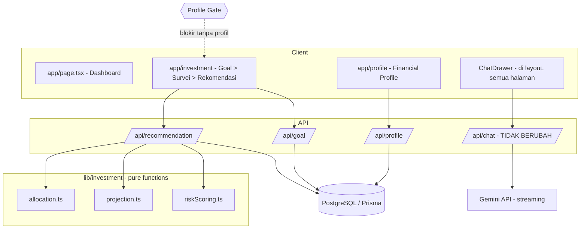

# Dokumentasi Financial Planner

> **Dokumen otoritatif arah produk.** File ini adalah sumber kebenaran utama untuk arah produk Financial Planner saat ini. Dokumen lama (`PRD.md`, `DESIGN.md`, `REQUIREMENTS.md`, `TASKS.md`) mendeskripsikan **fitur chatbot pelengkap** dari fase PoC dan tetap valid untuk bagian tersebut, tetapi tidak lagi merepresentasikan arah keseluruhan produk.

---

## 1. Ringkasan Produk

**Financial Planner** adalah aplikasi web (Next.js App Router) untuk perencanaan keuangan personal yang terstruktur. Arah produk telah bergeser:

- **Dulu (PoC):** aplikasi = chatbot konsultasi keuangan berbasis Gemini (halaman penuh).
- **Sekarang:** aplikasi utama = **perencana keuangan terstruktur**. Chatbot menjadi **fitur pelengkap (complementary)** yang dikemas sebagai panel drawer geser dari kanan, tersedia di semua halaman.

**Fokus MVP: cakupan Investasi (Investment scope) saja.** Alur berpandu membawa pengguna dari kondisi keuangan mereka menuju rekomendasi alokasi investasi yang konkret dan proyeksi kontribusi bulanan.

### Alur inti MVP
1. **Profil Finansial** (gate wajib): pengguna mengisi pemasukan bulanan, pengeluaran bulanan, dan tabungan saat ini. Tanpa profil ini, cakupan Investasi terkunci.
2. **Tujuan (Goal):** nominal target + jangka waktu (mis. Rp 100.000.000 dalam 5 tahun). Horizon diturunkan dari jangka waktu.
3. **Profil Risiko:** survei singkat → skor → klasifikasi `Konservatif` / `Moderat` / `Agresif`.
4. **Rekomendasi:** sistem menghitung alokasi berbasis aturan (matriks Horizon × Profil Risiko) + kontribusi bulanan yang diperlukan (Future Value of Annuity).

Rekomendasi angka bersifat **rule-based dan deterministik** — bukan hasil LLM. Chatbot AI hanya untuk konsultasi naratif.

---

## 2. Arsitektur



### Stack teknologi (dipertahankan)
- **Framework:** Next.js 16 (App Router), React 19, TypeScript.
- **Styling:** Tailwind CSS v4.
- **AI (chatbot):** `@google/genai` (streaming, runtime Node.js).
- **UI utilitas:** `lucide-react`, `react-markdown`, `remark-gfm`.

### Tambahan untuk arah baru
- **Database:** PostgreSQL lokal.
- **ORM:** Prisma (`prisma`, `@prisma/client`), singleton client di `lib/db.ts`.
- **Test runner:** Vitest (untuk logika murni `lib/investment/*`, TDD + property-based testing).

### Asumsi Database
```
DATABASE_URL="postgresql://alxtim@localhost:5432/financial_planner"
```
- User `alxtim`, tanpa password.
- Database `financial_planner` **belum ada** dan akan dibuat saat eksekusi (`createdb financial_planner` atau via `psql`), lalu Prisma `migrate` membuat tabel.
- Bila pembuatan database gagal karena izin/koneksi, hentikan dan konfirmasi ke pemilik proyek — jangan memaksa.

---

## 3. Model Data

Empat model Prisma. Semua menyertakan `userId` **nullable** sebagai placeholder autentikasi masa depan (MVP tidak memakai auth).

| Model | Field inti | Peran |
|---|---|---|
| `FinancialProfile` | `income`, `expense`, `currentSavings` | Sumber kebenaran kondisi keuangan; gate wajib. |
| `Goal` | `targetAmount`, `horizonYears` | Target + jangka waktu; sumber Horizon. |
| `RiskAssessment` | `answers`, `score`, `profile` | Hasil survei risiko + klasifikasi. |
| `InvestmentRecommendation` | `riskProfile`, `composition` (Json), `annualReturn`, `monthlyContribution` | Rekomendasi akhir yang dipersistensi. |

`FinancialProfile` adalah model terpusat: fitur roadmap (Planner, integrasi chatbot) akan membacanya sebagai konteks pengguna.

---

## 4. Cakupan Investasi (MVP) — Detail

### 4.1 Matriks Alokasi (inti mesin aturan)

| Horizon | Profil Risiko | Komposisi | Est. Return Tahunan |
|---|---|---|---|
| < 2 Tahun | Semua | 100% RDPU | 4,75% |
| 2–5 Tahun | Konservatif | 70% RDPU + 30% SBN/Deposito | 5,5% |
| 2–5 Tahun | Moderat | 50% RDPU + 50% Emas/SBN Ritel | 6,5% |
| 2–5 Tahun | Agresif | 30% RDPU + 40% SBN/RDPT + 30% Emas | 7,5% |
| > 5 Tahun | Konservatif | 50% SBN/RDPT + 30% Emas + 20% Saham | 7,0% |
| > 5 Tahun | Moderat | 40% Saham/Indeks + 40% SBN + 20% Emas | 9,5% |
| > 5 Tahun | Agresif | 70% Saham/Indeks + 20% SBN + 10% Emas | 11,0% |

**Aturan bucket horizon:**
- `horizonYears < 2` → bucket `<2` (**mengabaikan** profil risiko).
- `2 ≤ horizonYears ≤ 5` → bucket `2-5`.
- `horizonYears > 5` → bucket `>5`.

Implementasi: `lib/investment/allocation.ts` → `getAllocation(horizonYears, riskProfile)`. Total persentase komposisi selalu 100%. Input tidak valid (profil di luar himpunan atau horizon non-positif) melempar error.

### 4.2 Kontribusi Bulanan (Future Value of Annuity)

```
PMT = (FV − PV·(1+i)^n) · i / ((1+i)^n − 1)
```
- `FV` = nominal target Goal.
- `PV` = tabungan saat ini (dari Financial Profile).
- `i` = estimasi return tahunan / 12 (bunga bulanan).
- `n` = horizon dalam bulan (`horizonYears × 12`).
- **Fallback:** saat `i = 0`, gunakan linear `(FV − PV) / n`.
- Hasil dibatasi minimum `0` (bila tabungan sudah cukup).

Implementasi: `lib/investment/projection.ts` → `calculateMonthlyContribution(input)`.

**Contoh:** Target FV = Rp 100.000.000, tabungan PV = Rp 10.000.000, horizon 5 tahun, profil Moderat 2–5 tahun (return 6,5%).
- `i = 0,065 / 12 ≈ 0,0054167`
- `n = 5 × 12 = 60`
- `(1+i)^n ≈ 1,3829`
- `PV·(1+i)^n ≈ 10.000.000 × 1,3829 ≈ 13.829.000`
- Pembilang: `(100.000.000 − 13.829.000) × 0,0054167 ≈ 466.760`
- Penyebut: `1,3829 − 1 = 0,3829`
- `PMT ≈ 466.760 / 0,3829 ≈ Rp 1.219.000 per bulan` (perkiraan; angka pasti diverifikasi oleh test).

Sebagai perbandingan, tanpa pertumbuhan (`i = 0`): `(100.000.000 − 10.000.000) / 60 = Rp 1.500.000 per bulan`. Pertumbuhan investasi menurunkan setoran bulanan yang diperlukan.

### 4.3 Chatbot Pelengkap (Drawer)

Chatbot Gemini yang ada tetap sama secara logika (`POST /api/chat`, `lib/prompt.ts`, `types/chat.ts`, streaming, sentinel `[[STREAM_ERROR]]`). Perubahannya hanya **pengemasan UI**: dari halaman penuh menjadi panel drawer geser dari kanan (`components/ChatDrawer.tsx`), dipicu ikon di sudut kanan atas, di-mount di `app/layout.tsx` sehingga tersedia di semua halaman. Detail lengkap fitur chatbot ada di `DESIGN.md` dan `REQUIREMENTS.md`.

---

## 5. Roadmap (Belum Diimplementasikan)

Bagian ini adalah arah masa depan, bukan bagian MVP. Fondasinya sudah disiapkan agar mudah dibangun tanpa duplikasi.

### 5.1 Planner (penganggaran harian/bulanan)
Penganggaran 50/30/20 terstruktur, pencatatan transaksi, dan cash-flow bulanan. **Kontrak data yang akan dikonsumsi:** nilai `monthlyContribution` dari `InvestmentRecommendation` menjadi salah satu pos anggaran otomatis (alokasi tabungan/investasi bulanan).

### 5.2 Integrasi Chatbot ke Data Pengguna
Chatbot membaca konteks pengguna untuk konsultasi yang personal. **Kontrak data yang akan dikonsumsi:** `FinancialProfile` (income/expense/savings) + `InvestmentRecommendation` (komposisi, return, kontribusi bulanan) disuntikkan sebagai konteks ke prompt, sehingga jawaban chatbot selaras dengan rencana investasi pengguna.

### 5.3 Autentikasi
Field `userId` (nullable) sudah ada di semua model sejak awal, sehingga penambahan auth tidak memerlukan migrasi skema besar.

### Prinsip ekstensibilitas
Semua logika investasi berada di `lib/investment/*` sebagai **pure function** yang dapat diimpor independen (tanpa dependensi UI/API/DB). Ini memastikan Planner dan integrasi chatbot dapat memakai ulang mesin aturan dan kalkulator proyeksi.

---

## 6. Peta Dokumen

| Dokumen | Isi |
|---|---|
| `dokumentasi.md` (ini) | Arah produk keseluruhan (otoritatif). |
| `.kiro/specs/financial-planner/requirements.md` | Kebutuhan formal MVP (EARS). |
| `.kiro/specs/financial-planner/design.md` | Desain teknis, matriks, properti korektnes, testing. |
| `.kiro/specs/financial-planner/tasks.md` | Rencana implementasi 10 langkah. |
| `PRD.md`, `DESIGN.md`, `REQUIREMENTS.md`, `TASKS.md` | **Fitur chatbot pelengkap (fase PoC)** — lihat catatan pengarah di puncak masing-masing. |
